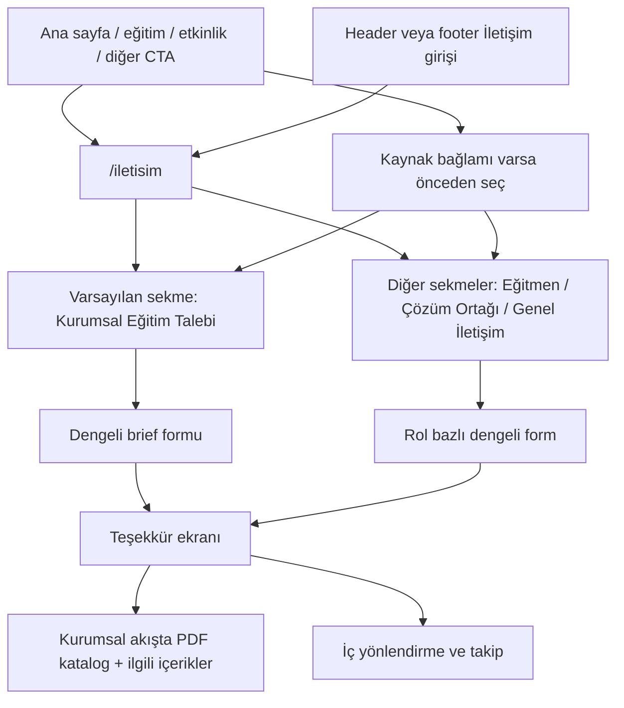

# Niyet Bazlı Başvuru Mimarisi

## Problem Frame

Netaş Academy sitesinin ana amacı kurumsal eğitim satmak. Buna rağmen mevcut yapı `frontend/src/app/iletisim/page.tsx` içinde tek bir genel iletişim formu sunuyor ve kurumsal eğitim talebi, eğitmen başvurusu, çözüm ortağı başvurusu ve genel iletişim aynı giriş noktasında birbirine karışıyor. Bu durum hem kullanıcı netliğini düşürüyor hem de gelen başvuruların doğru niyetle doğru ekibe yönlenmesini zorlaştırıyor.

Hedef, iletişim yüzeyini tek form mantığından çıkarıp niyet bazlı bir başvuru mimarisine dönüştürmek: kurumsal eğitim satışı ana dönüşüm olarak öne çıkmalı; diğer başvuru tipleri görünür kalmalı ama onu gölgelememeli. Eğitim, etkinlik ve diğer içerik sayfaları da kullanıcıyı boş bir iletişim formuna değil, ilgili niyeti önceden seçilmiş ve bağlamı taşınmış bir başvuru deneyimine götürmeli.

## User Flow

## Requirements

**Bilgi Mimarisi ve Giriş**

- R1. `İletişim` sayfası dört görünür sekme ile çalışmalıdır: `Kurumsal Eğitim Talebi`, `Eğitmen Başvurusu`, `Çözüm Ortağı Başvurusu`, `Genel İletişim`.
- R2. Varsayılan açık sekme `Kurumsal Eğitim Talebi` olmalıdır.
- R3. `Genel İletişim` sekmesi görünür kalmalı ancak birincil satış akışının gerisinde, ikincil konumda sunulmalıdır.
- R4. Ana sayfa ve ilgili içerik yüzeyleri, kullanıcıyı doğrudan `/iletisim` sayfasındaki doğru sekmeye götüren CTA’lar sunabilmelidir.

**Form Davranışı**

- R5. `Kurumsal Eğitim Talebi` formu ilk sürümde hafif tutulmalıdır: `fullName`, `email`, `phone`, opsiyonel `company`, zorunlu `interestTopic` ve zorunlu kısa ihtiyaç notu niteliğinde `message` toplamalıdır.
- R6. `Eğitmen Başvurusu` formu ilk sürümde hafif tutulmalıdır: `fullName`, `email`, `phone`, zorunlu `expertiseAreas` ve zorunlu `message` toplamalıdır.
- R7. `Çözüm Ortağı Başvurusu` formu ilk sürümde hafif tutulmalıdır: `fullName`, `email`, `phone`, opsiyonel `company`, zorunlu `partnershipArea` ve zorunlu `message` toplamalıdır.
- R8. `Genel İletişim` formu diğer başvuru tiplerine göre daha genel ve daha hafif kalmalıdır; kullanıcıyı satış öncesi brief toplamaya zorlamamalıdır.
- R9. Her başvuru tipi iç sistemde niyeti açık biçimde korunacak şekilde kaydedilmeli ve ilgili ekibe yönlendirilebilmelidir.
- R9a. İlk sürüm `leadType` enum değerleri `corporate_training_request`, `instructor_application`, `solution_partner_application` ve `general_contact` ile sınırlı olmalıdır.
- R9b. İlk sürüm `status` enum değerleri `new`, `contacted` ve `closed` ile sınırlı olmalıdır.
- R9c. `lead` modeli kişi adı için ayrı `firstName` ve `lastName` yerine tek `fullName` alanı kullanmalıdır.
- R9d. Type-specific alanlar ilk sürümde serbest metin olmalıdır; `interestTopic`, `expertiseAreas` ve `partnershipArea` için enum veya katı taksonomi zorunlu tutulmamalıdır.

**Bağlam ve Yönlendirme**

- R10. Kullanıcı bir eğitim, etkinlik veya ilgili içerik sayfasından başvuru akışına gelirse, geldiği bağlam başvuru formuna otomatik taşınmalı ve kullanıcı tarafından düzenlenebilir olmalıdır.
- R11. Bağlam taşınması yalnızca doğru sekmeyi açmakla sınırlı kalmamalı; ilgili eğitim veya konu bilgisi uygun alanda önceden doldurulmalıdır.
- R12. Başvuru mimarisi, etkinlik kaydı gibi mevcut ayrı akışları bozmadan onlarla birlikte çalışmalıdır; iletişim mimarisi etkinlik kayıt formunun yerine geçmemelidir.
- R12a. İlk sürümde içerik bağlamı frontend davranışı olarak kullanılmalı; backend `lead` kaydına `contextType`, `contextSlug` veya benzeri attribution alanları yazılmamalıdır.

**Frontend Uygulama Mimarisi**

- R12b. `/iletisim` sayfasının sayfa kabuğu server-rendered kalmalıdır; hero, layout ve statik açıklama içeriği server component olarak tutulmalıdır.
- R12c. İnteraktif form deneyimi ayrı bir client component içinde yürütülmelidir.
- R12d. Form state, submit lifecycle, hata durumu ve başarı durumu tek bir client orchestration katmanında yönetilmelidir.
- R12e. Her niyet tipi kendi küçük field section bileşeni ile render edilmeli; fetch ve submit davranışı section bileşenlerine dağıtılmamalıdır.
- R12f. Client form orkestrasyonu `react-hook-form` ile yönetilmeli ve type-specific doğrulama `zod` tabanlı discriminated union şemasıyla yapılmalıdır.
- R12g. Frontend submit payload'ı her istekte `leadType` göndermeli; ortak alanlar ile tipe özel alanlar aynı contract altında backend'e taşınmalıdır.
- R12h. Next.js client-side kullanım sınırı yalnızca interaktif form adası ile sınırlı tutulmalıdır; sekme dışındaki statik içerik, sayfa kabuğu ve yardımcı açıklamalar gereksiz yere client component'e taşınmamalıdır.
- R12i. Form performansı ve bakım kolaylığı için tek bir `use client` giriş noktası tercih edilmeli; her sekme veya alt section bağımsız fetch-owning mini uygulamalara dönüştürülmemelidir.

**Teşekkür Deneyimi ve Sonraki Adım**

- R13. `Kurumsal Eğitim Talebi` formu başarıyla gönderildiğinde teşekkür durumu, geri dönüş beklentisini net anlatmalı ve kullanıcıya PDF katalog ile ilgili eğitim veya webinar içeriklerini sunmalıdır.
- R14. `Eğitmen Başvurusu`, `Çözüm Ortağı Başvurusu` ve `Genel İletişim` akışlarında teşekkür durumu başvurunun alındığını ve sonraki temas beklentisini net anlatmalıdır.
- R15. Teşekkür deneyimi, kullanıcıyı boşta bırakmak yerine bir sonraki anlamlı adıma bağlamalıdır; kurumsal akışta bu adım katalog ve ilgili içerik keşfi olmalıdır.

**Ölçüm ve Başarı**

- R16. Birincil başarı ölçütü, nitelikli kurumsal eğitim talebi sayısındaki artış olmalıdır.
- R17. İkincil başarı ölçütü, ziyaretçinin hangi ihtiyacı için nereye başvuracağını daha hızlı ve daha net anlayabilmesidir.
- R18. Ölçüm omurgası en az şu davranışları ayırt edebilmelidir: sekme görüntüleme, sekme değiştirme, form başlatma, form tamamlama, bağlamlı giriş, katalog tıklaması ve ilgili içerik tıklaması.

## Success Criteria

- Kurumsal eğitim talebi formu tamamlama oranı (form başlatan → form gönderen) ölçülebilir olmalıdır.
- İletişim sayfasında varsayılan sekme (Kurumsal Eğitim Talebi) dışındaki sekmere geçiş oranı takip edilebilmelidir.
- Kurumsal eğitim talebi formu en fazla 6 alan toplamalıdır; alan sayısı başarı ölçütü olarak sabitlenir.
- Eğitim/etkinlik sayfasından gelen başvurularda bağlam prefill doğruluğu (doğru sekme + doğru alan) %100 olmalıdır.
- Form gönderimi sonrası teşekkür ekranında katalog/İçerik CTA tıklama oranı ölçülebilir olmalıdır.

## Scope Boundaries

- Bu kapsam ödeme akışını içermez.
- Bu kapsam toplantı planlama veya canlı takvim rezervasyonu içermez.
- Bu kapsam gelişmiş CRM otomasyonları, lead scoring veya kampanya orkestrasyonu içermez.
- Bu kapsam site içi arama, aylık takvim görünümü veya QR kampanya yönetimi içermez.
- Bu kapsam etkinlik kayıt akışını yeniden tasarlamaz; yalnızca onunla uyumlu çalışacak yeni başvuru mimarisini tanımlar.
- Bu kapsam ilk sürüm için dosya yükleme veya kapsamlı belge toplama zorunluluğu getirmez.

## Key Decisions

- Tek bir `İletişim` sayfası korunacak, ancak tek form yerine sekmeli niyet mimarisi kullanılacak: tek merkez, daha net karar yüzeyi sağladığı için.
- `Kurumsal Eğitim Talebi` varsayılan sekme olacak: sitenin ana ticari amacı kurumsal eğitim satmak olduğu için.
- `Genel İletişim` görünür ama ikincil kalacak: fallback ihtiyacı korunurken ana dönüşüm gölgelenmeyecek.
- Eğitim ve etkinlik içeriklerinden gelen trafik boş forma değil, bağlamı taşınmış sekmeye indirilecek: kullanıcı sürtünmesini azaltmak ve niyeti korumak için.
- Kurumsal teşekkür ekranı yalnızca “geri döneceğiz” demeyecek; katalog ve ilgili içerik sunacak: satış sürecini bir sonraki adıma taşımak için.
- İlk sürüm alan seti hafif tutulacak; kurumsal akış için ekip büyüklüğü, tarih, format ve benzeri daha ağır brief alanları sonraki faza bırakılacak.
- İlk sürümde içerik bağlamı backend domain verisi olmayacak; yalnızca doğru sekme ve prefill davranışı için kullanılacak.
- Next.js uygulama sınırı server shell + client form orkestrasyonu olarak kurulacak; RHF ve Zod yalnızca interaktif form katmanında kullanılacak.
- Bu akış için Next.js client-side kullanımı uygundur; ağırlık riski teknoloji seçiminden değil, client boundary'nin gereksiz genişletilmesinden doğar.

## Dependencies / Assumptions

- PDF katalog içeriği bu akış için hazırlanacaktır.
- Her başvuru tipinin iç tarafta bir sahibi veya yönleneceği ekip tanımlanacaktır.
- Mevcut iletişim altyapısı (`frontend/src/app/api/contact-submissions/submit/route.ts` ve `backend/src/api/contact-submission/content-types/contact-submission/schema.json`) `lead` modeline evrilecektir; `notification-routing` tablosu niyet bazlı yönlendirme için kullanılacaktır.
- Frontend tarafında bu requirement'ın uygulanabilmesi için `react-hook-form`, `zod` ve uygun resolver paketi projeye eklenecektir.

## Outstanding Questions

### Deferred to Planning

- [Affects R4][Technical] Sekme derin linkleri URL parametresi, hash veya başka bir yönlendirme deseni ile mi taşınmalı?
- [Affects R18][Needs research] Ölçüm olayları mevcut analitik altyapısı içinde mi çözülecek, yoksa bu iş için ayrıca bir ölçüm seçimi mi gerekecek?

## Next Steps

-> /ce-plan for structured implementation planning
