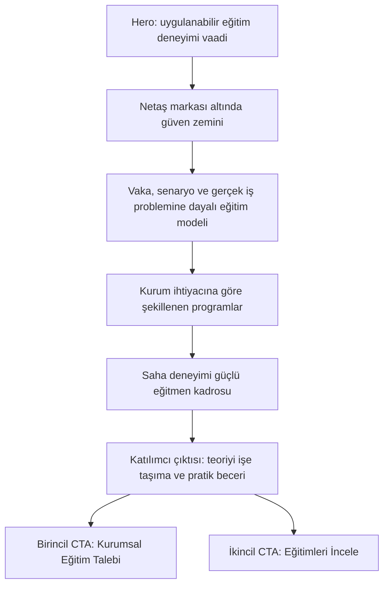

# Hakkımızda: Kurumsal Güven ve Eğitim Modeli

## Problem Frame

`/hakkimizda` sayfası bugün Netaş Academy'nin genel yaklaşımını ve eğitmen kadrosunu anlatıyor, ancak sayfanın kurumsal eğitim satışı hedefindeki rolü yeterince net değil. Sayfa yalnızca "biz kimiz" metni olarak kalırsa güven üretse bile kullanıcıyı eğitim keşfi veya kurumsal talep bırakma davranışına yeterince güçlü bağlamaz.

Bu çalışmanın amacı, Hakkımızda sayfasını dengeli bir tonla yeniden konumlandırmak: Netaş markasının güven zemini korunmalı, öğrenme modeli somutlaştırılmalı ve sayfa kurumsal eğitim talebi akışına doğal biçimde yönlendirmelidir.

## Requirements

**Ana Anlatı**
- R1. Sayfanın ana mesajı, Netaş Academy'yi Netaş'ın teknoloji ve sektör birikiminden güç alan, kurum ihtiyaçlarına göre şekillenen, vaka ve uygulama odaklı eğitim deneyimleri tasarlayan bir gelişim platformu olarak konumlandırmalıdır.
- R2. Sayfa tonu dengeli olmalıdır: kurumsal güveni korumalı, ancak soyut ve ağır kurumsal metin yerine canlı, anlaşılır ve iş sonucuna yakın bir dil kullanmalıdır.
- R3. Hero anlatısı, yalnızca "ilham verici yolculuk" gibi genel bir marka ifadesiyle değil, kurumların gelişim ihtiyaçlarına uygulanabilir eğitim deneyimleriyle yanıt verme vaadiyle açılmalıdır.

**İçerik Omurgası**
- R4. Sayfa, Netaş Academy'nin Netaş markası altındaki konumunu kısa ve güven veren bir bölümle açıklamalıdır; bu bölüm tarihçe anlatısına dönüşmemelidir.
- R5. Sayfa, eğitim modelini vaka, senaryo, interaktif çalışma ve gerçek iş problemi üzerinden öğrenme ekseninde somutlaştırmalıdır.
- R6. Sayfa, eğitimlerin kurumun sektörü, ekip profili, mevcut yetkinlik seviyesi ve hedeflenen gelişim alanlarına göre şekillenebileceğini açıkça anlatmalıdır.
- R7. Eğitmen kadrosu, yalnızca akademik anlatıcılar olarak değil, saha deneyimi ve uygulama gücü taşıyan rehberler olarak konumlandırılmalıdır.
- R8. Sayfa, katılımcı çıktısını açık ifade etmelidir: teoriyi işe taşıma, yeni bakış açısı kazanma, pratik becerileri geliştirme ve kurum içinde uygulanabilir yöntemler edinme.

**Yönlendirme ve Funnel Rolü**
- R9. Sayfanın birincil CTA'sı `Kurumsal Eğitim Talebi` olmalıdır; kullanıcıyı kurumsal eğitim talebi bırakmaya yönlendirmelidir.
- R10. Sayfanın ikincil CTA'sı `Eğitimleri İncele` olmalıdır; kullanıcıyı eğitim kataloğunu keşfetmeye yönlendirmelidir.
- R11. CTA dili satış baskısı yaratmamalı; "ihtiyaca uygun eğitim yolculuğu kuralım" hissini taşımalıdır.
- R12. Sayfa, mevcut eğitmen görünürlüğünü korumalı ancak eğitmen bölümünü sayfanın güven ve uygulama anlatısına bağlamalıdır.

## Suggested Narrative Flow

## Success Criteria

- İlk kez gelen kurumsal kullanıcı, Netaş Academy'nin neden güvenilir bir eğitim partneri olduğunu sayfa içinde anlayabilmelidir.
- Sayfa, eğitim modelini soyut kalite iddiaları yerine uygulanabilir öğrenme, gerçek iş problemi ve saha deneyimi üzerinden anlatmalıdır.
- Sayfa sonunda kullanıcı için en doğal birincil sonraki adım kurumsal eğitim talebi bırakmak olmalıdır.
- Eğitim kataloğu keşfi görünür kalmalı, ancak kurumsal eğitim talebinin önüne geçmemelidir.
- Sayfa mevcut Türkçe IA ve marka dilini bozmaz; İngilizce placeholder veya genel SaaS/pazarlama dili kullanılmaz.

## Scope Boundaries

- Bu çalışma Hakkımızda sayfasını yeni bir bağımsız satış landing page'e çevirmeyi amaçlamaz.
- Bu çalışma müşteri vaka hikayesi, referans logosu veya ölçülebilir başarı metriği içeriği icat etmez; gerçek kanıt yoksa metin güven vaadi ve yöntem anlatısı seviyesinde kalmalıdır.
- İlk karar seti yeni bir CMS modeli, yeni başvuru formu veya yeni ölçüm altyapısı tanımlamaz.
- Eğitmen listing/detail stratejisi bu dokümanın ana konusu değildir; Hakkımızda içindeki eğitmen görünürlüğü yalnızca destekleyici güven katmanı olarak ele alınır.

## Key Decisions

- Dengeli ton seçildi: Sayfa kurumsal güveni koruyacak, ancak daha pratik ve anlaşılır bir dille iş sonucuna yakın konuşacak.
- Ana omurga `kurumsal güven + uygulamalı öğrenme modeli + kuruma göre uyarlanabilir eğitim` olacak: Bu kombinasyon hem Hakkımızda beklentisini karşılıyor hem de sitenin kurumsal eğitim satışı hedefini destekliyor.
- Birincil CTA `Kurumsal Eğitim Talebi` olacak: Sitenin ana ticari hedefi kurumsal eğitim talebi üretmek olduğu için.
- İkincil CTA `Eğitimleri İncele` olacak: Kullanıcı talep bırakmaya hazır değilse katalog keşfine devam edebilmelidir.

## Dependencies / Assumptions

- `/hakkimizda`, `/egitimler` ve `/iletisim` IA içinde var olan yüzeyler olarak korunacaktır.
- Kurumsal eğitim talebi akışı, iletişim yüzeyindeki niyet bazlı başvuru mimarisiyle uyumlu çalışacaktır.
- Mevcut eğitmen verisi ve görsel düzen, Hakkımızda sayfasında destekleyici güven katmanı olarak kullanılabilir.

## Outstanding Questions

### Resolve Before Planning

- Yok.

### Deferred to Planning

- [Affects R9][Technical] `Kurumsal Eğitim Talebi` CTA'sının iletişim sayfasındaki ilgili niyeti teknik olarak nasıl açacağı planlama sırasında netleştirilmelidir.
- [Affects R12][Design] Eğitmen bölümünün mevcut carousel ile mi, yoksa daha anlatı odaklı bir bölümle mi sunulacağı planlama sırasında mevcut komponentlerle karşılaştırılmalıdır.

## Next Steps

-> /ce-plan for structured implementation planning
