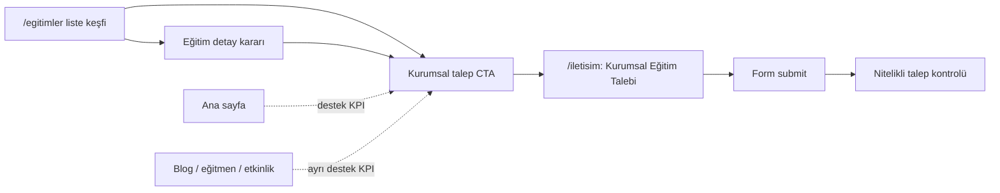

# Ölçüm Omurgası ve Başarı Tanımı

## Problem Frame

Netaş Academy requirements dokümanlarında birçok yüzey için "ölçülebilir olmalı" hedefi var, ancak başarı tanımı tek bir omurgada sabitlenmiş değil. Bu eksik kalırsa `/egitimler`, eğitim detayları, `/iletisim`, etkinlikler, blog, eğitmenler ve çözüm ortaklığı yüzeyleri kendi içinde iyi görünse bile hangi davranışın gerçek ürün başarısı sayılacağı belirsiz kalır.

Bu çalışma, analytics aracı seçmekten önce neyin başarı sayılacağını tanımlar. Ana amaç, sitenin kurumsal eğitim satışı hedefini ölçülebilir bir funnel'a bağlamak; destekleyici yüzeyleri de ana funnel'ı bulanıklaştırmadan kendi rolüne göre takip etmektir.

## Measurement Model

## Requirements

**Başarı Sözlüğü**

- R1. North Star metric `Nitelikli Kurumsal Eğitim Talebi` olmalıdır.
- R2. İlk faz ana web metriği, `corporate_training_request` tipinde kurumsal eğitim talebi form submit'i olmalıdır.
- R3. İlk faz kalite metriği, iç ekip tarafından geçerli veya nitelikli kabul edilen kurumsal eğitim talebi olmalıdır.
- R4. Satış sonucu, toplantı, teklif veya kapalı satış gibi daha geç sinyaller ilk faz web başarısının yerine geçmemeli; ayrı takip metriği olarak değerlendirilmelidir.

**Ana Funnel**

- R5. Ana ara başarı, eğitim keşfinden kurumsal talep akışına geçiş olmalıdır.
- R6. Eğitim keşfi kapsamı `/egitimler` liste sayfası ve `/egitimler/[slug]` detay sayfalarıyla sınırlı olmalıdır.
- R7. Ana funnel şu yolu ölçebilmelidir: eğitim liste veya detay keşfi → kurumsal CTA → `/iletisim` kurumsal talep sekmesi → form submit.
- R8. Kullanıcı eğitim liste sayfasından doğrudan kurumsal talep akışına geçerse bu geçiş geçerli ara başarı sayılmalıdır; eğitim detay sayfası zorunlu ara adım olmamalıdır.

**Destekleyici Yüzeyler**

- R9. Ana sayfa, blog, etkinlik, eğitmen ve çözüm ortağı yüzeyleri ana eğitim funnel'ına karıştırılmamalı; ayrı destek KPI kümeleriyle izlenmelidir.
- R10. Ana sayfa destek KPI'ları, `Kurumsal Eğitim Talep Et` CTA performansı ve eğitim keşfine yönlendirme etkisini gösterebilmelidir.
- R11. Blog destek KPI'ları, uzmanlık ve güven rolünü ölçmeli; blog trafiği doğrudan satış niyeti gibi yorumlanmamalıdır.
- R12. Etkinlik destek KPI'ları, etkinlik kayıt niyetini ve kayıt tamamlamayı ölçmeli; etkinlik kaydı kurumsal eğitim talebinin yerine geçmemelidir.
- R13. Eğitmen destek KPI'ları, eğitmen güven yüzeyinden ilgili eğitimlere geçişi ölçebilmelidir.
- R14. Çözüm ortağı ve eğitmen başvuruları, ekosistem başvuruları olarak ayrı conversion tipiyle izlenmelidir.

**Event Katalogu**

- R15. İlk faz event kataloğu tam funnel seti olmalıdır: görüntüleme, CTA tıklama, form başlatma, validation error, submit success/fail, teşekkür ekranı CTA tıklaması ve backend conversion created sinyalleri ayırt edilebilmelidir.
- R16. Event isimleri analiz etmesi en kolay model olan domain-first snake_case ile yazılmalıdır.
- R17. Event isimleri tek başına okununca davranışı anlatmalıdır; kritik davranışlar yalnızca generic `cta_clicked` veya `form_submitted` event'lerine gömülmemelidir.
- R18. Rapor ve dokümanlarda event'lerin Türkçe açıklama label'ları bulunmalıdır; teknik event id'leri İngilizce snake_case kalmalıdır.
- R19. İlk faz ortak property seti minimal olmalıdır: `page_path`, `source_page`, `cta_id`, `content_type`, `content_slug`, `session_id`.
- R20. Form event'leri form alan değerlerini property olarak taşımamalıdır.
- R21. Form validation event'leri alan adını ve hata kodunu taşıyabilir; kullanıcının girdiği kişisel değerleri taşımamalıdır.
- R22. Event'ler anonim session bazlı başlayabilmeli; submit success sonrası ilgili backend kaydıyla teknik referans üzerinden bağlanabilmelidir.
- R23. Submit sonrası ilişkilendirme kişisel veriyle değil, teknik kayıt referansıyla yapılmalıdır.

**Raporlama Ritmi**

- R24. İlk faz raporlama ana odağı kurucu/ürün kararı olmalıdır.
- R25. Raporun ana soruları, eğitim keşfinin kurumsal talebe dönüşüp dönüşmediğini, kullanıcıların nerede düştüğünü ve hangi eğitimlerin talep niyeti ürettiğini göstermelidir.
- R26. Raporlama ritmi haftalık kısa karar raporu olmalıdır.
- R27. Haftalık rapor az metrik ve net aksiyon mantığıyla hazırlanmalı; dashboard kalabalığı veya aylık gecikmiş değerlendirme ilk fazın ana ritmi olmamalıdır.
- R28. Satış/operasyon ve içerik/editoryal metrikler haftalık karar raporunda alt bölüm olarak yer alabilir, ancak raporun ana odağı ürün kararı kalmalıdır.

## Success Criteria

- Ana web metriği olarak kurumsal eğitim talebi submit sayısı takip edilebilir.
- Eğitim liste veya detay sayfasından kurumsal talep akışına geçiş oranı takip edilebilir.
- `/iletisim` kurumsal talep formunda form başlatma → submit tamamlama oranı takip edilebilir.
- Submit sonrası nitelikli/geçerli talep oranı haftalık raporda görülebilir.
- Destekleyici yüzeyler ana funnel metriğini bulanıklaştırmadan kendi rolüne göre raporlanabilir.
- Event isimleri ve property seti teknik olmayan bir ürün/satış paydaşının da okuyabileceği kadar anlaşılır kalır.
- Haftalık karar raporu bir sonraki ürün iyileştirmesi için net aksiyon çıkarabilir.

## Scope Boundaries

- Bu çalışma analytics vendor, dashboard aracı veya storage mimarisi seçmez.
- Bu çalışma yeni CRM otomasyonu, lead scoring veya kampanya orkestrasyonu tanımlamaz.
- Bu çalışma kişisel veriyi event property olarak toplamayı kapsam dışı bırakır.
- Bu çalışma blog, etkinlik veya eğitmen yüzeylerini ana satış funnel'ının zorunlu adımı yapmaz.
- Bu çalışma satış sonucu veya kapalı anlaşmayı ilk faz web başarısının tek ölçütü yapmaz.

## Key Decisions

- North Star `Nitelikli Kurumsal Eğitim Talebi` olacak: sitenin ana amacı kurumsal eğitim satmak olduğu için.
- İlk web metriği form submit olacak, kalite metriği sonradan iç ekip tarafından doğrulanacak: web sinyali hızlı, kalite sinyali daha doğru olduğu için.
- Ana ara başarı eğitim keşfinden kurumsal talebe geçiş olacak: sitenin ticari omurgası eğitim keşfi ve kurumsal talep arasında kuruluyor.
- Eğitim keşfi kapsamı liste + detay olacak: liste niyetini kaçırmadan detay karar yüzeyini de ölçmek için.
- Destek yüzeyleri ayrı KPI kümeleriyle izlenecek: blog, etkinlik ve eğitmen gibi yüzeyler değerli ama ana funnel'a karışırsa yorum bulanıklaşır.
- Event isimleri domain-first olacak: ekip ve stakeholder tarafından hızlı anlaşılması esneklikten daha önemli.
- Property seti minimal kalacak: ilk fazda yorumlanabilirlik ve veri hijyeni, geniş attribution setinden daha değerli.
- Event'ler anonim başlayıp submit sonrası backend record ile bağlanabilecek: kişisel veri taşımadan conversion bağlamı korunacağı için.
- Haftalık kısa karar raporu kullanılacak: ürün kararını hızlandırmak için aylık derin analiz veya dashboard-first yaklaşımından daha uygun.

## Initial Event Examples

- `course_list_viewed`: Eğitim liste sayfası görüntülendi.
- `course_detail_viewed`: Eğitim detay sayfası görüntülendi.
- `course_corporate_cta_clicked`: Eğitim liste veya detay yüzeyinden kurumsal talep CTA'sı tıklandı.
- `corporate_lead_form_started`: Kurumsal eğitim talebi formu başlatıldı.
- `corporate_lead_form_validation_failed`: Kurumsal eğitim talebi formunda doğrulama hatası oluştu.
- `corporate_lead_form_submitted`: Kurumsal eğitim talebi formu submit edildi.
- `corporate_lead_created`: Backend'de kurumsal talep kaydı oluştu.
- `corporate_lead_thank_you_cta_clicked`: Teşekkür ekranındaki katalog veya ilgili içerik CTA'sı tıklandı.
- `event_registration_started`: Etkinlik kayıt formu başlatıldı.
- `event_registration_completed`: Etkinlik kaydı tamamlandı.
- `blog_search_used`: Blog liste araması kullanıldı.
- `teacher_related_course_clicked`: Eğitmen detayından ilgili eğitime geçildi.
- `solution_partner_application_submitted`: Çözüm ortağı başvurusu gönderildi.
- `instructor_application_submitted`: Eğitmen başvurusu gönderildi.

## Dependencies / Assumptions

- Kurumsal eğitim talebi akışı niyet bazlı başvuru mimarisiyle uyumlu kalacaktır.
- İç ekip, nitelikli/geçerli talep ayrımını haftalık rapora yansıtacak basit bir operasyonel işaretleme veya manuel değerlendirme yapabilecektir.
- Analytics implementasyonu planlama aşamasında seçilecektir; bu doküman araçtan bağımsız davranış kontratı olarak kalır.

## Outstanding Questions

### Deferred to Planning

- [Affects R22, R23][Technical] Submit sonrası backend record referansı hangi kayıt tipleri için nasıl güvenli şekilde event akışına bağlanacak?
- [Affects R26, R27][Technical] Haftalık karar raporu ilk fazda otomatik dashboard, export veya manuel rapor formatlarından hangisiyle üretilecek?
- [Affects R3][Operational] İç ekibin nitelikli/geçerli talep işaretlemesini hangi minimum süreçle yapacağı netleştirilmeli.

## Next Steps

-> /ce-plan for structured implementation planning
