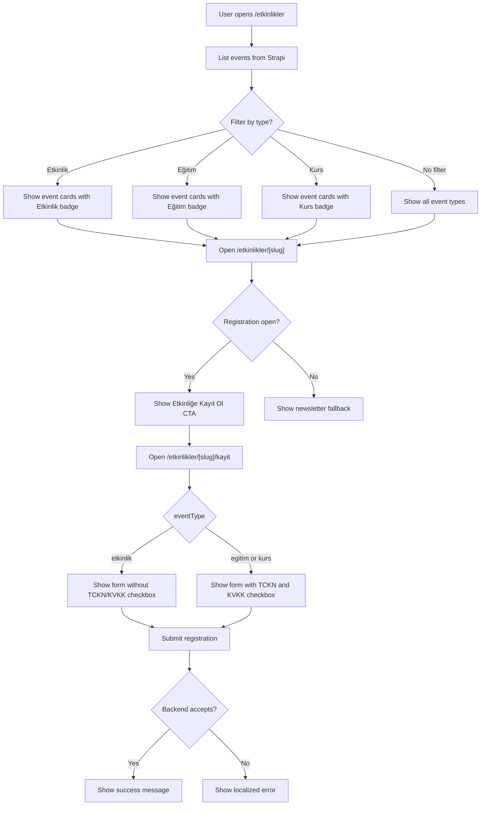
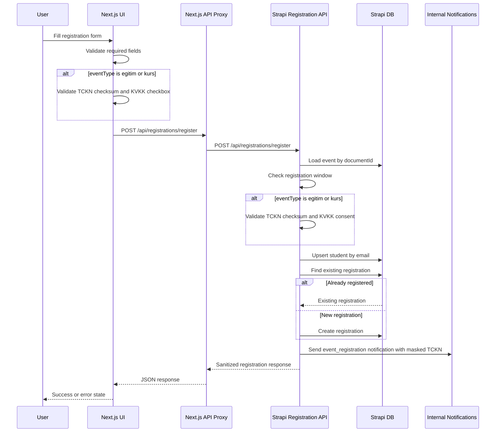
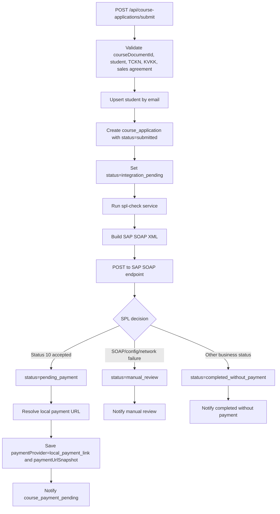
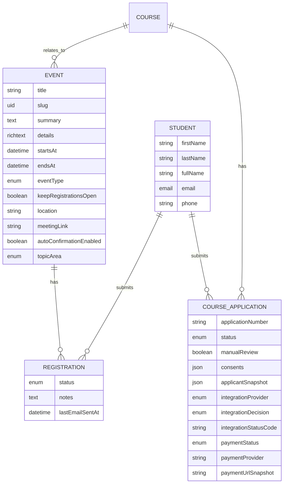

# Etkinlik Feature README

Last updated: 2026-05-11

This document is the feature entrypoint for the `Etkinlikler` surface. It explains what users see in the UI, what is persisted in Strapi, where TCKN / SAP SOAP / payment behavior belongs, and which parts are intentionally not part of event registration.

## Current Scope

The event feature is a registration-focused content surface:

- List events at `/etkinlikler`.
- Filter by event type: `etkinlik`, `egitim`, `kurs`.
- Show event details at `/etkinlikler/[slug]`.
- Accept event registrations at `/etkinlikler/[slug]/kayit` when registration is open.
- Save the attendee as a `student` and save the event signup as a `registration`.
- Send internal notification for a completed registration.

The event registration flow does not run the SAP SOAP SPL check and does not start payment. SAP SOAP and payment-link behavior currently belong to the separate course application flow.

## Source Map

Frontend:

- Event fetching/types: `frontend/src/lib/strapi-events.ts`, `frontend/src/lib/strapi-types.ts`
- Event type labels: `frontend/src/lib/content-taxonomy.ts`
- Event list: `frontend/src/app/[locale]/etkinlikler/page.tsx`
- Event detail: `frontend/src/app/[locale]/etkinlikler/[slug]/page.tsx`
- Event registration page: `frontend/src/app/[locale]/etkinlikler/[slug]/kayit/page.tsx`
- Registration form: `frontend/src/components/event-registration-form.tsx`
- Registration form state/validation: `frontend/src/hooks/use-event-registration-form.ts`
- Frontend proxy route: `frontend/src/app/[locale]/api/registrations/register/route.ts`

Backend:

- Event schema: `backend/src/api/event/content-types/event/schema.json`
- Event registration status endpoint: `backend/src/api/event/controllers/event.ts`
- Registration open helper: `backend/src/utils/event-registration.ts`
- Registration endpoint: `backend/src/api/registration/routes/custom-registration.ts`
- Registration controller/service: `backend/src/api/registration/controllers/registration.ts`, `backend/src/api/registration/services/registration.ts`
- Student schema/service: `backend/src/api/student/content-types/student/schema.json`, `backend/src/api/student/services/student.ts`
- Registration schema: `backend/src/api/registration/content-types/registration/schema.json`

Adjacent course application integration:

- Course application endpoint/service: `backend/src/api/course-application/controllers/course-application.ts`, `backend/src/api/course-application/services/course-application.ts`
- SAP SOAP SPL service: `backend/src/services/spl-check/`
- Course application status mapping: `backend/src/services/course-application/domain/course-application-status.ts`

## Event Types

`eventType` is stored on the Strapi `event` content type as an enum:

```txt
etkinlik | egitim | kurs
```

| Type | UI label | UI behavior | Registration fields shown | Backend validation | DB persistence |
| --- | --- | --- | --- | --- | --- |
| `etkinlik` | `Etkinlik` | Appears in listing/detail with event badge, date, optional end date, location, summary/details, and registration CTA when open. | `firstName`, `lastName`, `email`, optional `phone`, optional `notes`. No TCKN field. No KVKK checkbox in the current form. | Requires event to exist and registration to be open. Does not require TCKN or KVKK consent. | Upserts `student`; creates or reuses `registration` for the event/student pair. |
| `egitim` | `Eğitim` | Same event listing/detail shell, but classified as an education-type event. | `firstName`, `lastName`, `email`, optional `phone`, required `tckn`, optional `notes`, required KVKK checkbox. | Requires event to exist, registration to be open, valid TCKN checksum, and `kvkkConsent === true`. | Upserts `student`; creates or reuses `registration`. Raw TCKN is not saved in `student` or `registration`. |
| `kurs` | `Kurs` | Same event listing/detail shell, but classified as a course-type event. | Same as `egitim`: TCKN and KVKK checkbox are required. | Same as `egitim`. | Same as `egitim`. Raw TCKN is not saved in `student` or `registration`. |

Important distinction: `egitim` / `kurs` event registration currently asks for and validates TCKN locally, but it still does not call SAP SOAP. The SAP SOAP SPL check is only implemented in course applications.

## What We Show In The UI

### `/etkinlikler`

The list page shows:

- Hero title and description from `frontend/src/messages/*`.
- Filter chips for `Etkinlik`, `Eğitim`, `Kurs`.
- Sort toggle for `startsAt` ascending/descending.
- Cards with:
  - Event type label.
  - Title.
  - Summary or fallback empty text.
  - Start date/time.
  - Optional end date/time.
  - Optional location.

The data query reads:

- `title`
- `slug`
- `summary`
- `startsAt`
- `eventType`
- `endsAt`
- `keepRegistrationsOpen`
- `location`
- `topicArea`
- related `course.title`, `course.slug`, `course.topicArea`

### `/etkinlikler/[slug]`

The detail page shows:

- Breadcrumbs.
- Event title.
- Summary.
- Rich text details.
- Information panel with title, start/end date, and location.
- `Etkinliğe Kayıt Ol` CTA when registration is open.
- Newsletter fallback when registration is closed.

Registration is considered open when:

- `keepRegistrationsOpen` is `true`; or
- current time is earlier than `startsAt - 24 hours`.

### `/etkinlikler/[slug]/kayit`

The registration page shows:

- Same event context and logistics.
- Open/closed state.
- Registration form only if registration is open.
- Closed-state message if registration is closed.

The form dynamically changes by `eventType`:

- `etkinlik`: no TCKN input, no KVKK checkbox.
- `egitim` / `kurs`: TCKN input and KVKK checkbox are required.

## What We Save In The DB

### `events`

Stores the editorial/event object:

- `title`
- `slug`
- `summary`
- `details`
- `startsAt`
- `endsAt`
- `eventType`
- `keepRegistrationsOpen`
- `location`
- `meetingLink`
- `autoConfirmationEnabled`
- `topicArea`
- relation to `course`
- relation to `registrations`

### `students`

Stores the attendee identity:

- `firstName`
- `lastName`
- `fullName`
- `email`
- `phone`
- relation to `registrations`
- relation to `courseApplications`

Current event registration does not save TCKN on `student`.

### `registrations`

Stores the event signup:

- `status`: `pending`, `confirmed`, `cancelled`, `waitlisted`, `attended`
- `notes`
- `lastEmailSentAt`
- relation to `student`
- relation to `event`

Duplicate registration is prevented by checking the existing event/student relation and by the database unique index on `(student_id, event_id)`.

### TCKN In Event Registration

For `egitim` and `kurs`, TCKN is:

- normalized and validated on the frontend;
- validated again on the backend;
- masked in internal notification payloads;
- not persisted in `students`;
- not persisted in `registrations`.

## SAP SOAP, TCKN, And Payment Boundary

There are two separate flows:

1. Event registration.
2. Course application.

Event registration uses TCKN only as a local checksum validation gate for `egitim` / `kurs`. It does not call SAP SOAP, does not create a course application, and does not create a payment session.

Course application owns the SAP SOAP SPL check:

- Endpoint: `POST /api/course-applications/submit`
- TCKN is required and validated.
- TCKN is stored only as `applicantSnapshot.tcknHash`.
- SAP SOAP provider is recorded as `integrationProvider = "sap_soap"`.
- SAP status `10` maps to `pending_payment`.
- SOAP failure maps to `manual_review`.
- Other SOAP statuses map to `completed_without_payment`.

## Iyzico Status

There is no iyzico integration in the current codebase.

Current course application payment behavior is payment-link based:

- `paymentProvider` is saved as `local_payment_link` when the application reaches `pending_payment`.
- `paymentUrlSnapshot` stores the resolved URL.
- The URL is resolved from `COURSE_APPLICATION_PAYMENT_URL` or an injected template.
- There is no iyzico checkout token, payment callback, webhook verification, or provider transaction ID in the current implementation.

If iyzico is added later, it should attach to the course application payment boundary, not directly to event registration. The minimum additional persistence should include provider name, provider session/token/reference, payment state, callback/audit metadata, and a verified transition from `pending` to `paid` / `failed` / `cancelled`.

## User Flow



## Event Registration Data Flow



## Course Application SPL And Payment Flow

This flow is shown here because it is often confused with event registration.



## Persistence Boundary Diagram



## Operational Notes

- Event read access is public via Strapi bootstrap permissions.
- Registration submit is public through the custom `POST /api/registrations/register` endpoint.
- Registration status is public through `GET /api/events/:documentId/registration-status`.
- Registration status must be checked on the backend even if the UI already hides the form.
- Do not add raw request-body logging around event registration because attendee PII can include email, phone, and TCKN.
- Keep event registration and course application payment/SPL behavior separate unless a future product decision explicitly merges them.

