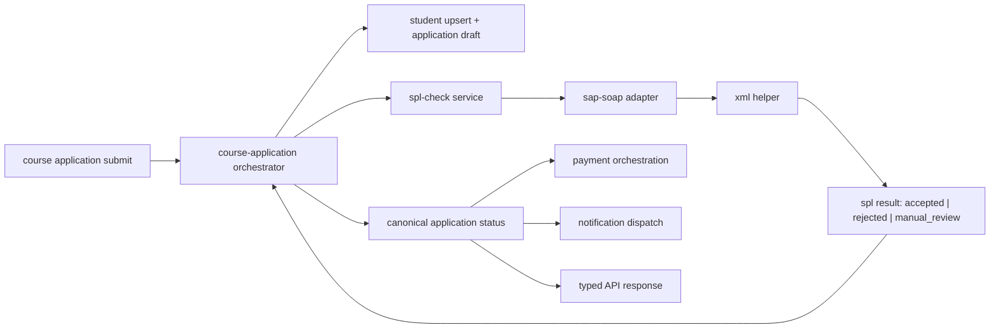
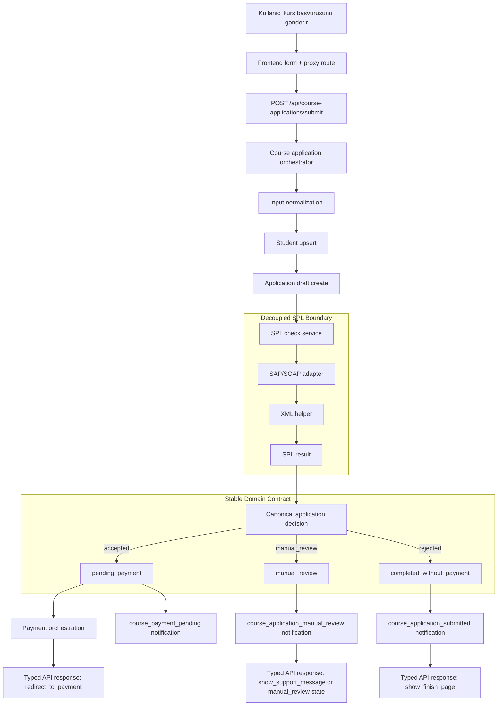

# feat: Integrate decoupled SPL check into course application workflow

## Overview

Bu plan, legacy `splCheck` davranisini yeni `netas_academy` yapisina dogrudan UI flag veya course application service icine gomulu SOAP kodu olarak tasimadan entegre etmeyi tanimlar. Hedef, SPL sonucunu course application submit orkestrasyonunda kullanmak; fakat entegrasyon detayini basit bir `spl-check service -> sap-soap adapter` ayrimi ile domain'den ayirmaktir.

## Problem Frame

Repo icindeki mevcut spec'ler course application, payment, notification ve SAP/SOAP entegrasyonunu ayri sorumluluklar olarak tanimliyor; fakat `splCheck` halen legacy kontrol akisinin bir parcasi olarak tarifli. Yeni sistemde frontend `splCheck` veya `manuelCheck` flag okumamali; backend typed bir `integration` sonucu ve `nextAction` donmeli. Bu nedenle ihtiyac, SPL check kararini application service'in icine gommeden, sade ama temiz bir servis ayrimi ile sisteme baglamaktir.

## Requirements Trace

- R1. SPL check sonucu UI flag yerine typed domain karari olarak modellenmeli.
- R2. Course application submit orkestrasyonu SPL sonucunu kullanmali, fakat SPL implementasyonu application service'e dogrudan gomulmemeli.
- R3. Harici provider degisikligi veya SOAP entegrasyon detaylari, application orchestration katmanini yeniden yazmayi gerektirmemeli.
- R4. Manual review, accepted ve completed-without-payment dallari backend tarafinda tek bir canonical decision modeline map edilmelidir.
- R5. Notification ve payment tetikleri application status/nextAction uzerinden calismali; `splCheck` benzeri field'lar frontend'e sizmamalidir.
- R6. Integration failures audit/log olarak korunmali, fakat ana transaction modelini anlamsiz sekilde bloklamamalidir.

## Scope Boundaries

- Event registration akisina degisiklik yapilmasi bu planin disindadir.
- Contact submission akisina degisiklik yapilmasi bu planin disindadir.
- Gercek payment provider implementasyonu bu planin odagi degildir; sadece SPL sonucunun payment orchestration ile contract'i tanimlanir.
- Admin panel UI'si veya manuel inceleme backoffice ekranlari bu planin disindadir.

### Deferred to Separate Tasks

- Gercek SAP/SOAP credential, endpoint ve operational rollout ayarlari: ayri environment/ops gorevi olarak ele alinmali.
- Manual review durumunda kullanicinin odemeye devam edip etmeyecegi product karari: ayri karar veya follow-up plan olarak netlestirilmeli.

## Context & Research

### Relevant Code and Patterns

- `backend/src/api/registration/services/registration.ts`: backend orchestrator -> persistence -> notification akisini ince, feature logic'in controller yerine service'te tutuldugu pattern.
- `backend/src/api/contact-submission/services/contact-submission.ts`: normalized input + create + non-blocking notification pattern'i.
- `backend/src/services/internal-notifications/service-core.ts`: adapter-style dependency injection ile decoupled service-core pattern'i.
- `frontend/src/app/api/registrations/register/route.ts`: frontend route proxy pattern'i; UI'nin Strapi endpoint detayini bilmeden typed response tuketmesine uygun.

### Institutional Learnings

- Bu repo icin acik migration siniri: `event registration`, `contact submission`, `student`, notification routing, frontend proxy route/hook pattern korunur; Unity UI flag'leri (`splCheck`, `manuelCheck`) discard edilir.
- SOAP tarafinda basari esigi `<Status> == "10"` olarak korunmali, fakat sonucu typed application state ve `nextAction` kontratina map edilmelidir.

### External References

- Harici arastirma yapilmadi. Mevcut repo spec'leri ve var olan service pattern'leri bu plan icin yeterli yerel zemin sagliyor.

## Key Technical Decisions

- SPL check, `course-application` service'in icinde inline `if/else + fetch + XML parse` olarak yazilmayacak; `spl-check service -> sap-soap adapter -> xml helper` ayrimi kurulacak.
- `sap-soap adapter` provider sonucunu `accepted | rejected | manual_review` kararina ve `statusCode` bilgisine normalize edecek; `course-application` service bu sonucu kendi domain state'ine map edecek.
- `course-application` service yalnizca `decision`, `statusCode`, `rawResponse` veya `errorReason` gibi typed bilgiler tuketecek; SOAP body, endpoint veya parser detaylarini bilmeyecek.
- Non-blocking operational yan etkiler korunacak: notification send failure loglanir, ama application state rollback edilmez.
- Frontend sadece `status`, `manualReview`, `integration.decision`, `nextAction`, `paymentUrl` gibi alanlari gorecek; legacy flag isimleri contract'a alinmayacak.

## Open Questions

### Resolved During Planning

- SPL check nereye entegre edilmeli: `course-application` submit orkestrasyonuna, fakat SOAP kodu ayri `spl-check service` altinda kalmali.
- SOAP sonucu nasil modele alinmali: adapter `accepted`, `manual_review`, `rejected` ve `statusCode` donmeli; application service bunlari canonical application state'e map etmeli.
- Frontend ne bilmeli: yalnizca application outcome ve `nextAction`; provider veya XML detaylari bilinmemeli.

### Deferred to Implementation

- `Status != "10"` dalinin kesin canonical state'i `completed_without_payment` mi yoksa baska daha acik bir enum mu olacak: implementasyon sirasinda mevcut product karariyla netlestirilmeli.
- Manual review durumunda kullaniciya `show_support_message` mi yoksa `continue_to_payment` mi donulecek: plan bunu ayrik decision hook'u olarak koruyor, ama nihai product secimi implementasyon oncesi netlesmeli.
- Integration log ayri content type mi olacak yoksa ilk fazda application uzerindeki snapshot alanlari yeterli mi: veri hacmi ve audit ihtiyacina gore netlestirilmeli.

## High-Level Technical Design

> *This illustrates the intended approach and is directional guidance for review, not implementation specification. The implementing agent should treat it as context, not code to reproduce.*

Bu tasarimda `spl-check service` application domain ile SOAP entegrasyonu arasindaki stabil seam'dir. SOAP istegi veya XML parse mantigi degistiginde `course-application` service degismez; application status mapping'i ise yine domain katmaninda kalir.

## Flow Chart

> *This chart is a review aid for the intended boundary split. It is directional guidance, not implementation specification.*

## Implementation Units

- [ ] **Unit 1: Define the minimal SPL result contract**

**Goal:** SPL check servisinin course application tarafina dondurecegi minimum typed sonucu tanimlamak.

**Requirements:** R1, R2, R3, R4

**Dependencies:** None

**Files:**
- Create: `backend/src/services/spl-check/types.ts`
- Create: `backend/src/services/course-application/domain/course-application-status.ts`
- Modify: `docs/superpowers/specs/2026-04-21-course-application-workflow.md`
- Modify: `docs/superpowers/specs/2026-04-21-sap-soap-integration.md`
- Test: `backend/tests/services/spl-check/types.test.ts`

**Approach:**
- SPL service'in dondugu sonucu sade tut: `decision`, `statusCode`, `rawResponse`, `errorReason`.
- `accepted`, `manual_review`, `rejected` kararlarini ve bunlardan tureyen `application status` ile `nextAction` kombinasyonlarini course application tarafinda topla.
- `splCheck` ve `manuelCheck` gibi legacy isimleri sadece mapping notu olarak dokumanda tut; yeni TypeScript surface'ine tasima.

**Patterns to follow:**
- `backend/src/services/internal-notifications/types.ts`
- `docs/superpowers/specs/2026-04-21-course-application-workflow.md`

**Test scenarios:**
- Happy path: `statusCode = "10"` dondugunde SPL result `accepted` olur.
- Edge case: `statusCode = null` ve parse metadata mevcut oldugunda SPL result `manual_review` olur.
- Error path: SOAP technical failure modeli `manual_review` ve `errorReason` ile temsil edilir.
- Integration: `accepted`, `manual_review`, `rejected` sonucunun her biri beklenen application `status` ve `nextAction` kombinasyonuna cozulur.

**Verification:**
- Course application orkestrasyonu artik SPL sonucunu legacy flag ile degil, tek bir sade servis kontrati ile tuketebilir.

- [ ] **Unit 2: Build the simple SPL service and SAP/SOAP adapter**

**Goal:** Application service'ten bagimsiz calisan sade SPL check katmanini kurmak.

**Requirements:** R2, R3, R6

**Dependencies:** Unit 1

**Files:**
- Create: `backend/src/services/spl-check/service.ts`
- Create: `backend/src/services/spl-check/sap-soap-adapter.ts`
- Create: `backend/src/services/spl-check/xml.ts`
- Create: `backend/src/services/spl-check/config.ts`
- Test: `backend/tests/services/spl-check/service.test.ts`
- Test: `backend/tests/services/spl-check/sap-soap-adapter.test.ts`
- Test: `backend/tests/services/spl-check/xml.test.ts`

**Approach:**
- `service.ts` course application tarafinin tek cagiracagi public giris noktasi olsun.
- `sap-soap-adapter.ts` request/response ve SOAP call ile ilgilensin; normalize `SplCheckResult` donsun.
- XML parsing ayrik modulde olsun; adapter parse'i inline yapmasin.
- Config/credential okuma mantigi `config.ts` icinde toplansin; application service env detaylarini bilmesin.

**Execution note:** Start with failing backend service tests for accepted/manual-review/parse-failure branches before writing the adapter.

**Patterns to follow:**
- `backend/src/services/internal-notifications/strapi-service.ts`
- `docs/superpowers/specs/2026-04-21-sap-soap-integration.md`

**Test scenarios:**
- Happy path: SAP/SOAP adapter gecerli XML ve `Status == "10"` aldiginda `accepted` sonucu doner.
- Edge case: response icinde beklenen alanlarin sirasi degisse bile parser dogru `Status` degerini cikarir.
- Error path: network/protocol hatasinda adapter structured failure result doner, throw ile orchestration'i kirmaz.
- Error path: `<Status>` bulunamazsa parse failure result doner ve raw snapshot audit metadata icinde korunur.
- Integration: `service.ts` konfigden endpoint/credential alip adapter'i calistirir.

**Verification:**
- SPL capability artik `course-application` olmadan da test edilebilir ve application service SOAP detaylarini bilmez.

- [ ] **Unit 3: Orchestrate SPL decisions inside course application submission**

**Goal:** Course application submit akisinin SPL gateway sonucuna gore status, nextAction ve persistence kararlarini vermesi.

**Requirements:** R1, R2, R4, R5, R6

**Dependencies:** Unit 1, Unit 2

**Files:**
- Create: `backend/src/api/course-application/content-types/course-application/schema.json`
- Create: `backend/src/api/course-application/controllers/course-application.ts`
- Create: `backend/src/api/course-application/routes/course-application.ts`
- Create: `backend/src/api/course-application/routes/custom-course-application.ts`
- Create: `backend/src/api/course-application/services/course-application.ts`
- Modify: `backend/src/api/student/services/student.ts`
- Test: `backend/tests/api/course-application/service.test.ts`
- Test: `backend/tests/api/course-application/routes.test.ts`

**Approach:**
- Submit orkestrasyonu sirasiyla normalize input, student upsert, application draft create, SPL service call, application status mapping ve final persistence yapsin.
- `manualReview`, `integrationDecision`, `integrationStatusCode`, `integrationProvider`, `paymentStatus` gibi alanlar application kaydinda domain snapshot olarak dursun.
- Provider result'in ham hali gerekiyorsa application kaydina kisa audit snapshot ya da ayri log relation ile yazilsin; controller icinde branching yapilmasin.
- Duplicate kuralinin event registration'daki gibi domain service seviyesinde kalmasina dikkat et.

**Patterns to follow:**
- `backend/src/api/registration/services/registration.ts`
- `backend/src/api/contact-submission/services/contact-submission.ts`
- `docs/superpowers/specs/2026-04-21-course-application-implementation-outline.md`

**Test scenarios:**
- Happy path: yeni applicant ve `accepted` SPL sonucu ile application `pending_payment` olur.
- Happy path: `rejected` SPL sonucu ile application `completed_without_payment` olur ve payment bilgisi donmez.
- Edge case: ayni ogrenci ve ayni kurs icin aktif application varsa duplicate error doner.
- Error path: SPL technical failure oldugunda application `manual_review` olarak kaydolur ve response `nextAction` kullaniciyi bloklamayan bir fallback doner.
- Integration: student upsert sonucu application kaydina baglanir ve application response canonical integration objesini icerir.

**Verification:**
- Submit endpoint'i frontend'e artik legacy entegrasyon detaylarini sizdirmadan karar verebilir bir response dondurur.

- [ ] **Unit 4: Keep payment and notification reactions downstream of canonical status**

**Goal:** SPL sonucunun yarattigi dallanmalarin payment ve notification katmanlarina dogru, fakat gevsek bagimli sekilde aktarilmasi.

**Requirements:** R4, R5, R6

**Dependencies:** Unit 3

**Files:**
- Modify: `backend/src/index.ts`
- Modify: `backend/src/services/internal-notifications/types.ts`
- Modify: `backend/src/services/internal-notifications/templates.ts`
- Modify: `backend/src/services/internal-notifications/keys.ts`
- Create: `backend/src/services/course-application/payment-orchestration.ts`
- Test: `backend/tests/services/internal-notifications/templates.test.ts`
- Test: `backend/tests/api/course-application/payment-orchestration.test.ts`
- Test: `backend/tests/scripts/course-application-notification-routing-seed.test.ts`

**Approach:**
- Notification trigger'lari `course_application_submitted`, `course_application_manual_review`, `course_payment_pending` anahtarlarina canonical `status`/`decision` uzerinden baglansin.
- Payment link/session secimi SPL check sonucuna degil, application'in canonical state'ine bagli olsun.
- Notification/payout yan etkileri ana submit transaction'ini anlamsiz rollback etmeyecek sekilde loglanip devam etsin.

**Patterns to follow:**
- `backend/src/services/internal-notifications/service-core.ts`
- `docs/superpowers/specs/2026-04-21-notification-dispatch.md`
- `docs/superpowers/specs/2026-04-21-payment-orchestration.md`

**Test scenarios:**
- Happy path: application `pending_payment` oldugunda payment orchestration uygun payment URL doner ve `course_payment_pending` notification payload'i kurulabilir.
- Happy path: application `manual_review` oldugunda manuel inceleme notification'i dogru key ile tetiklenir.
- Edge case: notification routing disabled oldugunda application submit basarili kalir.
- Error path: email send failure loglanir ve application status degismez.
- Integration: payment orchestration application state'ten calisir; SPL sonucu dogrudan okumaz.

**Verification:**
- Downstream payment ve notification davranislari SPL provider'a degil, application state kontratina baglanmis olur.

- [ ] **Unit 5: Expose only the stable frontend contract**

**Goal:** Frontend'in SPL check detaylarini bilmeden yeni submit contract'ini consume etmesini saglamak.

**Requirements:** R1, R5

**Dependencies:** Unit 3, Unit 4

**Files:**
- Create: `frontend/src/app/api/course-applications/submit/route.ts`
- Create: `frontend/src/lib/course-application.ts`
- Create: `frontend/src/hooks/use-course-application-form.ts`
- Create: `frontend/src/components/course-application-form.tsx`
- Test: `frontend/src/lib/course-application.test.ts`

**Approach:**
- Frontend route handler mevcut registration/contact pattern'i gibi Strapi custom endpoint'ine ince proxy olsun.
- UI branching `status`, `manualReview`, `integration.decision`, `nextAction`, `paymentUrl` uzerinden yapilsin.
- `splCheck`, `manuelCheck`, `Status == "10"` gibi legacy kavramlar frontend codebase'ine alinmasin.

**Patterns to follow:**
- `frontend/src/app/api/registrations/register/route.ts`
- `frontend/src/app/api/contact-submissions/submit/route.ts`

**Test scenarios:**
- Happy path: backend `pending_payment` response'u verdiginde frontend typed parser payment step bilgilerini cikarir.
- Happy path: backend `manual_review` response'u verdiginde UI state fallback mesajina gecer.
- Error path: backend error envelope dondurdugunde hook human-readable hata state'i uretir.
- Integration: frontend proxy route backend response'u shape bozmadan iletir.

**Verification:**
- Frontend, backend'in canonical outcome contract'ini tuketir; provider detayi veya legacy flag bilgisi UI'ya sizmaz.

## System-Wide Impact

- **Interaction graph:** `course application submit -> student upsert -> SPL gateway -> decision evaluator -> application persistence -> payment orchestration -> notification dispatch`.
- **Interaction graph:** `course application submit -> student upsert -> spl-check service -> sap-soap adapter -> application persistence -> payment orchestration -> notification dispatch`.
- **Error propagation:** provider/network/parser hatalari application service'e typed failure olarak donmeli; beklenmeyen programlama hatalari disinda hard throw ile user flow kirilmamali.
- **State lifecycle risks:** draft application yaratip SPL sonucunu beklerken yarim-kayit riski vardir; create/update siniri acik kurulmalidir.
- **API surface parity:** gelecekte `lookup-by-tckn` ve `create-payment-session` endpoint'leri ayni canonical application state modelini kullanmalidir.
- **Integration coverage:** service test'leri tek basina yeterli degil; submit service ile payment/notification reaction kombinasyonlari da test edilmelidir.
- **Unchanged invariants:** event registration ve contact submission akislari mevcut service-core + route proxy pattern'leri ile calismaya devam eder; SPL check onlara tasinmaz.

## Risks & Dependencies

| Risk | Mitigation |
|------|------------|
| SOAP parsing kurallari belirsiz veya kirilgan kalir | XML parse'i ayri modulde test et, raw string split mantigini geri getirme |
| Application service yeniden legacy monolite doner | SPL service, SOAP adapter ve XML helper sinirlarini ayri dosya ve testlerle zorunlu kil |
| Manual review davranisi product'ta net degil | `nextAction` karari ayri mapping noktasi olarak tutulup implementasyon oncesi netlestir |
| Notification ve payment SPL sonucuna dogrudan baglanir | Downstream logic'i canonical application status uzerine kur |
| Audit ihtiyaci artarsa application modeli sisebilir | Gerekirse ikinci fazda `integration-log` content type ayiracak sekilde seam birak |

## Documentation / Operational Notes

- `docs/superpowers/specs/2026-04-21-course-application-workflow.md` ve `docs/superpowers/specs/2026-04-21-sap-soap-integration.md` yeni canonical decision boundary'yi acikca gosterecek sekilde guncellenmeli.
- Environment variable isimleri ve credential yonetimi kodla birlikte degil, ayri deploy/runbook dokumaniyla netlestirilmeli.
- TCKN veya raw SOAP payload iceren log'larda redaction policy basindan tanimlanmali.

## Sources & References

- Related code: `backend/src/api/registration/services/registration.ts`
- Related code: `backend/src/api/contact-submission/services/contact-submission.ts`
- Related code: `backend/src/services/internal-notifications/service-core.ts`
- Related code: `frontend/src/app/api/registrations/register/route.ts`
- Related spec: `docs/superpowers/specs/2026-04-21-course-application-workflow.md`
- Related spec: `docs/superpowers/specs/2026-04-21-sap-soap-integration.md`
- Related spec: `docs/superpowers/specs/2026-04-21-course-application-implementation-outline.md`
- Related spec: `docs/superpowers/specs/2026-04-21-notification-dispatch.md`
- Related spec: `docs/superpowers/specs/2026-04-21-payment-orchestration.md`
