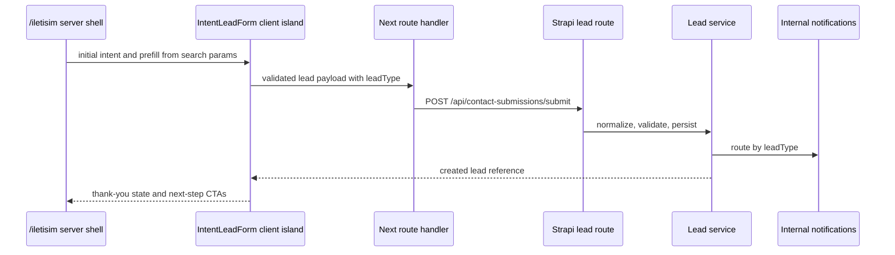

# refactor: Build intent-based lead architecture

## Overview

Replace the single generic contact form with a tabbed, intent-based lead flow on `/iletisim`. The page shell stays server-rendered, while one client form island owns tab selection, validation, submit lifecycle, success state, and context prefill.

## Problem Frame

The current `/iletisim` surface mixes corporate training requests, instructor applications, solution partner applications, and general contact in one undifferentiated form. The origin document sets corporate training as the primary conversion while preserving the other intents as visible secondary paths (see origin: `docs/brainstorms/2026-04-21-niyet-bazli-basvuru-mimarisi-requirements.md`).

## Requirements Trace

- R1. Render four visible tabs: `Kurumsal Eğitim Talebi`, `Eğitmen Başvurusu`, `Çözüm Ortağı Başvurusu`, `Genel İletişim`.
- R2. Default to `Kurumsal Eğitim Talebi`, with deep links from content pages opening the right tab.
- R3. Persist a `leadType` and limited `status` enum on the backend, using `fullName` instead of `firstName` and `lastName`.
- R4. Keep type-specific fields lightweight and text-based in the first version.
- R5. Preserve the server-rendered page shell and limit `use client` to the interactive form island.
- R6. Add measurable interaction hooks for tab views, starts, submits, contextual entries, catalog clicks, and related-content clicks.

## Scope Boundaries

- No payment flow, meeting scheduling, CRM automation, lead scoring, file upload, or event-registration redesign.
- Backend attribution fields such as `contextType` and `contextSlug` are out of first-version scope; context is used for frontend tab/prefill only.
- Catalog PDF content is assumed to exist or be added as a static asset separately.

## Context & Research

### Relevant Code and Patterns

- `frontend/src/app/iletisim/page.tsx` is already a server component shell.
- `frontend/src/components/contact-form.tsx` and `frontend/src/hooks/use-contact-form.ts` are the current client form split.
- `frontend/src/app/api/contact-submissions/submit/route.ts` proxies submissions to Strapi.
- `backend/src/api/contact-submission/*` follows the controller-validates / service-orchestrates pattern.
- `backend/src/services/internal-notifications/*` provides routable internal notification patterns.

### Institutional Learnings

- Prior contact work established the App Router proxy -> Strapi custom route -> Strapi service pattern.
- Prior course-application work favored typed backend decisions over UI-only flags; this plan follows that with `leadType` and `status`.

## Key Technical Decisions

- Evolve `contact-submission` into the lead model in place, not a parallel model: the origin document names existing contact infrastructure as the migration surface and this avoids duplicate admin queues.
- Use query parameters for deep links, for example `/iletisim?intent=corporate_training_request&topic=<slug-or-title>`: this preserves SSR, is shareable, and avoids hash-only state.
- Add `react-hook-form`, `zod`, and the resolver package only in the frontend form island: the validation requirement is explicit, but the client boundary must stay narrow.
- Keep notification routing keyed by lead intent: it fits the existing `notification-routing` table and keeps ownership operationally visible.
- Treat analytics as a local helper contract first; if the measurement-spine plan lands first, use that tracker instead of hard-coded event handling.

## Open Questions

### Resolved During Planning

- Deep-link pattern: use query parameters because they are server-visible, shareable, and easier to test than hash state.
- Analytics dependency: add event hooks in the UI, but let the measurement-spine implementation decide the final transport.

### Deferred to Implementation

- Exact Turkish helper copy for each tab: preserve the origin intent and final copy can be tuned while implementing the component.
- Catalog PDF path: wire to the final static or CMS asset once it exists.

## High-Level Technical Design

> *This illustrates the intended approach and is directional guidance for review, not implementation specification. The implementing agent should treat it as context, not code to reproduce.*

## Implementation Units

- [ ] **Unit 1: Backend lead contract**

**Goal:** Extend the contact-submission model and service into a lead-ready contract.

**Requirements:** R3, R4

**Dependencies:** None

**Files:**
- Modify: `backend/src/api/contact-submission/content-types/contact-submission/schema.json`
- Modify: `backend/src/api/contact-submission/controllers/contact-submission.ts`
- Modify: `backend/src/api/contact-submission/services/contact-submission.ts`
- Modify: `backend/src/services/internal-notifications/keys.ts`
- Modify: `backend/src/services/internal-notifications/templates.ts`
- Modify: `backend/src/index.ts`
- Test: `backend/tests/api/contact-submission/service.test.ts`
- Test: `backend/tests/internal-notifications/templates.test.ts`

**Approach:**
- Add `leadType`, `status`, `fullName`, and optional type-specific text fields while preserving existing fields only as needed for transition.
- Limit `leadType` to `corporate_training_request`, `instructor_application`, `solution_partner_application`, and `general_contact`.
- Limit `status` to `new`, `contacted`, and `closed` for the first version.
- Normalize `fullName`, email, phone, optional company, and message in the service.

**Patterns to follow:**
- `backend/src/api/contact-submission/services/contact-submission.ts`
- `backend/src/api/registration/services/registration.ts`
- `backend/src/services/internal-notifications/templates.ts`

**Test scenarios:**
- Happy path: corporate training lead with `interestTopic` persists as `leadType=corporate_training_request` and `status=new`.
- Happy path: instructor lead with `expertiseAreas` persists and routes to the instructor notification key.
- Edge case: extra whitespace in `fullName`, email, and message is normalized before persistence.
- Error path: missing required type-specific field rejects with a validation error.
- Integration: notification delivery failure logs an error but does not fail lead persistence.

**Verification:**
- Lead records can be created through the custom route with each supported `leadType`.
- Internal notification payloads include the intent and the relevant type-specific field.

- [ ] **Unit 2: Frontend form island and validation**

**Goal:** Replace the generic contact form with a single client orchestration layer and intent-specific field sections.

**Requirements:** R1, R2, R4, R5

**Dependencies:** Unit 1

**Files:**
- Modify: `frontend/package.json`
- Modify: `frontend/package-lock.json`
- Modify: `frontend/src/components/contact-form.tsx`
- Modify: `frontend/src/hooks/use-contact-form.ts`
- Create: `frontend/src/components/contact/intent-lead-form.tsx`
- Create: `frontend/src/components/contact/intent-field-sections.tsx`
- Create: `frontend/src/lib/lead-intents.ts`
- Modify: `frontend/src/app/api/contact-submissions/submit/route.ts`
- Test: `frontend/src/__tests__/intent-lead-form-source.test.mjs`

**Approach:**
- Keep one `use client` entry for the full tabbed form.
- Use `react-hook-form` and a Zod discriminated union keyed by `leadType`.
- Render small field-section components with no fetch ownership.
- Show intent-specific success states; corporate success includes catalog and related content CTAs.

**Patterns to follow:**
- Existing `ContactForm` field classes and legal/KVKK copy.
- `frontend/src/components/ui/*` primitives.

**Test scenarios:**
- Happy path: default render opens `Kurumsal Eğitim Talebi`.
- Happy path: changing tabs changes visible required fields without remounting the server shell.
- Edge case: `?intent=solution_partner_application` opens the solution partner tab.
- Error path: corporate submit without `interestTopic` shows local validation instead of submitting.
- Integration: submitted payload includes `leadType` and does not include frontend-only context attribution fields.

**Verification:**
- The `/iletisim` page remains a server component and only the form island is client-side.
- All four tabs can submit through the same proxy route.

- [ ] **Unit 3: Contextual CTAs and prefill**

**Goal:** Send users from course, event, and related content pages into the correct intent with useful prefilled context.

**Requirements:** R2, R4

**Dependencies:** Unit 2

**Files:**
- Modify: `frontend/src/app/egitimler/[slug]/page.tsx`
- Modify: `frontend/src/app/etkinlikler/[slug]/page.tsx`
- Modify: `frontend/src/app/page.tsx`
- Modify: `frontend/src/app/hakkimizda/page.tsx`
- Modify: `frontend/src/lib/lead-intents.ts`
- Test: `frontend/src/__tests__/intent-lead-links-source.test.mjs`

**Approach:**
- Add helper functions for intent lead URLs so all CTA sources encode intent and prefill consistently.
- Route corporate training CTAs to the corporate tab and prefill topic/interest text from the source title.
- Preserve event registration CTAs; the contact lead flow is not a replacement for `/etkinlikler/[slug]/kayit`.

**Patterns to follow:**
- Existing route-level server components and `Link` usage.
- The accepted Turkish IA: `/egitimler`, `/etkinlikler`, `/iletisim`.

**Test scenarios:**
- Happy path: course detail CTA creates `/iletisim?intent=corporate_training_request&...`.
- Happy path: home hero primary CTA targets the corporate intent.
- Edge case: event detail keeps `Etkinliğe Kayıt Ol` when registration is open.
- Integration: contextual entry opens the expected tab and prepopulates the relevant editable field.

**Verification:**
- Users never land on a blank generic form from primary education CTAs.

- [ ] **Unit 4: Measurement hooks and thank-you next steps**

**Goal:** Expose observable lead-flow behavior without choosing a final analytics vendor inside this feature.

**Requirements:** R5, R6

**Dependencies:** Unit 2

**Files:**
- Create: `frontend/src/lib/analytics-events.ts`
- Modify: `frontend/src/components/contact/intent-lead-form.tsx`
- Test: `frontend/src/__tests__/lead-analytics-events-source.test.mjs`

**Approach:**
- Emit domain-first event calls for tab view, tab change, form start, submit success/fail, contextual entry, catalog click, and related-content click.
- Avoid form values in event properties.
- Keep the helper transport swappable so the measurement-spine plan can replace it.

**Patterns to follow:**
- Domain-first event names from `docs/brainstorms/2026-04-27-olcum-omurgasi-ve-basari-tanimi-requirements.md`.

**Test scenarios:**
- Happy path: first field interaction emits a form-start event once per visit.
- Happy path: corporate success CTA click emits a catalog-click event with no PII.
- Error path: failed submit emits a failure event with reason code only.

**Verification:**
- Measurement calls distinguish tab view, start, completion, contextual entry, catalog click, and related-content click.

## System-Wide Impact

- **Interaction graph:** `/iletisim`, home, course detail, event detail, about page, Next proxy route, Strapi custom route, notification routing.
- **Error propagation:** validation errors should return user-safe Turkish copy; notification failures stay backend logs.
- **State lifecycle risks:** schema enum changes must preserve existing contact records or include a migration/backfill path.
- **API surface parity:** frontend proxy and Strapi route must accept the same payload shape.
- **Integration coverage:** at least one end-to-end route exercise should confirm proxy-to-Strapi submission after backend is running.
- **Unchanged invariants:** event registration remains separate; no user-entered PII enters analytics properties.

## Risks & Dependencies

| Risk | Mitigation |
|------|------------|
| Existing contact records no longer match the schema | Keep transitional fields or add a controlled migration/backfill note before deployment. |
| Client boundary grows too wide | Keep static shell content in `frontend/src/app/iletisim/page.tsx` and isolate interactivity in one form component. |
| Analytics implementation arrives later | Use a small local analytics helper with a stable event contract. |
| Team routing is undefined | Seed default `notification-routing` rows per lead intent and let admins configure recipients. |

## Documentation / Operational Notes

- Update `README.md` or an operations note only if lead statuses or routing ownership need admin explanation.
- KVKK/open-consent text should be legally reviewed before production launch.

## Sources & References

- Origin document: `docs/brainstorms/2026-04-21-niyet-bazli-basvuru-mimarisi-requirements.md`
- Related code: `frontend/src/app/iletisim/page.tsx`
- Related code: `backend/src/api/contact-submission/services/contact-submission.ts`
- Related code: `backend/src/services/internal-notifications/templates.ts`
