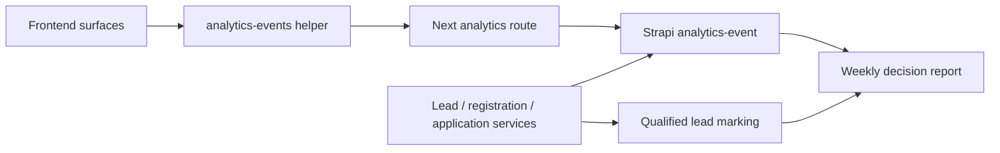

# feat: Add measurement spine and success model

## Overview

Create a vendor-neutral first-phase measurement spine for Netaş Academy: domain-first events, no PII in event properties, session-based tracking, backend conversion references, and weekly decision reporting around qualified corporate training demand.

## Problem Frame

Multiple requirements documents say behavior should be measurable, but success is not yet centralized. The origin document defines the North Star as `Nitelikli Kurumsal Eğitim Talebi` and separates the main education-to-lead funnel from support-surface KPIs (see origin: `docs/brainstorms/2026-04-27-olcum-omurgasi-ve-basari-tanimi-requirements.md`).

## Requirements Trace

- R1. North Star is qualified corporate training lead.
- R2. First web metric is `corporate_training_request` submit.
- R3. Main funnel is course list/detail -> corporate CTA -> `/iletisim` corporate tab -> submit.
- R4. Home, blog, events, teachers, and solution partner surfaces have separate support KPIs.
- R5. Event catalog distinguishes views, CTA clicks, form starts, validation errors, submit success/fail, thank-you clicks, and backend conversion creation.
- R6. Event IDs are domain-first snake_case with Turkish explanatory labels.
- R7. Minimal properties: `page_path`, `source_page`, `cta_id`, `content_type`, `content_slug`, `session_id`.
- R8. No form field values or personal values in event properties.
- R9. Submit success can link to backend record by technical reference.
- R10. Weekly report answers where users drop, which courses create demand, and how support surfaces contribute.

## Scope Boundaries

- No analytics vendor choice, dashboard product selection, CRM automation, lead scoring, campaign orchestration, or PII collection in analytics events.
- Sales outcomes and closed deals remain separate later-stage metrics.

## Context & Research

### Relevant Code and Patterns

- No current analytics helper exists.
- Frontend surfaces include home, courses, contact/lead, events, blog, teachers, about, and solution partner pages.
- Backend custom services already create contact submissions, event registrations, and course applications.
- Internal notification and route tests show Vitest patterns for backend service behavior.

### Institutional Learnings

- Use typed backend contracts and avoid UI-only flags.
- Contact/lead architecture should preserve `leadType`; measurement should treat that as the conversion type.

## Key Technical Decisions

- Add a small first-party analytics event collection endpoint in Strapi for first-phase event capture, because vendor choice is explicitly out of scope.
- Generate anonymous `session_id` client-side and store it in first-party storage; never store form values in event properties.
- Return backend technical references from conversion endpoints and emit `*_created` events server-side or immediately after submit success.
- Store event definitions in code and document labels in a Markdown reference so product/sales stakeholders can read the catalog.
- Produce weekly report data as an admin/exportable query or script first, not a dashboard-heavy product.

## Open Questions

### Resolved During Planning

- Backend record reference: use non-PII technical record IDs or document IDs returned from conversion endpoints.
- First report format: start with a lightweight generated Markdown/CSV report, not a dashboard.
- Qualified lead marking: add minimal lead status/quality fields to the lead/contact model if not already present.

### Deferred to Implementation

- Final analytics vendor or BI destination.
- Exact operational owner for marking a lead as qualified.

## High-Level Technical Design

> *This illustrates the intended approach and is directional guidance for review, not implementation specification. The implementing agent should treat it as context, not code to reproduce.*

## Implementation Units

- [ ] **Unit 1: Event catalog and frontend helper**

**Goal:** Define stable event IDs, labels, and no-PII property rules.

**Requirements:** R5, R6, R7, R8

**Dependencies:** None

**Files:**
- Create: `frontend/src/lib/analytics-events.ts`
- Create: `docs/reference/academy-measurement-events.md`
- Test: `frontend/src/__tests__/analytics-events-source.test.mjs`

**Approach:**
- Encode domain-first event IDs from the origin examples.
- Define minimal property builder and runtime guards that omit unknown/form-value fields.
- Include Turkish labels and descriptions in the reference document.

**Patterns to follow:**
- Existing typed helper style in `frontend/src/lib/strapi.ts`.

**Test scenarios:**
- Happy path: `course_corporate_cta_clicked` accepts page/content/session metadata.
- Error path: email/name/phone-like properties are omitted or rejected.
- Integration: event catalog includes Turkish label for each event ID.

**Verification:**
- Implementers have one source for event IDs and allowed properties.

- [ ] **Unit 2: Analytics collection endpoint**

**Goal:** Persist first-party anonymous events without choosing a vendor.

**Requirements:** R5, R7, R8, R9

**Dependencies:** Unit 1

**Files:**
- Create: `backend/src/api/analytics-event/content-types/analytics-event/schema.json`
- Create: `backend/src/api/analytics-event/controllers/analytics-event.ts`
- Create: `backend/src/api/analytics-event/routes/custom-analytics-event.ts`
- Create: `backend/src/api/analytics-event/services/analytics-event.ts`
- Create: `frontend/src/app/api/analytics/events/route.ts`
- Test: `backend/tests/api/analytics-event/service.test.ts`
- Test: `backend/tests/api/analytics-event/routes.test.ts`

**Approach:**
- Persist event ID, timestamp, session ID, page/source/content/cta properties, and optional backend record reference.
- Reject or strip disallowed PII-like keys.
- Keep endpoint unauthenticated but validation-strict.

**Patterns to follow:**
- Contact submission custom route/service pattern.

**Test scenarios:**
- Happy path: valid event persists with minimal properties.
- Error path: unknown event ID rejects.
- Error path: payload with email/phone property is rejected or sanitized.
- Integration: Next proxy forwards allowed payload and returns success.

**Verification:**
- Events are stored locally with no personal field values.

- [ ] **Unit 3: Main funnel instrumentation**

**Goal:** Instrument course discovery and corporate lead flow as the main funnel.

**Requirements:** R1, R2, R3, R5, R9

**Dependencies:** Units 1 and 2; intent lead architecture for lead submit flow

**Files:**
- Modify: `frontend/src/app/egitimler/page.tsx`
- Modify: `frontend/src/app/egitimler/[slug]/page.tsx`
- Modify: `frontend/src/components/contact/intent-lead-form.tsx`
- Modify: `backend/src/api/contact-submission/services/contact-submission.ts`
- Test: `frontend/src/__tests__/main-funnel-measurement-source.test.mjs`
- Test: `backend/tests/api/contact-submission/service.test.ts`

**Approach:**
- Track course list/detail views, corporate CTA clicks, corporate form start, validation failure, submit, backend lead creation, and thank-you CTA clicks.
- Backend lead creation should include a technical reference, not personal data.

**Patterns to follow:**
- Intent lead plan’s `leadType=corporate_training_request`.

**Test scenarios:**
- Happy path: course detail corporate CTA emits `course_corporate_cta_clicked`.
- Happy path: corporate lead submit emits frontend success and backend-created reference.
- Error path: validation failure emits field name/error code only.
- Integration: a list-page direct CTA counts without requiring detail-page view.

**Verification:**
- Main funnel can be reconstructed from stored anonymous events and lead references.

- [ ] **Unit 4: Support surface instrumentation**

**Goal:** Track home, blog, events, teachers, solution partner, and instructor application surfaces separately.

**Requirements:** R4, R5, R6

**Dependencies:** Units 1 and 2

**Files:**
- Modify: `frontend/src/app/page.tsx`
- Modify: `frontend/src/app/blog-yazilari/page.tsx`
- Modify: `frontend/src/app/blog-yazilari/[slug]/page.tsx`
- Modify: `frontend/src/app/etkinlikler/[slug]/kayit/page.tsx`
- Modify: `frontend/src/app/egitmenler/[slug]/page.tsx`
- Modify: `frontend/src/app/cozum-ortagi/page.tsx`
- Test: `frontend/src/__tests__/support-surface-measurement-source.test.mjs`

**Approach:**
- Instrument only role-specific support KPIs.
- Keep event registration events separate from corporate lead events.
- Track solution partner and instructor application submits as ecosystem conversions.

**Patterns to follow:**
- Event examples in the origin document.

**Test scenarios:**
- Happy path: blog search emits `blog_search_used`.
- Happy path: teacher related course click emits `teacher_related_course_clicked`.
- Happy path: event registration completion emits `event_registration_completed`.
- Integration: solution partner submit does not count as corporate training lead.

**Verification:**
- Support surfaces do not blur the main education funnel metric.

- [ ] **Unit 5: Qualified lead status and weekly report**

**Goal:** Provide a first weekly decision report around main funnel and support KPIs.

**Requirements:** R1, R3, R10

**Dependencies:** Units 2 and 3

**Files:**
- Modify: `backend/src/api/contact-submission/content-types/contact-submission/schema.json`
- Modify: `backend/src/api/contact-submission/services/contact-submission.ts`
- Create: `backend/scripts/weekly-measurement-report.js`
- Test: `backend/tests/scripts/weekly-measurement-report.test.js`

**Approach:**
- Add minimal operational quality marker if the lead model does not already include it, such as `qualityStatus`.
- Generate a weekly Markdown/CSV report that shows corporate lead submits, qualified lead count, course CTA conversion, form completion, and support-surface highlights.
- Keep dashboard work out of first phase.

**Patterns to follow:**
- Existing backend script tests and seed script style.

**Test scenarios:**
- Happy path: report summarizes course-to-lead funnel by week.
- Happy path: qualified lead count uses operational marker, not raw submit count.
- Edge case: week with no events generates an empty but readable report.
- Integration: support KPIs are separated from main funnel totals.

**Verification:**
- Weekly report answers where users drop and which courses produce lead intent.

## System-Wide Impact

- **Interaction graph:** frontend pages, analytics helper, Next proxy, Strapi analytics-event API, lead/registration services, report script.
- **Error propagation:** analytics failures should not block primary user actions.
- **State lifecycle risks:** event table can grow; first phase should support pruning/export decisions later.
- **API surface parity:** event IDs and allowed properties must match frontend and backend validation.
- **Integration coverage:** one manual flow should verify view -> CTA -> form start -> submit -> backend created reference.
- **Unchanged invariants:** no PII in analytics properties and no vendor lock-in.

## Risks & Dependencies

| Risk | Mitigation |
|------|------------|
| Analytics endpoint collects PII accidentally | Enforce allowlisted property keys and tests for disallowed fields. |
| First-party store becomes a permanent analytics product | Document vendor/dashboard selection as future work. |
| Event failures break UX | Fire-and-forget frontend behavior and backend errors isolated from main submits. |
| Qualified lead marking is operationally vague | Add minimal status/quality field and weekly review ownership note. |

## Documentation / Operational Notes

- `docs/reference/academy-measurement-events.md` should be treated as the event catalog source for product/sales review.
- Weekly report ownership should be assigned before production use.

## Sources & References

- Origin document: `docs/brainstorms/2026-04-27-olcum-omurgasi-ve-basari-tanimi-requirements.md`
- Related code: `frontend/src/lib/strapi.ts`
- Related code: `backend/src/api/contact-submission/services/contact-submission.ts`
- Related code: `backend/tests/api/contact-submission/service.test.ts`
