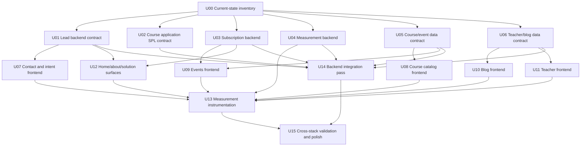

# Parallel Subagent Execution Units

## Purpose

This document turns the current plan set in `docs/plans/` into parallel execution units for subagents.

It does not replace the source plans. Each subagent should treat the referenced plan files as the detailed contract and this file as the coordination map: ownership, dependencies, conflict boundaries, validation, and merge order.

## Source Plan Set

- `docs/plans/2026-04-24-001-feat-decoupled-spl-check-plan.md`
- `docs/plans/2026-04-27-002-refactor-intent-based-lead-architecture-plan.md`
- `docs/plans/2026-04-27-002-refactor-intent-based-lead-remaining-plans.md`
- `docs/plans/2026-04-27-003-feat-blog-discovery-author-context-plan.md`
- `docs/plans/2026-04-27-004-feat-teacher-narrative-fields-plan.md`
- `docs/plans/2026-04-27-005-feat-teacher-listing-schema-plan.md`
- `docs/plans/2026-04-27-006-refactor-events-registration-focused-experience-plan.md`
- `docs/plans/2026-04-27-007-refactor-home-trust-narrative-plan.md`
- `docs/plans/2026-04-27-008-feat-newsletter-announcement-subscription-plan.md`
- `docs/plans/2026-04-27-009-feat-solution-partner-entry-plan.md`
- `docs/plans/2026-04-27-010-refactor-course-capability-catalog-plan.md`
- `docs/plans/2026-04-27-011-feat-content-taxonomy-foundation-plan.md`
- `docs/plans/2026-04-27-012-refactor-about-trust-learning-model-plan.md`
- `docs/plans/2026-04-27-013-feat-measurement-spine-plan.md`

## Coordination Rules

- Every subagent must read `AGENTS.md`, `frontend/AGENTS.md` when touching frontend code, and the exact source plan files assigned to it.
- Do not revert unrelated dirty worktree changes. Work with the current repo state.
- Keep write ownership narrow. If a required file is outside the assigned write set, stop and report the needed handoff instead of editing it silently.
- Avoid multiple subagents regenerating `backend/types/generated/contentTypes.d.ts`; schema-owning agents should update schemas and tests/seed coverage, then the integration unit regenerates or reconciles generated types once.
- Avoid multiple subagents editing `backend/src/index.ts`; backend agents should document needed bootstrap/public-permission changes, then the backend integration unit applies them once.
- Frontend agents should consume typed helpers from `frontend/src/lib/strapi.ts` and intent/analytics helpers instead of duplicating query or event logic.
- Each subagent final output must include changed files, skipped items, validation commands run, and any dependency blockers.

## Dependency Graph



## Parallel Waves

### Wave 0: Inventory

Run this before implementation subagents start.

#### U00 Current-state inventory

**Can run with:** no other write agents.

**Source plans:** all plans.

**Goal:** Establish what is already implemented, what is only planned, and where the dirty worktree overlaps the plan set.

**Write ownership:** none, unless creating a short inventory note is explicitly requested.

**Required output:**

- Which source plans appear already partially implemented.
- Exact changed/untracked files grouped by plan.
- Conflicting files that need single-owner handling.
- Recommended wave start set.

**Validation:** `git status --short`, targeted `rg` checks for core helpers/routes/content types.

### Wave 1: Backend and Data Foundations

These units can run in parallel after U00, because their primary ownership is separated. They should not each edit shared generated/bootstrap files.

#### U01 Lead backend contract

**Source plans:**

- `2026-04-27-002-refactor-intent-based-lead-architecture-plan.md`
- `2026-04-27-002-refactor-intent-based-lead-remaining-plans.md`
- `2026-04-27-009-feat-solution-partner-entry-plan.md` for `solution_partner_application`

**Goal:** Finish the backend lead/contact contract: typed lead intent, status, metadata, notification routing, duplicate-safe persistence, and tests.

**Primary write ownership:**

- `backend/src/api/contact-submission/**`
- `backend/tests/api/contact-submission/**`
- `backend/src/services/internal-notifications/**` only for lead/contact notification keys and templates

**Do not own:**

- `frontend/src/app/iletisim/**`
- `frontend/src/lib/lead-intents.ts`
- `backend/src/index.ts` final bootstrap reconciliation
- `backend/types/generated/contentTypes.d.ts` final generated type reconciliation

**Output contract for dependents:**

- Supported `leadType` values.
- Submit payload shape.
- Error response shape.
- Notification routing keys required in bootstrap.

**Validation:** targeted backend tests for contact submission plus `npm run build:backend` if dependencies are available.

#### U02 Course application SPL contract

**Source plan:** `2026-04-24-001-feat-decoupled-spl-check-plan.md`

**Goal:** Deliver or verify the decoupled SPL check path for course applications, keeping `spl-check service -> provider adapter` separate from course application orchestration.

**Primary write ownership:**

- `backend/src/api/course-application/**`
- `backend/src/services/course-application/**`
- `backend/src/services/spl-check/**`
- `backend/tests/api/course-application/**`
- `backend/tests/services/**` only for course application and SPL tests

**Do not own:**

- Event registration flow.
- Contact submission flow.
- Public course listing/detail UI except typed submit response consumption if explicitly assigned later.

**Output contract for dependents:**

- Course application endpoint.
- Submit request/response shape.
- `integration.decision` and `nextAction` values.
- Required env/config keys.

**Validation:** course-application and SPL tests, then `npm run build:backend`.

#### U03 Newsletter subscription backend

**Source plan:** `2026-04-27-008-feat-newsletter-announcement-subscription-plan.md`

**Goal:** Persist newsletter/announcement subscriptions with consent, source context, idempotent email handling, and no campaign sending.

**Primary write ownership:**

- New `backend/src/api/newsletter-subscription/**` or equivalent subscription API.
- Subscription-specific backend tests.

**Do not own:**

- Footer/news/event frontend placement.
- `backend/src/index.ts` final permission/bootstrap reconciliation.

**Output contract for dependents:**

- Submit endpoint.
- Payload shape.
- Consent/source fields.
- Duplicate handling behavior.

**Validation:** targeted subscription API tests and `npm run build:backend`.

#### U04 Measurement backend

**Source plan:** `2026-04-27-013-feat-measurement-spine-plan.md`

**Goal:** Add vendor-neutral first-party analytics event capture: event catalog, no-PII property policy, anonymous/session event persistence, and backend tests.

**Primary write ownership:**

- New measurement/analytics backend API and services.
- Backend tests for measurement persistence and no-PII validation.
- Shared event catalog file if backend-only.

**Do not own:**

- Page-level instrumentation.
- Marketing page copy/layout.
- Weekly report UI/dashboard.

**Output contract for dependents:**

- Event IDs and allowed property schema.
- Client capture endpoint.
- Failure behavior.
- Session identity expectations.

**Validation:** targeted measurement tests and `npm run build:backend`.

#### U05 Course/event data contract

**Source plans:**

- `2026-04-27-006-refactor-events-registration-focused-experience-plan.md`
- `2026-04-27-010-refactor-course-capability-catalog-plan.md`
- `2026-04-27-011-feat-content-taxonomy-foundation-plan.md`

**Goal:** Add the shared Strapi data fields needed for course capability catalog, first-phase taxonomy, and event value/state rendering.

**Primary write ownership:**

- `backend/src/api/course/content-types/course/schema.json`
- `backend/src/api/event/content-types/event/schema.json`
- `backend/scripts/seed-demo.js` only for course/event seed fields
- Backend tests only if schema behavior is covered locally

**Do not own:**

- `frontend/src/lib/strapi.ts`
- Course/event page rendering.
- Generated types final reconciliation.

**Output contract for dependents:**

- Course fields added.
- Event fields added.
- Enum/value sets for topic, level, audience, and capability metadata.
- Seed expectations.

**Validation:** `npm run seed:demo` after integration if backend is runnable; otherwise schema review plus backend build.

#### U06 Teacher/blog data contract

**Source plans:**

- `2026-04-27-003-feat-blog-discovery-author-context-plan.md`
- `2026-04-27-004-feat-teacher-narrative-fields-plan.md`
- `2026-04-27-005-feat-teacher-listing-schema-plan.md`

**Goal:** Add optional teacher narrative/listing fields and blog author/date/source metadata without creating competing teacher contracts.

**Primary write ownership:**

- `backend/src/api/teacher/content-types/teacher/schema.json`
- `backend/src/api/blog-post/content-types/blog-post/schema.json`
- `backend/scripts/seed-demo.js` only for teacher/blog seed fields

**Do not own:**

- Teacher/blog frontend rendering.
- Generated types final reconciliation.

**Output contract for dependents:**

- Teacher field names and value shapes.
- Blog metadata field names.
- Which fields are optional and how empty values should render.

**Validation:** schema review, seed coverage, backend build after integration.

### Wave 2: Frontend Feature Surfaces

These units can run in parallel once their backend/data contracts are available. They must coordinate before editing shared frontend helpers.

#### U07 Contact and intent frontend

**Depends on:** U01.

**Source plans:**

- `2026-04-27-002-refactor-intent-based-lead-architecture-plan.md`
- `2026-04-27-002-refactor-intent-based-lead-remaining-plans.md`

**Goal:** Complete `/iletisim` as a single client orchestration layer with intent-specific sections, URL-prefill support, source-level form tests, and typed helper usage.

**Primary write ownership:**

- `frontend/src/app/iletisim/**`
- `frontend/src/components/contact/**`
- `frontend/src/lib/lead-intents.ts`
- `frontend/src/__tests__/*intent*`

**Do not own:**

- Home/about/solution page copy except through helper contract.
- Backend contact service.

**Validation:** `npm run lint`, source tests if configured, and `npm run build:frontend`.

#### U08 Course catalog frontend

**Depends on:** U05.

**Source plans:**

- `2026-04-27-010-refactor-course-capability-catalog-plan.md`
- `2026-04-27-011-feat-content-taxonomy-foundation-plan.md`

**Goal:** Turn `/egitimler` into a searchable capability discovery surface and reorder course detail around corporate value and related events.

**Primary write ownership:**

- `frontend/src/app/egitimler/page.tsx`
- `frontend/src/app/egitimler/[slug]/page.tsx`
- Course-specific components if extracted

**Shared file coordination:**

- `frontend/src/lib/strapi.ts` must be edited in one coordinated pass with U09, U10, and U11, or each frontend agent must patch only its assigned type/query section.

**Validation:** `npm run lint`, `npm run build:frontend`.

#### U09 Events frontend

**Depends on:** U03 and U05.

**Source plans:**

- `2026-04-27-006-refactor-events-registration-focused-experience-plan.md`
- `2026-04-27-008-feat-newsletter-announcement-subscription-plan.md`
- `2026-04-27-011-feat-content-taxonomy-foundation-plan.md`

**Goal:** Reframe event list/detail around value, registration state, topic badges, and closed-event newsletter CTA while preserving existing event filters and sort.

**Primary write ownership:**

- `frontend/src/app/etkinlikler/page.tsx`
- `frontend/src/app/etkinlikler/[slug]/page.tsx`
- Event-specific components if extracted

**Do not own:**

- Subscription backend.
- Global footer subscription placement unless explicitly assigned from U12.

**Validation:** `npm run lint`, `npm run build:frontend`.

#### U10 Blog frontend

**Depends on:** U06.

**Source plan:** `2026-04-27-003-feat-blog-discovery-author-context-plan.md`

**Goal:** Add title-searchable, newest-first blog discovery and author/date/source context on list/detail pages.

**Primary write ownership:**

- `frontend/src/app/blog-yazilari/**`
- Blog-specific components if extracted

**Shared file coordination:** `frontend/src/lib/strapi.ts` blog type/query sections only.

**Validation:** `npm run lint`, `npm run build:frontend`.

#### U11 Teacher frontend

**Depends on:** U06.

**Source plans:**

- `2026-04-27-004-feat-teacher-narrative-fields-plan.md`
- `2026-04-27-005-feat-teacher-listing-schema-plan.md`

**Goal:** Add `/egitmenler`, improve teacher detail hierarchy, and keep listing/detail narrative fields consistent.

**Primary write ownership:**

- `frontend/src/app/egitmenler/**`
- Teacher-specific components

**Do not own:**

- About page teacher preview unless coordinated with U12.

**Validation:** `npm run lint`, `npm run build:frontend`.

#### U12 Home, about, and solution surfaces

**Depends on:** U01 for intent URLs. U03 if adding subscription placement. Can start copy/layout work earlier behind plain `/iletisim` fallback.

**Source plans:**

- `2026-04-27-007-refactor-home-trust-narrative-plan.md`
- `2026-04-27-009-feat-solution-partner-entry-plan.md`
- `2026-04-27-012-refactor-about-trust-learning-model-plan.md`
- `2026-04-27-008-feat-newsletter-announcement-subscription-plan.md` for footer/news placement if included

**Goal:** Rework high-level trust/demand pages and solution partner entry without conflicting with data-heavy course/event/blog/teacher work.

**Primary write ownership:**

- `frontend/src/app/page.tsx`
- `frontend/src/app/hakkimizda/page.tsx`
- `frontend/src/app/cozum-ortagi/**`
- `frontend/src/components/site-header.tsx` only if navigation requires the new route
- `frontend/src/components/site-footer.tsx` only if subscription placement is included

**Do not own:**

- Contact form internals.
- Teacher listing/detail route.
- Measurement helper internals.

**Validation:** `npm run lint`, `npm run build:frontend`, browser smoke check for first viewport and mobile header/footer if possible.

### Wave 3: Instrumentation and Shared Integration

Run after the main feature surfaces exist. These units should be single-owner to avoid cross-cutting conflicts.

#### U13 Measurement instrumentation

**Depends on:** U04 plus the frontend surfaces it instruments.

**Source plans:**

- `2026-04-27-013-feat-measurement-spine-plan.md`
- Measurement sections in plans 002, 007, 012

**Goal:** Wire page and CTA events to the measurement spine without PII and without selecting a vendor.

**Primary write ownership:**

- `frontend/src/lib/analytics-events.ts`
- Page-level event calls across implemented surfaces
- `frontend/src/__tests__/*analytics*`

**Do not own:**

- Backend event persistence internals.
- Page layout rewrites.

**Validation:** source tests for event IDs/properties, `npm run lint`, `npm run build:frontend`.

#### U14 Backend integration pass

**Depends on:** U01, U02, U03, U04, U05, U06.

**Source plans:** all backend/data plans.

**Goal:** Reconcile shared backend surfaces after parallel work.

**Primary write ownership:**

- `backend/src/index.ts`
- `backend/types/generated/contentTypes.d.ts`
- Root/backend package scripts only if required by implemented tests
- Cross-feature backend test fixes

**Tasks:**

- Consolidate public read permissions and bootstrap defaults.
- Regenerate or reconcile Strapi generated types once.
- Resolve schema/seed conflicts.
- Verify notification routing keys.
- Run backend build and relevant backend test suites.

**Validation:** `npm run build:backend`, backend test command used by the repo, `npm run seed:demo` if model changes are included.

#### U15 Cross-stack validation and polish

**Depends on:** U07-U14.

**Source plans:** all plans.

**Goal:** Validate the integrated product behavior and clean up only integration fallout.

**Primary write ownership:**

- Narrow fixes across touched files after integration.
- Documentation notes if final behavior differs from plans.

**Tasks:**

- Run `npm run lint`.
- Run `npm run build`.
- Run `npm run seed:demo` for cross-stack model/seed changes.
- Browser smoke test core routes: `/`, `/egitimler`, `/egitimler/[slug]`, `/etkinlikler`, `/etkinlikler/[slug]`, `/blog-yazilari`, `/egitmenler`, `/hakkimizda`, `/iletisim`, `/cozum-ortagi`.
- Check Turkish labels and ASCII URL slugs remain consistent.
- Confirm no PII is sent in analytics events.

## Recommended Parallel Start Set

After U00, start these together:

- U01 Lead backend contract
- U02 Course application SPL contract
- U03 Newsletter subscription backend
- U04 Measurement backend
- U05 Course/event data contract
- U06 Teacher/blog data contract

When enough contracts are available, start these frontend units together:

- U07 Contact and intent frontend
- U08 Course catalog frontend
- U09 Events frontend
- U10 Blog frontend
- U11 Teacher frontend
- U12 Home, about, and solution surfaces

Keep U13, U14, and U15 as integration units, not early parallel implementation units.

## Subagent Prompt Template

Use this template for each subagent:

```text
You are working in /Users/arda/Desktop/development/netas_academy.

Read AGENTS.md first. If touching frontend, also read frontend/AGENTS.md.

Assigned unit: <UNIT ID and title from docs/plans/2026-04-27-parallel-subagent-execution-units.md>
Source plan files: <exact plan paths>

Work only inside the unit's primary write ownership. Do not edit excluded/shared integration files unless the unit explicitly owns them. Do not revert unrelated dirty worktree changes.

Implement the assigned unit against the current repo state. If another unit's dependency is missing, create the smallest compatible local boundary only when the unit allows it; otherwise report the blocker.

Final response must include:
- changed files
- validation commands and results
- blockers or handoffs for integration units
- any source-plan requirement intentionally deferred
```

## Merge Order

1. Merge U01-U06 independently only after each passes its targeted validation.
2. Run U14 to reconcile backend shared files and generated types.
3. Merge U07-U12, resolving shared `frontend/src/lib/strapi.ts` and navigation/footer conflicts carefully.
4. Run U13 after all pages it instruments are present.
5. Run U15 as the final cross-stack validation and polish pass.

