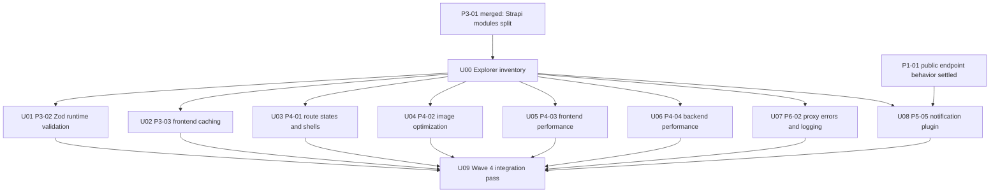

# refactor: Parallelize Wave 4 after P3-01

## Overview

Wave 4 in `.kilo/audit/PR_STRATEGY.md` becomes the maximum-parallel execution wave after P3-01 has landed. This plan turns that wave into explicit explorer and implementation-agent units with narrow ownership, known conflict zones, and a final integration pass.

Current explorer research found the checkout already reflects the P3-01 split: `frontend/src/lib/strapi.ts` is gone and the active ownership surfaces are `frontend/src/lib/strapi-client.ts`, `frontend/src/lib/strapi-types.ts`, `frontend/src/lib/strapi-courses.ts`, `frontend/src/lib/strapi-events.ts`, `frontend/src/lib/strapi-blog.ts`, `frontend/src/lib/strapi-teachers.ts`, and `frontend/src/lib/strapi-media.ts`.

## Problem Frame

The PR strategy says all Wave 4 PRs can be worked in parallel after P3-01, but the real file map has shared collision surfaces. Several units need the same frontend Strapi client and domain modules, and one backend unit moves notification ownership into a plugin. Without a delegation plan, parallel agents would either block each other or create avoidable merge churn.

This plan preserves maximum parallelization by separating broad discovery from implementation:

- Explorer agents perform read-only mapping and report file ownership, stale paths, conflicts, and validation gaps.
- Worker agents perform source edits only inside assigned write boundaries.
- A final integration owner reconciles shared files and validates the combined Wave 4 branch stack.

## Requirements Trace

- R1. Use `.kilo/audit/PR_STRATEGY.md` as the source for Wave 4 scope and dependencies.
- R2. Keep P3-01 as the hard upstream gate before Wave 4 starts.
- R3. Maximize parallel work across the eight Wave 4 PRs: P3-02, P3-03, P4-01, P4-02, P4-03, P4-04, P6-02, and P5-05.
- R4. Use explorer agents for read-only file mapping and stale-path detection before write agents begin.
- R5. Do not assign broad read-only discovery tasks to write agents.
- R6. Give every implementation unit a narrow write boundary, conflict notes, test paths, and verification expectations.
- R7. Preserve the existing Turkish IA/copy, Next.js App Router conventions, Strapi 5 backend boundaries, and npm/Node 22 workflow.
- R8. Make any earlier-wave gate that still affects a Wave 4 unit explicit before starting that unit.

Note: PR ids are inherited from `.kilo/audit/PR_STRATEGY.md`. P5-05 and P6-02 are intentionally part of that document's Wave 4 batch even though their numeric prefixes look like later waves.

R5 applies globally to all write-worker units through the Worker Prompt Template, even when an individual unit lists only its feature-bearing requirements.

## Scope Boundaries

- No application code changes are part of this plan.
- No changes to Waves 0-3 or Waves 5-6 sequencing, except where their dependencies affect Wave 4 boundaries.
- No replacement of `.kilo/audit/PR_STRATEGY.md`; this is an execution plan derived from it.
- No generated/dependency directory edits.
- No broad rewrite of Turkish route names, labels, slugs, or editorial copy.

### Deferred to Separate Tasks

- P5-01 and P7-* work remains outside Wave 4 unless a Wave 4 implementation explicitly hands off a blocker.
- Full end-to-end browser automation is deferred until the repo has a committed browser test setup or the relevant later test PR begins.
- Any final `gh` branch/PR creation policy should be applied by the execution runner, not embedded as implementation steps here.
- P5-05 is conditionally parallel: it may start with the other Wave 4 units only after P1-01 public endpoint security/rate-limit behavior is merged or explicitly confirmed as already settled on the target branch.

## Context & Research

### Relevant Code and Patterns

- `frontend/src/lib/strapi-client.ts`: shared fetch client, error handling, cache/retry/logging collision point.
- `frontend/src/lib/strapi-types.ts`: shared Strapi response type surface and likely Zod schema home.
- `frontend/src/lib/strapi-courses.ts`, `frontend/src/lib/strapi-events.ts`, `frontend/src/lib/strapi-blog.ts`, `frontend/src/lib/strapi-teachers.ts`: domain fetch/query/cache/validation ownership.
- `frontend/src/lib/strapi-media.ts`: media URL and responsive format selection.
- `frontend/src/components/content/content-page-shell.tsx`, `frontend/src/components/content/content-detail-shell.tsx`, `frontend/src/components/content/content-grid.tsx`, `frontend/src/components/content/content-card-shell.tsx`: existing shells to extend before creating new page abstractions.
- `frontend/src/components/content/search-field.tsx`: current shared search component; the strategy reference to `blog-search.tsx` is stale.
- `frontend/src/components/courses/course-catalog-list.tsx`: current course catalog list surface for large-list optimization.
- `backend/src/services/internal-notifications/**`: current internal notification service surface to migrate if P5-05 proceeds.
- `backend/src/services/spl-check/xml.ts`: SPL XML parser surface; current code already includes some hardening, so Wave 4 may be mostly regression coverage here.

### Institutional Learnings

- Prior Academy roadmap planning used one unit-owned subagent slice per branch/PR and explicit conflict boundaries.
- Earlier selector planning used `Unit 0: Explorer inventory pass` to keep cheap read-only discovery separate from implementation.
- Shared integration files should have one reconciliation owner instead of letting every subagent independently regenerate or reshape them.

### External References

- Not used. Local strategy and repo patterns are sufficient for this coordination plan.

## Key Technical Decisions

- Use a read-only `Unit 0` explorer pass before implementation: this satisfies the user request and prevents stale file paths from leaking into worker prompts.
- Run all eight Wave 4 implementation units in parallel after P3-01 and Unit 0, with P5-05 also gated by settled P1-01 public endpoint behavior: this keeps maximum throughput while making shared-file conflicts explicit.
- Treat `frontend/src/lib/strapi-client.ts` as the highest-risk shared file: P3-02, P3-03, P4-03, and P6-02 must keep their changes minimal and declare handoffs for integration.
- Keep P5-05 as a backend-heavy worker lane: it has little overlap with frontend Wave 4 work but overlaps later notification tests and backend convention cleanup.
- Add a final integration unit: parallel PRs can be reviewable independently, but the combined branch needs one owner to resolve shared client/domain-module conflicts and rerun validation.

## Open Questions

### Resolved During Planning

- Is P3-01 still hypothetical? Explorer research found the current checkout is already post-P3-01, but the plan still treats P3-01 as the upstream merge gate for branch execution.
- Should workers perform broad file discovery? No. Explorer agents own read-only mapping. Workers may inspect their assigned files while editing, but they should not be asked to perform broad discovery sweeps.
- Should external framework research be included? No. The work is coordination over existing repo surfaces and local patterns.

### Deferred to Implementation

- Exact Zod schema/type inference style for P3-02: choose while editing `strapi-types.ts`, preserving local TypeScript ergonomics.
- Exact cache primitive for P3-03: ISR `revalidate: 60` is the likely boundary for editorial content, but implementation should confirm current Next.js 16 behavior locally.
- Whether P4-03 needs a new virtualization dependency: prefer no dependency unless current course list behavior proves it is needed.
- Whether a future task moves `notification-routing` fully into plugin content types after Wave 4's compatibility-preserving plugin migration.

## Parallelization Graph



Prose is authoritative if this diagram and unit details diverge.

## Subagent Delegation Rules

- Explorer agents are read-only. They map files, stale paths, conflicts, tests, and validation gaps. They do not edit or stage files.
- Unit 0 is two-step: explorer agents return read-only reports, then the coordinator/integration owner writes `docs/plans/2026-05-03-001-refactor-wave4-parallel-delegation-inventory.md` from those reports before write workers start.
- Worker agents are write agents. They receive the Unit 0 inventory plus their unit-specific file map and own only the files listed for their unit.
- A worker must stop and report a handoff if a necessary file is outside its write boundary.
- If Unit 0 finds a review-only drift that requires source edits, the coordinator must either expand that unit's write boundary before work begins or create a named handoff/blocker. Workers must not self-expand during implementation.
- No worker should be assigned "scan the whole repo" or "find all affected files" as a task. That belongs to the explorer pass.
- Shared files require explicit conflict notes in final handoff: `frontend/src/lib/strapi-client.ts`, `frontend/src/lib/strapi-types.ts`, `frontend/src/lib/strapi-blog.ts`, `frontend/src/lib/strapi-events.ts`, and `backend/src/index.ts`.
- Every worker final handoff should include changed files, skipped/deferred items, validation outcomes, integration handoffs, and any branch/PR metadata produced by the runner.

### Explorer Prompt Template

```txt
Use an explorer/read-only agent.

Do not edit files.

Read .kilo/audit/PR_STRATEGY.md, AGENTS.md, frontend/AGENTS.md if frontend is touched, and the assigned Wave 4 unit surfaces.

Return:
- current file map with repo-relative paths
- stale paths in PR_STRATEGY.md
- files to modify/create/test
- likely conflicts with other Wave 4 units
- patterns to follow
- validation scenarios
- blockers and implementation-time unknowns
```

### Worker Prompt Template

```txt
Use sub agents. Do not do this as one large monolithic task.

You are a write worker for one Wave 4 unit only.

Read the Unit 0 explorer inventory and this unit plan. Do not perform broad read-only discovery. Inspect only the assigned files needed to implement the unit.

Own only the files listed in the unit. If another file is required, stop and report the handoff.

Preserve Turkish IA/copy, repo conventions, and unrelated worktree changes.
Return changed files, validation outcomes, skipped/deferred items, and integration handoffs.
```

## Shared Client Contract

Workers touching `frontend/src/lib/strapi-client.ts` or domain Strapi modules must preserve this intended final pipeline:

- Domain modules own query construction, populate fields, cache options, and domain-level transformations.
- The shared client owns request execution, retry/backoff for transient fetch or server failures, structured redacted logging, and JSON parsing.
- Runtime validation runs after a response body is available and before domain data is returned to page components.
- Validation failures are not retried as network failures.
- Cache/no-store choices are passed intentionally by the caller or helper; mutation, proxy, and registration-status paths stay no-store.
- Logging records route/domain key, endpoint key, status, request correlation if available, and error category. It must not log raw request bodies, authorization headers, cookies, provider responses, emails, phone numbers, TCKN values, notification recipient lists, or other PII-heavy payload fields.

Unit 9 must verify that cache policy, validation parsing, retry behavior, and logging compose in this order without duplicate logs or swallowed validation errors.

## Baseline Validation Gate

Before Unit 6 or Unit 8 starts, Unit 0 must read `backend/tests/FAILING_TESTS.md` if it exists and classify backend tests into:

- clean targeted tests the unit can use as regression proof
- known baseline failures that must be reported separately
- prerequisite failures that should be fixed before the unit starts

Backend workers must not mark Wave 4 work complete by ignoring baseline failures. They should either prove their targeted tests were clean before their changes, or explicitly report known baseline failures as unrelated blockers.

## Implementation Units

- [ ] **Unit 0: Explorer inventory pass**

**Goal:** Produce a read-only current-state map for all Wave 4 units before write agents start.

**Requirements:** R1, R3, R4, R5, R6

**Dependencies:** P3-01 merged.

**Files:**
- Read only: `.kilo/audit/PR_STRATEGY.md`
- Read only: `AGENTS.md`
- Read only: `frontend/AGENTS.md`
- Read only: `README.md`
- Read only: `frontend/src`
- Read only: `backend/src`
- Read only: `backend/tests`
- Coordinator writes from explorer reports: `docs/plans/2026-05-03-001-refactor-wave4-parallel-delegation-inventory.md`

**Approach:**
- Assign explorer agents by PR pair so discovery runs in parallel.
- Require each explorer to report current paths, stale strategy paths, conflict zones, test paths, and validation scenarios.
- Have the coordinator consolidate the explorer reports into the inventory artifact before worker prompts are issued.
- Include `backend/tests/FAILING_TESTS.md` in the inventory if it exists, with known baseline failures separated from Wave 4 regression expectations.

**Execution note:** Explorer agents are read-only. The coordinator may write only the inventory artifact from explorer reports; committing or staging that artifact remains a separate execution-runner decision.

**Patterns to follow:**
- `docs/plans/2026-04-29-015-testid-selector-instrumentation-plan.md` for the explorer-first planning pattern.
- `docs/plans/2026-04-27-parallel-subagent-execution-units.md` for unit-owned subagent coordination.

**Test scenarios:**
- Test expectation: none -- read-only planning inventory.

**Verification:**
- Inventory names all eight Wave 4 PRs and flags stale paths before workers start.

- [ ] **Unit 1: P3-02 Zod runtime type safety**

**Goal:** Add runtime validation at frontend Strapi response boundaries and align contact/registration validation contracts where needed.

**Requirements:** R1, R2, R3, R6, R7

**Dependencies:** Unit 0.

**Files:**
- Modify: `frontend/src/lib/strapi-types.ts`
- Modify: `frontend/src/lib/strapi-client.ts`
- Modify: `frontend/src/lib/strapi-courses.ts`
- Modify: `frontend/src/lib/strapi-events.ts`
- Modify: `frontend/src/lib/strapi-blog.ts`
- Modify: `frontend/src/lib/strapi-teachers.ts`
- Modify if media schemas require it: `frontend/src/lib/strapi-media.ts`
- Handoff if contract drift is found: `frontend/src/lib/lead-intents.ts`
- Handoff if contract drift is found: `frontend/src/components/contact/intent-lead-form.tsx`
- Handoff if contract drift is found: `frontend/src/app/api/contact-submissions/submit/route.ts`
- Handoff if contract drift is found: `frontend/src/app/api/registrations/register/route.ts`
- Handoff if contract drift is found: `backend/src/api/contact-submission/controllers/contact-submission.ts`
- Handoff if contract drift is found: `backend/src/api/contact-submission/services/contact-submission.ts`
- Handoff if contract drift is found: `backend/src/api/registration/controllers/registration.ts`
- Handoff if contract drift is found: `backend/src/api/registration/services/registration.ts`
- Handoff if contract drift is found: `backend/src/utils/controller-helpers.ts`
- Test: `frontend/src/__tests__/strapi-runtime-validation-source.test.mjs`
- Test if backend validation changes: `backend/tests/api/contact-submission/service.test.ts`
- Test if backend validation changes: `backend/tests/api/registration/service.test.ts`

**Approach:**
- Keep Zod validation at API boundaries, not scattered through page components.
- Prefer deriving TypeScript types from schemas only if it improves clarity without rewriting every consumer.
- Keep P3-02 focused on validation. Do not change cache policy, retry/backoff, image format selection, or shared page shells.

**Subagent delegation:** One frontend-focused write worker. Backend, proxy, and contact-form drift is a mandatory handoff unless the coordinator expands Unit 1 ownership before the worker begins.

**Patterns to follow:**
- Current split Strapi domain modules under `frontend/src/lib/strapi-*.ts`.
- Existing `zod` usage in frontend form validation.
- Current Node source-test style under `frontend/src/__tests__`.

**Test scenarios:**
- Happy path: valid course, event, blog, teacher, and media responses parse and return the same domain shapes consumed by pages.
- Error path: missing `slug`, wrong `eventType`, malformed `data`, malformed media `formats`, or malformed registration-status shape fails at the boundary with a clear validation error or fallback.
- Integration: contact form frontend requirements remain compatible with backend contact-submission requirements.
- Integration: registration proxy/controller contract remains compatible after any validation alignment.

**Verification:**
- Frontend build, lint, and source tests pass.
- Backend tests pass if backend validation files were changed.
- Invalid Strapi payloads are rejected before page components dereference them.

- [ ] **Unit 2: P3-03 frontend caching strategy**

**Goal:** Make editorial Strapi fetch caching consistent across list/detail/slug functions while preserving no-store behavior for status and mutation-related endpoints.

**Requirements:** R1, R2, R3, R6, R7

**Dependencies:** Unit 0.

**Files:**
- Modify only if needed for shared cache helpers: `frontend/src/lib/strapi-client.ts`
- Modify: `frontend/src/lib/strapi-courses.ts`
- Modify: `frontend/src/lib/strapi-events.ts`
- Modify: `frontend/src/lib/strapi-blog.ts`
- Modify: `frontend/src/lib/strapi-teachers.ts`
- Modify: `frontend/src/app/egitimler/page.tsx`
- Modify: `frontend/src/app/etkinlikler/page.tsx`
- Modify: `frontend/src/app/blog-yazilari/page.tsx`
- Modify: `frontend/src/app/hakkimizda/page.tsx`
- Modify if Unit 0 finds active Strapi fetches or strategy drift there: `frontend/src/app/page.tsx`
- Modify if policy includes detail routes: `frontend/src/app/egitimler/[slug]/page.tsx`
- Modify if policy includes detail routes: `frontend/src/app/etkinlikler/[slug]/page.tsx`
- Modify if policy includes detail routes: `frontend/src/app/blog-yazilari/[slug]/page.tsx`
- Test: `frontend/src/__tests__/strapi-cache-policy-source.test.mjs`

**Approach:**
- Use ISR around 60 seconds for editorial list/detail/slug fetches unless implementation confirms a stronger local convention.
- Keep event registration status and mutation/proxy endpoints uncached.
- Remove contradictory `force-dynamic` page directives only where fetch policy has become cacheable.
- Do not add Zod parsing, retry/backoff, image format changes, or page-shell refactors.

**Subagent delegation:** One frontend write worker owns caching only. It must declare any `strapi-client.ts` helper changes for Unit 9 integration.

**Patterns to follow:**
- Next.js App Router route-level exports currently used in `frontend/src/app`.
- Existing split fetch functions in domain modules.

**Test scenarios:**
- Happy path: course, event, blog, and teacher list/detail pages render from cached editorial fetches.
- Edge case: event registration status remains no-store and is not accidentally cached with event detail content.
- Integration: blog slug, blog list, and blog detail use non-contradictory policies.
- Integration: pages with search params still filter/render correctly after route directive changes.
- Integration: home page fetch parallelization/cache policy is either implemented or explicitly marked already complete by Unit 0.

**Verification:**
- Frontend build, lint, and source tests pass.
- Editorial pages have a documented, consistent cache policy.
- Status and mutation-related fetches remain uncached.

- [ ] **Unit 3: P4-01 route loading/error states and shared shells**

**Goal:** Add route-level loading/error states and reduce duplicated list/detail page structure using existing content shell patterns.

**Requirements:** R1, R2, R3, R6, R7

**Dependencies:** Unit 0.

**Files:**
- Create: `frontend/src/app/error.tsx`
- Create as needed: `frontend/src/app/*/loading.tsx`
- Create as needed: `frontend/src/app/*/error.tsx`
- Modify: `frontend/src/components/content/content-page-shell.tsx`
- Modify: `frontend/src/components/content/content-detail-shell.tsx`
- Modify: `frontend/src/components/content/content-grid.tsx`
- Modify: `frontend/src/components/content/content-card-shell.tsx`
- Create if needed: `frontend/src/components/content/content-list-page.tsx`
- Create if needed: `frontend/src/components/content/content-detail-page-shell.tsx`
- Create if needed: `frontend/src/components/content/route-loading.tsx`
- Create if needed: `frontend/src/components/content/route-error.tsx`
- Modify: `frontend/src/app/egitimler/page.tsx`
- Modify: `frontend/src/app/egitimler/[slug]/page.tsx`
- Modify: `frontend/src/app/etkinlikler/page.tsx`
- Modify: `frontend/src/app/etkinlikler/[slug]/page.tsx`
- Modify: `frontend/src/app/blog-yazilari/page.tsx`
- Modify: `frontend/src/app/blog-yazilari/[slug]/page.tsx`
- Modify: `frontend/src/app/egitmenler/page.tsx`
- Modify: `frontend/src/app/egitmenler/[slug]/page.tsx`
- Modify: `frontend/src/app/hakkimizda/page.tsx`
- Test: `frontend/src/__tests__/route-states-source.test.mjs`
- Test: `frontend/src/__tests__/content-shell-source.test.mjs`

**Approach:**
- Extend existing shells before creating new abstractions.
- Keep loading/error UI Turkish and visually aligned with the current content surface.
- Route error components should follow the App Router error/reset contract, include a Turkish retry control, expose stable selectors, and use appropriate alert or live-region semantics.
- Avoid changing Strapi fetch behavior except import adjustments caused by page refactors.
- Preserve stable `data-testid` conventions where already present.

**Subagent delegation:** One frontend route-UX worker. It must coordinate with Unit 2 if both touch page exports or fetch structure.

**Patterns to follow:**
- `frontend/src/components/content/content-page-shell.tsx`
- `frontend/src/components/content/content-detail-shell.tsx`
- `frontend/src/lib/testids.ts`

**Test scenarios:**
- Happy path: course, event, and blog list/detail pages render the same content after shell refactor.
- Happy path: teacher list/detail and about-page teacher/course surfaces keep consistent shells and Turkish UX.
- Error path: when Strapi fetches fail, route-level error UI shows a branded retry affordance without breaking layout.
- Error path: route errors preserve reset behavior, accessible error semantics, and stable retry selectors.
- Edge case: route groups without dynamic data either receive no unnecessary error state or get a lightweight generic state.
- Integration: loading files do not convert server components into client components unnecessarily.

**Verification:**
- Frontend build, lint, and source tests pass.
- Slow navigation shows loading UI.
- Strapi failure produces consistent error UI.

- [ ] **Unit 4: P4-02 image optimization pipeline**

**Goal:** Improve blog/media image selection and keep rich-text sanitization out of client bundles where possible.

**Requirements:** R1, R2, R3, R6, R7

**Dependencies:** Unit 0.

**Files:**
- Modify: `frontend/src/lib/strapi-blog.ts`
- Modify: `frontend/src/lib/strapi-media.ts`
- Modify: `frontend/src/lib/strapi-types.ts`
- Modify: `frontend/src/components/content/blog.tsx`
- Modify if image behavior remains centralized: `frontend/src/components/content/content-card-shell.tsx`
- Modify: `frontend/src/components/content/rich-text-content.tsx`
- Create if needed: `frontend/src/lib/sanitize-html.ts`
- Create if needed: `frontend/src/components/content/rich-text-content.server.tsx`
- Test: `frontend/src/__tests__/strapi-media-source.test.mjs`
- Test: `frontend/src/__tests__/rich-text-bundle-source.test.mjs`

**Approach:**
- Populate and select responsive Strapi media formats intentionally instead of preferring originals by default.
- Keep Next `Image` sizing explicit for blog cards and hero/detail images.
- Move sanitization to a server-only helper or component boundary if the current implementation pulls `isomorphic-dompurify` into client chunks.
- Do not change cache policy, retry/backoff, or search performance behavior.

**Subagent delegation:** One frontend media worker. It must coordinate with Unit 1 for `strapi-types.ts` and with Unit 2 for `strapi-blog.ts`.

**Patterns to follow:**
- Existing `Image` usage in `ContentCardShell`, blog detail, and teacher detail surfaces.
- `frontend/next.config.ts` same-origin upload rewrite and remote image settings.

**Test scenarios:**
- Happy path: blog list cards and blog detail hero render responsive images with correct URLs and dimensions.
- Happy path: teacher listing cards, teacher detail media, and about-page teacher carousel still render after shared media selection changes.
- Edge case: media without named formats still renders via a safe fallback.
- Error path: malformed or missing media data does not crash blog listing/detail pages.
- Integration: rich text remains sanitized while sanitizer code stays out of client-facing bundles where possible.

**Verification:**
- Frontend build, lint, and source tests pass.
- Blog image URLs use intended responsive formats.
- Shared teacher/about media consumers still render with safe alt text and fallback behavior.
- Rich text behavior remains sanitized.

- [ ] **Unit 5: P4-03 frontend performance anti-patterns**

**Goal:** Fix targeted frontend performance issues: fetch retry/backoff, server-side event filtering, debounced search URL updates, and large course-list rendering.

**Requirements:** R1, R2, R3, R6, R7

**Dependencies:** Unit 0.

**Files:**
- Modify: `frontend/src/lib/strapi-client.ts`
- Modify: `frontend/src/lib/strapi-events.ts`
- Modify: `frontend/src/components/content/search-field.tsx`
- Modify: `frontend/src/components/courses/course-catalog-list.tsx`
- Modify if adding a virtualization dependency: `frontend/package.json`
- Modify if adding a virtualization dependency: `frontend/package-lock.json`
- Modify if reusable card extraction is needed: `frontend/src/components/content/courses.tsx`
- Test: `frontend/src/__tests__/strapi-retry-source.test.mjs`
- Test: `frontend/src/__tests__/event-filter-source.test.mjs`
- Test: `frontend/src/__tests__/search-debounce-source.test.mjs`
- Test if virtualization is implemented: `frontend/src/__tests__/course-list-virtualization-source.test.mjs`

**Approach:**
- Keep retry/backoff minimal and centralized in the Strapi client.
- Move event type filtering into Strapi query params rather than client-side filtering after fetch.
- Debounce shared search URL updates in `SearchField`, not a removed `blog-search.tsx`.
- Preserve `search-field.toggle`, `search-field.input`, keyboard focus behavior, and Turkish accessible labels/placeholders while adding debounce.
- Prefer simple rendering improvements before adding a virtualization dependency.
- Do not touch media/image selection, rich-text sanitization, backend services, or caching policy beyond necessary query semantics.

**Subagent delegation:** One frontend performance worker. It must coordinate with Unit 1, Unit 2, and Unit 7 on `strapi-client.ts`.

**Patterns to follow:**
- Existing `SearchField` shared by `/blog-yazilari` and `/egitimler`.
- Existing event query construction in `frontend/src/lib/strapi-events.ts`.

**Test scenarios:**
- Happy path: Strapi fetch succeeds after a transient failure and returns the expected content.
- Error path: repeated failures still propagate a clear fetch error after retry attempts are exhausted.
- Integration: event type filters are sent to Strapi instead of filtering the full returned list in the UI.
- Edge case: rapid typing updates search state once after debounce while preserving final query text.
- Edge case: debounce does not break keyboard focus, current search selectors, or the Turkish accessible name/placeholder.
- Edge case: large course lists remain scrollable and do not render excessive offscreen DOM if virtualization is used.

**Verification:**
- Frontend build, lint, and source tests pass.
- Event pages request filtered data from Strapi.
- Search remains responsive on both course and blog surfaces.

- [ ] **Unit 6: P4-04 backend performance and SPL hardening**

**Goal:** Add analytics-event retention behavior and close SPL XML parser regression gaps.

**Requirements:** R1, R2, R3, R6, R7

**Dependencies:** Unit 0.

**Files:**
- Modify: `backend/src/api/analytics-event/services/analytics-event.ts`
- Modify/create: `backend/tests/api/analytics-event/service.test.ts`
- Modify if regression tests expose gaps: `backend/src/services/spl-check/xml.ts`
- Modify: `backend/tests/services/spl-check/xml.test.ts`
- Modify only if implementation chooses cron instead of on-insert cleanup: `backend/config/server.ts`

**Approach:**
- Prefer retention cleanup on analytics-event insert to avoid broader Strapi cron/config churn unless explorer findings show an existing cron pattern.
- Keep the existing analytics capture response contract intact.
- Treat SPL parser implementation as mostly hardened already; add regression coverage first and only change parser behavior for observed gaps.
- Separate any known baseline backend failures from new Unit 6 regressions using the Baseline Validation Gate.
- Do not touch frontend analytics client, notification plugin, route naming, or rate-limit/CSRF middleware.

**Subagent delegation:** One backend performance worker. This lane can run in parallel with frontend units and P5-05 because it has low overlap.

**Patterns to follow:**
- Existing backend Vitest tests under `backend/tests`.
- Current `fast-xml-parser` usage in `backend/src/services/spl-check/xml.ts`.

**Test scenarios:**
- Happy path: new analytics event capture still persists and returns the existing success contract.
- Edge case: analytics events older than the retention cutoff are removed while current rows remain.
- Error path: malformed, oversized, or entity-like SPL XML returns `null` or the current safe failure shape.
- Integration: namespaced SOAP, nested response bodies, text-node values, and CDATA shapes extract status/reference consistently.

**Verification:**
- Backend build and targeted backend tests pass.
- Known baseline backend failures, if present, are reported separately from Unit 6 regressions.
- Retention cleanup is bounded to old analytics rows.
- SPL parser behavior is safer without changing successful response semantics.

- [ ] **Unit 7: P6-02 API proxy error handling and Strapi logging**

**Goal:** Add consistent Strapi fetch logging and close any remaining frontend API proxy error-handling gaps.

**Requirements:** R1, R2, R3, R6, R7

**Dependencies:** Unit 0.

**Files:**
- Modify: `frontend/src/lib/strapi-client.ts`
- Modify if domain-level catch/logging remains useful: `frontend/src/lib/strapi-courses.ts`
- Modify if domain-level catch/logging remains useful: `frontend/src/lib/strapi-events.ts`
- Modify if domain-level catch/logging remains useful: `frontend/src/lib/strapi-blog.ts`
- Modify if domain-level catch/logging remains useful: `frontend/src/lib/strapi-teachers.ts`
- Handoff if parity gaps require proxy edits beyond logging/error normalization: `frontend/src/app/api/contact-submissions/submit/route.ts`
- Handoff if parity gaps require proxy edits beyond logging/error normalization: `frontend/src/app/api/registrations/register/route.ts`
- Handoff if parity gaps require proxy edits beyond logging/error normalization: `frontend/src/app/api/analytics/events/route.ts`
- Handoff if parity gaps require proxy edits beyond logging/error normalization: `frontend/src/app/api/newsletter-subscriptions/subscribe/route.ts`
- Test: `frontend/src/__tests__/api-proxy-error-source.test.mjs`
- Test: `frontend/src/__tests__/strapi-logging-source.test.mjs`

**Approach:**
- Reuse the existing proxy route pattern: parse JSON, forward to Strapi with no-store, preserve upstream status, and return Turkish fallback JSON on failure.
- Add structured server-side logging around Strapi fetch failures without changing user-facing copy unless required.
- For public proxy routes, verify the trust boundary explicitly: malformed JSON and unsupported content types should fail deterministically, expected request shape should be validated before forwarding where schemas exist, upstream error bodies should be normalized before returning to the browser, and proxy responses should remain no-store.
- Apply the shared logging redaction contract from this plan. Do not log raw request bodies, auth headers, cookies, provider responses, emails, phone numbers, TCKN values, or notification recipient lists.
- Keep this unit logging/proxy-focused. Do not alter backend controllers, schemas, caching, validation, or retry behavior except through declared handoffs.

**Subagent delegation:** One frontend resilience worker. It must coordinate with Unit 1, Unit 2, and Unit 5 on `strapi-client.ts`.

**Patterns to follow:**
- Existing proxy routes under `frontend/src/app/api/**/route.ts`.
- Existing Turkish fallback messages in proxy responses.

**Test scenarios:**
- Happy path: existing proxy routes preserve successful Strapi responses and statuses.
- Error path: Strapi unavailable causes proxy routes to return structured 502 JSON.
- Error path: malformed JSON, unsupported content types, or invalid request shapes are rejected consistently without forwarding unsafe payloads.
- Error path: failed page data fetch logs endpoint/context details server-side without leaking secrets.
- Integration: proxy responses preserve no-store behavior and do not relay sensitive upstream error bodies.
- Integration: pages backed by courses, events, blog posts, and teachers still render fallback UI or route errors consistently.

**Verification:**
- Frontend build, lint, and source tests pass.
- Stopped/unreachable Strapi produces structured proxy responses and useful logs.

- [ ] **Unit 8: P5-05 internal notifications Strapi plugin**

**Goal:** Convert internal notification delivery/routing into a Strapi plugin while preserving current lead, registration, and course application behavior.

**Requirements:** R1, R2, R3, R6, R7, R8

**Dependencies:** Unit 0 and P1-01 public endpoint security/rate-limit behavior settled on the target branch.

**Files:**
- Create: `backend/src/plugins/internal-notifications/server/register.ts`
- Create: `backend/src/plugins/internal-notifications/server/bootstrap.ts`
- Create: `backend/src/plugins/internal-notifications/server/destroy.ts`
- Create: `backend/src/plugins/internal-notifications/server/services/*`
- Create or modify after Unit 0 confirms Strapi 5 local-plugin convention: `backend/src/plugins/internal-notifications/strapi-server.ts`
- Modify if local plugin registration requires it: `backend/config/plugins.ts`
- Modify/move/delete as appropriate: `backend/src/services/internal-notifications/keys.ts`
- Modify/move/delete as appropriate: `backend/src/services/internal-notifications/recipient-utils.ts`
- Modify/move/delete as appropriate: `backend/src/services/internal-notifications/service-core.ts`
- Modify/move/delete as appropriate: `backend/src/services/internal-notifications/strapi-service.ts`
- Modify/move/delete as appropriate: `backend/src/services/internal-notifications/templates.ts`
- Modify/move/delete as appropriate: `backend/src/services/internal-notifications/types.ts`
- Modify: `backend/src/api/registration/services/registration.ts`
- Modify: `backend/src/api/contact-submission/services/contact-submission.ts`
- Modify: `backend/src/api/course-application/services/course-application.ts`
- Modify if plugin bootstrap/public permissions require it: `backend/src/index.ts`
- Modify: `backend/scripts/notification-routing-seed.js`
- Modify: `backend/scripts/seed-demo.js`
- Preserve as compatibility API unless a separate approved unit changes routing ownership: `backend/src/api/notification-routing/**`
- Test: `backend/tests/internal-notifications/*`
- Test: `backend/tests/api/notification-routing/routes.test.ts`
- Test: `backend/tests/scripts/notification-routing-seed.test.js`
- Test: `backend/tests/api/registration/service.test.ts`
- Test: `backend/tests/api/contact-submission/service.test.ts`
- Test: `backend/tests/api/course-application/service.test.ts`

**Approach:**
- Preserve the current pure-core notification split where delivery logic is dependency-injected and easy to test.
- Keep consumer flows intact; swap notification access to the plugin service boundary without redesigning lead/contact/registration/course-application behavior.
- Preserve the existing `notification-routing` API as a compatibility bridge for Wave 4. Full routing content-type migration and admin UI are separate tasks unless a blocking Strapi plugin requirement proves otherwise.
- Keep notification-routing config and recipient data private to Strapi admin/service code. Do not grant public read/write permissions for routing configuration.
- Preserve current duplicate-submission and retry-after-failure semantics; the plugin migration must not send duplicate successful notifications for one logical submission.
- Do not mix in backend route renaming, seed modularization, `as any` cleanup, or plugin admin UI work unless required for server plugin loading.

**Subagent delegation:** One backend plugin worker. It should not share files with frontend workers and should declare any `backend/src/index.ts` or seed-script handoff for Unit 9.

**Patterns to follow:**
- Current notification service files under `backend/src/services/internal-notifications`.
- Strapi plugin server structure under `backend/src/plugins`.
- Existing backend notification tests and route tests.

**Test scenarios:**
- Happy path: contact submission, event registration, and course application still trigger the same notification outcomes through the plugin service.
- Edge case: missing or incomplete notification routing config fails with the current safe logging/failure behavior.
- Error path: email provider failure does not mark notification as successful.
- Error path: duplicate submissions and retry-after-failure paths do not produce duplicate successful notifications for the same logical submission.
- Integration: seed/demo setup creates or preserves notification routing data after the plugin migration.
- Integration: anonymous access cannot read or write notification-routing config, while internal plugin/service access still works.
- Integration: Strapi builds and loads the plugin without breaking admin/API startup.

**Verification:**
- Backend build, tests, and seed workflow pass.
- Known baseline backend failures, if present, are reported separately from Unit 8 regressions.
- Notification routing remains configurable.
- Existing public submit flows continue to work against a running backend.

- [ ] **Unit 9: Wave 4 integration reconciliation**

**Goal:** Reconcile all parallel Wave 4 PRs into one coherent branch stack and resolve shared-file conflicts intentionally.

**Requirements:** R2, R3, R5, R6, R7

**Dependencies:** Units 1-8 have produced reviewable branches or explicit blockers.

**Files:**
- Modify as needed after branch reconciliation: `frontend/src/lib/strapi-client.ts`
- Modify as needed after branch reconciliation: `frontend/src/lib/strapi-types.ts`
- Modify as needed after branch reconciliation: `frontend/src/lib/strapi-courses.ts`
- Modify as needed after branch reconciliation: `frontend/src/lib/strapi-events.ts`
- Modify as needed after branch reconciliation: `frontend/src/lib/strapi-blog.ts`
- Modify as needed after branch reconciliation: `frontend/src/lib/strapi-teachers.ts`
- Modify as needed after branch reconciliation: `frontend/src/lib/strapi-media.ts`
- Modify as needed after branch reconciliation: `backend/src/index.ts`
- Modify as needed after branch reconciliation: `backend/scripts/seed-demo.js`
- Test: all frontend source tests touched by Units 1-7.
- Test: all backend tests touched by Units 6 and 8.

**Approach:**
- Reconcile shared Strapi client changes in this order of intent: cache policy, validation parsing, retry behavior, logging.
- Confirm domain modules combine query changes, cache directives, Zod validation, media populate, and server-side filters without dropping any unit's behavior.
- Confirm backend notification plugin changes do not regress analytics retention or SPL parser work.
- Preserve any unit's deliberate no-store boundary for status/mutation paths.
- Run runtime smoke gates after static validation: build both apps, start backend and frontend against demo data, load representative list/detail pages, exercise public proxy submit routes with safe test payloads or dry-run equivalents, force a Strapi-unavailable path to verify 502 proxy behavior, and confirm Strapi starts with the notification plugin and seed data intact.

**Subagent delegation:** One integration worker. This unit should run after parallel branches exist; it is not a broad feature worker.

**Patterns to follow:**
- Prior integration guidance in `docs/plans/2026-04-27-parallel-subagent-execution-units.md`.
- Unit handoffs and explorer inventory for exact conflict notes.

**Test scenarios:**
- Integration: all editorial list/detail pages render with consistent cache policy and validated Strapi responses.
- Integration: event registration status remains uncached even after client/domain reconciliation.
- Integration: blog media populate, responsive selection, and Zod media schema agree.
- Integration: Strapi fetch retry/logging still reports failures clearly after validation wrappers are added.
- Integration: notification plugin migration and analytics/SPL backend changes pass together.
- Integration: runtime smoke checks cover route loading/error behavior, Strapi-down proxy behavior, plugin startup, cache/no-store boundaries, and representative notification-triggering flows.

**Verification:**
- Frontend and backend validation suites pass for all touched surfaces.
- Runtime smoke gates pass or produce clearly separated known-baseline failures from `backend/tests/FAILING_TESTS.md`.
- The final conflict report names any deferred Wave 5/6 blocker rather than hiding it.

## System-Wide Impact

- **Interaction graph:** Frontend Strapi client changes fan out to all list/detail pages. Backend notification plugin changes fan out to contact, registration, and course-application submit flows.
- **Error propagation:** Validation, retry, and logging must compose predictably. Failed validation should not be retried as a network failure, and retry exhaustion should log endpoint context without leaking secrets.
- **State lifecycle risks:** Caching must not freeze event registration status or mutation responses. Analytics retention must not delete current rows. Notification migration must not mark failed sends as delivered.
- **API surface parity:** Contact and registration frontend validation must stay compatible with backend controller/service validation.
- **Integration coverage:** Unit tests alone will not prove route loading/error behavior, Strapi-down proxy behavior, plugin startup, or combined client fetch behavior; integration smoke checks are required in Unit 9.
- **Unchanged invariants:** Turkish routes/slugs, current page IA, existing submit endpoints, and public content read behavior stay unchanged unless a source PR already changes them.

## Shared Conflict Matrix

| Shared surface | Units touching it | Ownership rule |
|---|---:|---|
| `frontend/src/lib/strapi-client.ts` | P3-02, P3-03, P4-03, P6-02 | Each unit edits only its concern; Unit 9 reconciles order and composition. |
| `frontend/src/lib/strapi-types.ts` | P3-02, P4-02 | P3-02 owns schemas; P4-02 owns media shape requirements and hands off schema needs. |
| `frontend/src/lib/strapi-media.ts` | P3-02, P4-02 | P4-02 owns responsive media selection; P3-02 owns validation compatibility; Unit 9 verifies combined behavior. |
| `frontend/src/lib/strapi-courses.ts` | P3-02, P3-03, P6-02 | P3-02 owns parse validation; P3-03 owns cache; P6-02 owns logging handoffs; Unit 9 verifies composition. |
| `frontend/src/lib/strapi-teachers.ts` | P3-02, P3-03, P6-02 | P3-02 owns parse validation; P3-03 owns cache; P6-02 owns logging handoffs; Unit 9 verifies teacher/about routes. |
| `frontend/src/lib/strapi-blog.ts` | P3-02, P3-03, P4-02 | Unit 9 verifies query populate, cache policy, and validation all survive. |
| `frontend/src/lib/strapi-events.ts` | P3-02, P3-03, P4-03 | P4-03 owns server-side filters; P3-03 owns cache; P3-02 owns parse validation. |
| `frontend/src/app/*/page.tsx` | P3-03, P4-01 | P3-03 owns route cache directives; P4-01 owns route states/shell structure. |
| `frontend/src/components/content/content-card-shell.tsx` | P4-01, P4-02 | P4-01 owns shell abstraction; P4-02 owns image behavior; Unit 9 verifies card layout/media behavior. |
| `backend/src/index.ts` | P5-05, possible prior backend convention work | P5-05 declares plugin bootstrap needs; Unit 9 reconciles if other backend branches changed it. |

## Risks & Dependencies

| Risk | Mitigation |
|------|------------|
| Parallel workers collide on `strapi-client.ts` | Keep unit-level edits concern-only and require Unit 9 reconciliation. |
| Strategy file paths are stale after P3-01 | Unit 0 explorer inventory is mandatory and workers use current paths from that inventory. |
| P3-03 accidentally caches dynamic registration status | Explicit no-store invariant and test scenario in Unit 2 and Unit 9. |
| P4-02 and P3-02 disagree on media schema shape | P4-02 hands media field needs to P3-02/Unit 9; Unit 9 verifies blog/media schema and rendering together. |
| P5-05 expands into unrelated backend cleanup | Backend plugin worker owns notifications only and reports unrelated cleanup as deferred. |
| P5-05 starts before public endpoint behavior is settled | Treat P1-01 as an explicit gate for Unit 8 even though Unit 8 appears in the Wave 4 batch. |
| Backend tests have known pre-existing failures | Unit 0 classifies `backend/tests/FAILING_TESTS.md`; Units 6/8 separate baseline failures from new regressions. |
| Logging improvements expose PII | Shared logging contract forbids raw bodies, auth headers, cookies, provider responses, emails, phone numbers, TCKN values, and recipient lists. |
| Workers duplicate broad discovery | Worker prompt forbids broad read-only discovery; explorers own mapping. |

## Documentation / Operational Notes

- Keep this plan and the Unit 0 inventory together when assigning Wave 4 work.
- If a worker discovers a missing dependency from earlier waves, it should stop and report the blocker instead of broadening scope.
- If a Wave 4 branch is reviewable but blocked by another shared-file unit, label the blocker in the handoff and leave final reconciliation to Unit 9.
- Update `.kilo/audit/PR_STRATEGY.md` separately if the strategy itself should reflect the stale-path corrections found by explorers.

## Sources & References

- **Origin document:** `.kilo/audit/PR_STRATEGY.md`
- Related plan: `docs/plans/2026-04-27-parallel-subagent-execution-units.md`
- Related plan: `docs/plans/2026-04-29-015-testid-selector-instrumentation-plan.md`
- Repo guidance: `AGENTS.md`
- Frontend guidance: `frontend/AGENTS.md`
