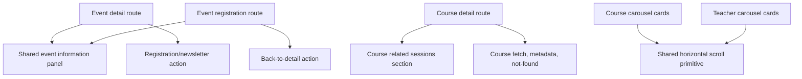

# refactor: Clean up page modularity

## Summary

Clean up route-local presentation drift on the event detail, event registration, and course detail surfaces while preserving the academy site's current product behavior. The plan moves duplicated panels and related-session rendering into durable shared components, removes stale component surface, and keeps tests focused on the affected modularity contracts.

---

## Problem Frame

The listing routes already compose shared content components, but detail and registration pages have accumulated their own presentation logic. Event detail and event registration each define an information panel, and course detail owns the upcoming/past session section inside the route body.

The same review found stale component exports, an unused hero abstraction, duplicate carousel scroll behavior, and a no-op search prop. These are close enough to the page-modularity drift that leaving them in place would keep misleading patterns available to future agents.

---

## Requirements

**Event detail and registration boundaries**

- R1. Event detail and event registration must share one event information presentation owner.
- R2. The shared event information surface must accept page-specific actions so detail CTAs and registration back navigation stay independent.
- R3. Event logistics rendering must stay consistent for title, date, optional end date, location, format, price, and registration state when those values exist.
- R4. Event registration page-owned copy must use `next-intl` messages instead of hard-coded JSX strings.

**Course detail sessions boundary**

- R5. Course detail must move related-session presentation out of the route body.
- R6. Related-session rendering must preserve the upcoming-first and past-secondary split.
- R7. The no-upcoming-session fallback must continue to route users toward the existing lead/contact intent flow.
- R8. Course detail must keep ownership of route loading, metadata, not-found behavior, and Strapi fetch orchestration.

**Component surface cleanup**

- R9. Unused shared detail exports must be removed from the public content barrel unless an active route adopts them.
- R10. The unused hero overlay abstraction must be removed unless implementation proves an active surface still depends on it.
- R11. Course and teacher carousels must share one horizontal-scroll behavior owner while preserving separate card rendering.
- R12. Component props must not advertise intentionally ignored behavior.

**Preserved behavior**

- R13. The cleanup must not add Strapi fields, change registration business rules, or alter public route URLs.
- R14. Existing list-page composition patterns remain intact.
- R15. Visual changes must be incidental to boundary cleanup, not a design-system pass.

---

## Key Technical Decisions

- **Keep route pages as Server Components:** Current Next.js 16 guidance keeps pages and metadata functions server-side by default, while client components are reserved for interactivity. The new event info and related-session sections should therefore be server-renderable unless they need browser state.
- **Use slots for page-specific actions:** Event information is shared, but the detail page owns registration/newsletter CTA behavior and the registration page owns back-to-detail navigation. A slot keeps shared logistics rendering separate from page action policy.
- **Keep summary ownership route-controlled:** Registration currently shows event summary or a fallback inside its panel, while event detail already shows summary in the hero/body. The shared event panel should accept optional body content for registration and must not add summary fallback content to event detail.
- **Preserve current detail-only schedule rendering without expanding the origin contract:** `dailySchedule` exists in current event detail logistics. Preserve it when present on the detail route, but do not treat it as a new required shared parity field for registration.
- **Extract course sessions as a presentation section, not a data fetcher:** Course detail already fetches the course and related events. The route should pass the comparison timestamp or pre-partitioned arrays so the upcoming/past boundary remains testable and does not drift inside render-time component logic.
- **Remove stale abstractions instead of reviving them:** `CourseDetail`, `EventDetail`, and `HeroOverlay` are not current active patterns in the source tree. Removing their exported functions/types and obsolete file is lower-risk than making current routes depend on abstractions they have already outgrown.
- **Add a carousel primitive for behavior only:** Horizontal scroll refs, scroll amount, and controls are duplicated. Card content should remain owned by `CourseCarousel` and `TeacherCarousel`, and the primitive must preserve each carousel's existing control placement.
- **Retire the `SearchField.searchOnly` no-op:** The prop is passed by active pages but intentionally ignored. The component API should match the current search-only design rather than preserving a misleading option.

---

## High-Level Technical Design

The shared event panel owns logistics layout and labels. Each route supplies its own action slot so the event detail registration CTA, closed-registration newsletter state, and registration-page back action do not become coupled.

The course related-session section owns upcoming/past grouping presentation, but the course route remains the data boundary. This preserves the current App Router shape: routes fetch, translate, build metadata, and compose sections.

---

## Implementation Units

### U1. Shared Event Information Panel

**Goal:** Replace duplicated route-local event information panels with one reusable event logistics component.

**Requirements:** R1, R2, R3, R13.

**Dependencies:** None.

**Files:**

- Create: `frontend/src/components/events/event-information-panel.tsx`
- Modify: `frontend/src/app/[locale]/etkinlikler/[slug]/page.tsx`
- Modify: `frontend/src/app/[locale]/etkinlikler/[slug]/kayit/page.tsx`
- Test: `frontend/src/__tests__/event-information-panel-source.test.mjs`
- Test: `frontend/src/__tests__/event-detail-source.test.mjs`
- Test: `frontend/src/__tests__/event-registration-page-source.test.mjs`

**Approach:** Move the shared logistics layout into `components/events`. The component should accept translated labels, formatted display strings, optional route-controlled body content, the optional registration-state display, and an action slot. Detail page usage supplies the existing `RegistrationStatusButton` and no body summary; registration page usage supplies summary/fallback body content and the back-to-detail action. Preserve current detail `dailySchedule` rendering when present without making it a mandatory registration-page logistics field.

**Patterns to follow:** Existing `RegistrationStatusButton`, `formatEventDateTime`, `getTranslations("events")`, `getTranslations("event_reg")`, and the current `panel-surface rounded-sm` visual rhythm.

**Test scenarios:**

- Covers AE1. Given an open event detail page, the source composes the shared information panel with the registration status action.
- Covers AE2. Given the registration page, the source composes the shared information panel with the back-to-detail action instead of the event-detail CTA stack.
- Covers R3. Given optional logistics fields, the shared component source exposes labels for date, end date, format, location, price, and registration state.
- Current behavior: when detail data includes `dailySchedule`, the detail composition preserves its display without forcing the registration page to render an extra schedule row.
- Edge case: event detail does not gain summary fallback content inside the information panel.
- Edge case: event registration keeps summary/fallback body content inside the information panel.
- Edge case: when optional logistics fields are absent, the component source keeps conditional rendering rather than forcing empty rows.
- Integration: both event routes import the shared component and no longer define their own `EventInformationPanel` function.

**Verification:** Event detail and event registration render the same logistics responsibility through one component, while their actions remain distinct.

### U2. Event Registration I18n Cleanup

**Goal:** Move registration-page shell, panel, fallback, and closed-state copy into the established translation files.

**Requirements:** R4, R13.

**Dependencies:** U1.

**Files:**

- Modify: `frontend/src/app/[locale]/etkinlikler/[slug]/kayit/page.tsx`
- Modify: `frontend/src/messages/tr.json`
- Modify: `frontend/src/messages/en.json`
- Test: `frontend/src/__tests__/event-registration-i18n-source.test.mjs`

**Approach:** Extend the existing `event_reg` namespace for page-level labels and closed/open explanatory text. Add keys for metadata title suffix, metadata description, breadcrumb list/detail/registration labels, hero eyebrow, hero open/closed body text, information-panel heading, open/closed status labels, back-to-detail CTA, closed-state heading, closed-state body paragraphs, and registration summary fallback. Keep content values equivalent to current behavior, but consume them through `getTranslations` so English locale users do not see Turkish literals from the page source.

**Patterns to follow:** Existing `event_reg` field, validation, submit, error, and success messages; event detail's `events.detail` translation access.

**Test scenarios:**

- Covers AE3. Given the English locale, the registration route source obtains page-owned labels from `getTranslations` instead of hard-coded Turkish JSX.
- Happy path: `generateMetadata` title/description and Open Graph title/description use `event_reg` keys rather than inline Turkish/English ternary literals.
- Happy path: breadcrumbs, hero eyebrow, registration status labels, back-to-detail CTA, and closed-state heading/body copy are translation-key driven.
- Happy path: open-registration hero/body copy is translation-key driven.
- Error path: closed-registration body copy and CTA label are translation-key driven.
- Edge case: registration panel summary fallback is translation-key driven when the event has no summary.

**Verification:** Registration page user-facing strings are present in both `tr.json` and `en.json`, and the route source has no page-owned Turkish literals except route slugs, brand names, or imported content.

### U3. Course Related Sessions Section

**Goal:** Move related event session presentation out of the course detail route while preserving current behavior.

**Requirements:** R5, R6, R7, R8, R13.

**Dependencies:** None.

**Files:**

- Create: `frontend/src/components/courses/course-related-sessions-section.tsx`
- Modify: `frontend/src/app/[locale]/egitimler/[slug]/page.tsx`
- Test: `frontend/src/__tests__/course-related-sessions-source.test.mjs`
- Test: `frontend/src/__tests__/course-detail-source.test.mjs`

**Approach:** Extract the upcoming/past split, session cards, collapsed past-session disclosure, and no-upcoming fallback into a focused course component. The route should continue fetching `course.events`, translating labels, building metadata, handling draft mode, and composing the section with translated strings. Keep the partition boundary explicit by passing a stable `now` value or pre-partitioned upcoming/past arrays; upcoming means `startsAt > now`, and past means `startsAt <= now`.

**Patterns to follow:** Current course detail session markup, `buildIntentLeadUrl("general_contact")`, `formatEventDateTime`, and `join()` for stable test IDs.

**Test scenarios:**

- Covers AE4. Given future and past related events, the section source renders upcoming sessions before the past sessions disclosure.
- Covers AE5. Given no upcoming sessions, the section source keeps the lead/contact fallback link.
- Edge case: when there are no upcoming sessions but past sessions exist, the fallback remains visible and past sessions remain secondary.
- Edge case: when there are no related events at all, the fallback renders without an empty session card.
- Edge case: an event exactly equal to the comparison timestamp is classified as past.
- Edge case: past sessions remain collapsed by default and their summary label includes a translated count.
- Happy path: upcoming session CTA still links to the event registration route.
- Integration: course detail imports the section and no longer computes `upcoming` and `past` inline in the route body.

**Verification:** Course detail remains the route/data owner, while the related-session UI can be reviewed without reading the full route file.

### U4. Shared Component Surface Pruning

**Goal:** Remove obsolete public component surface and misleading props that encourage reuse of stale patterns.

**Requirements:** R9, R10, R12, R14, R15.

**Dependencies:** U1, U3.

**Files:**

- Modify: `frontend/src/components/content/index.ts`
- Modify: `frontend/src/components/content/courses.tsx`
- Modify: `frontend/src/components/content/events.tsx`
- Delete: `frontend/src/components/hero-overlay.tsx`
- Modify: `frontend/src/components/content/search-field.tsx`
- Modify: `frontend/src/app/[locale]/egitimler/page.tsx`
- Modify: `frontend/src/app/[locale]/egitmenler/page.tsx`
- Modify: `frontend/src/app/[locale]/blog-yazilari/page.tsx`
- Test: `frontend/src/__tests__/content-component-surface-source.test.mjs`
- Test: `frontend/src/__tests__/blog-discovery-source.test.mjs`
- Test: `frontend/src/__tests__/search-debounce-source.test.mjs`

**Approach:** Remove `CourseDetail` / `CourseDetailProps` and `EventDetail` / `EventDetailProps`, not only their content-barrel exports, unless implementation discovers an active import. Delete `HeroOverlay` if the current source tree still has zero imports. Remove the `searchOnly` prop from `SearchField` and its callers because the component is already search-only.

**Patterns to follow:** Current import scan with `rg`, existing `SearchField` debounce and focus behavior, and prior homepage plan outcome that replaced active hero usage with `HomeHeroSection`.

**Test scenarios:**

- Covers AE6. Given a future import from the content barrel, the source no longer exports unused detail wrappers.
- Covers AE6. Given a future direct import from the detail wrapper modules, the obsolete `CourseDetail` and `EventDetail` functions/types no longer exist.
- Covers AE6. Given the current source tree, no active import references `HeroOverlay` before deleting it.
- Covers AE7. Given a developer inspects `SearchField`, its public props no longer include a no-op `searchOnly`.
- Edge case: existing search debounce, focus behavior, and `search-field.toggle` / `search-field.input` selectors remain unchanged.
- Integration: pages that previously passed `searchOnly` still render `SearchField` with the same initial search value.

**Verification:** Shared exports match active component patterns, and the cleanup does not change list-page composition behavior.

### U5. Carousel Scroll Primitive

**Goal:** Centralize duplicated horizontal-scroll behavior across course and teacher carousels while preserving their separate cards.

**Requirements:** R11, R12, R14, R15.

**Dependencies:** None.

**Files:**

- Create: `frontend/src/components/carousel/horizontal-scroll-carousel.tsx`
- Modify: `frontend/src/components/course-carousel.tsx`
- Modify: `frontend/src/components/teacher-carousel.tsx`
- Test: `frontend/src/__tests__/horizontal-scroll-carousel-source.test.mjs`
- Test: `frontend/src/__tests__/about-teacher-section-source.test.mjs`

**Approach:** Extract the client-side ref, scroll amount calculation, and prev/next controls into a small primitive. Keep each carousel's item mapping, badges, avatars, labels, and empty states in the existing domain components. The primitive should accept translated aria labels, optional test IDs, and a control-placement/composition option so `CourseCarousel` keeps controls after the scroll area and `TeacherCarousel` keeps controls before it.

**Patterns to follow:** Existing `cardTestIdPrefix` string pattern for Server-to-Client serialization, current `Button` `size="icon-sm"` controls, and the current carousel translation keys in `common`.

**Test scenarios:**

- Covers AE7. Given a developer changes scroll behavior, the source has one behavior owner rather than duplicated scroll handlers.
- Happy path: course carousel still maps course title, slug, summary, topic area, and level into course cards.
- Happy path: teacher carousel still maps teacher name, slug, image URL, and alt text into teacher cards.
- Edge case: empty state rendering remains in each domain carousel.
- Edge case: no carousel controls render for empty states.
- Edge case: single-item or non-overflow carousels do not expose misleading scroll behavior; controls are hidden or disabled consistently.
- Integration: source tests preserve course control order after the scroll area and teacher control order before the scroll area.
- Integration: no function props cross from server sections into client carousels.

**Verification:** Horizontal scrolling behavior is shared, while course and teacher card rendering remains separate and recognizable.

### U6. Focused Source-Test Realignment

**Goal:** Keep tests useful for the current `[locale]` App Router structure and the modularity cleanup.

**Requirements:** R1, R4, R13, R14, R15.

**Dependencies:** U1, U2, U3, U4, U5.

**Files:**

- Modify: `frontend/src/__tests__/event-detail-source.test.mjs`
- Modify: `frontend/src/__tests__/event-newsletter-fallback-source.test.mjs`
- Modify: `frontend/src/__tests__/task-3-responsive-shells.test.mjs`
- Modify: `frontend/src/__tests__/events-list-source.test.mjs`

**Approach:** Update only tests that directly cover the affected route/component surface or currently read stale non-locale route paths in the listed files. Do not migrate every old test path in the repository as part of this cleanup. This unit is not a roll-up for all U1-U5 tests; those units own their feature-bearing test files.

**Patterns to follow:** `route-testids-source.test.mjs`, which already reads current `[locale]` route paths, and existing Node built-in source-test style.

**Test scenarios:**

- Happy path: the listed event tests read current localized route paths and no longer fail from stale non-locale paths.
- Happy path: the responsive shell test reads current localized contact and registration route paths.
- Happy path: the events list source test reads the current localized listing route path and preserves list-page composition expectations.
- Edge case: unrelated stale path tests remain deferred unless they fail because of touched files in this plan.
- Validation path: the plan uses a focused `node --test` invocation for touched test files rather than relying on the full coverage runner while unrelated stale path tests remain deferred.

**Verification:** The affected source tests describe the current source tree and fail for regressions that would reintroduce route-local duplication or stale API surface.

---

## Scope Boundaries

- No Strapi schema, seed, backend registration-service, or API contract changes.
- No payment, calendar, campaign, QR, analytics, or newsletter model expansion.
- No rewrite of homepage, content cards, global page shell, or list-page IA.
- No broad copywriting pass beyond moving registration-page owned strings into translation files.
- No broad source-test path migration outside the cleanup surface.

### Deferred to Follow-Up Work

- A repository-wide cleanup of stale source tests that still reference old non-locale route paths.
- Route-state, Strapi cache-policy, Strapi runtime-validation, and other stale source-test path fixes unless they fail because of files changed by this cleanup.
- A broader icon-library consolidation between `lucide-react` and Phosphor.
- A future design pass for carousel visuals, hero systems, or content card density.

---

## System-Wide Impact

- **End users:** Event detail, registration, and course detail should read the same as before except for incidental consistency from shared rendering.
- **Content editors:** No content model or Strapi field changes are planned.
- **Developers:** The public component surface becomes smaller and less misleading, reducing the chance that future work imports obsolete wrappers.
- **Runtime behavior:** Event registration freshness remains owned by the existing registration-status endpoint and client status component.
- **Localization:** Registration-page shell text becomes properly locale-driven.
- **Responsive behavior:** Event detail and registration grids should continue stacking before `xl`; course session cards should continue stacking before `sm`; carousel controls should preserve their current mobile and desktop placement.

---

## Risks & Dependencies

| Risk | Mitigation |
| --- | --- |
| Shared event panel accidentally couples detail CTA behavior to registration-page back navigation | Keep the action as a slot and test both route compositions separately. |
| Course session extraction changes grouping because `now` handling moves | Keep grouping logic equivalent and cover future, past, and empty scenarios in source tests. |
| Deleting `HeroOverlay` conflicts with an overlooked import | Run an import scan immediately before deletion and keep the deletion scoped to zero-reference status. |
| Search prop cleanup breaks active page call sites | Remove the prop from the three known callers in the same unit and preserve existing debounce/focus tests. |
| Carousel primitive grows into a card abstraction | Limit the primitive to scroll container and controls; leave cards in domain carousels. |
| Full source-test runner fails on deferred stale paths | Validate this plan with a focused `node --test` file list, and defer unrelated stale path migration unless touched files force it. |

---

## Sources & Research

- Origin: `docs/brainstorms/2026-06-21-page-modularity-cleanup-requirements.md`
- Project guidance: `AGENTS.md`, `frontend/AGENTS.md`, `CLAUDE.md`
- Next.js local docs: `frontend/node_modules/next/dist/docs/01-app/01-getting-started/03-layouts-and-pages.md`, `frontend/node_modules/next/dist/docs/01-app/01-getting-started/05-server-and-client-components.md`, `frontend/node_modules/next/dist/docs/01-app/01-getting-started/14-metadata-and-og-images.md`
- Event routes: `frontend/src/app/[locale]/etkinlikler/[slug]/page.tsx`, `frontend/src/app/[locale]/etkinlikler/[slug]/kayit/page.tsx`
- Course detail route: `frontend/src/app/[locale]/egitimler/[slug]/page.tsx`
- Component surface: `frontend/src/components/content/index.ts`, `frontend/src/components/content/events.tsx`, `frontend/src/components/content/courses.tsx`, `frontend/src/components/hero-overlay.tsx`, `frontend/src/components/content/search-field.tsx`
- Carousel components: `frontend/src/components/course-carousel.tsx`, `frontend/src/components/teacher-carousel.tsx`
- Data and type contracts: `frontend/src/lib/strapi-events.ts`, `frontend/src/lib/strapi-courses.ts`, `frontend/src/lib/strapi-types.ts`
- Related prior plans: `docs/plans/2026-04-27-006-refactor-events-registration-focused-experience-plan.md`, `docs/plans/2026-04-27-010-refactor-course-capability-catalog-plan.md`, `docs/plans/2026-05-11-001-feat-homepage-unified-uncode-redesign-plan.md`, `docs/plans/2026-05-15-001-fix-full-stack-performance-improvements-plan.md`

---

## Validation

- Frontend lint completes without new violations.
- Frontend build completes successfully.
- Focused Node source tests for event detail, event registration, course related sessions, component surface, search behavior, carousel behavior, and responsive shell preservation pass. Use a focused `node --test` invocation over the touched test files while broader stale source-test path migration remains deferred.
- Manual review confirms event detail, event registration, and course detail preserve their existing route URLs and user-facing flows.
