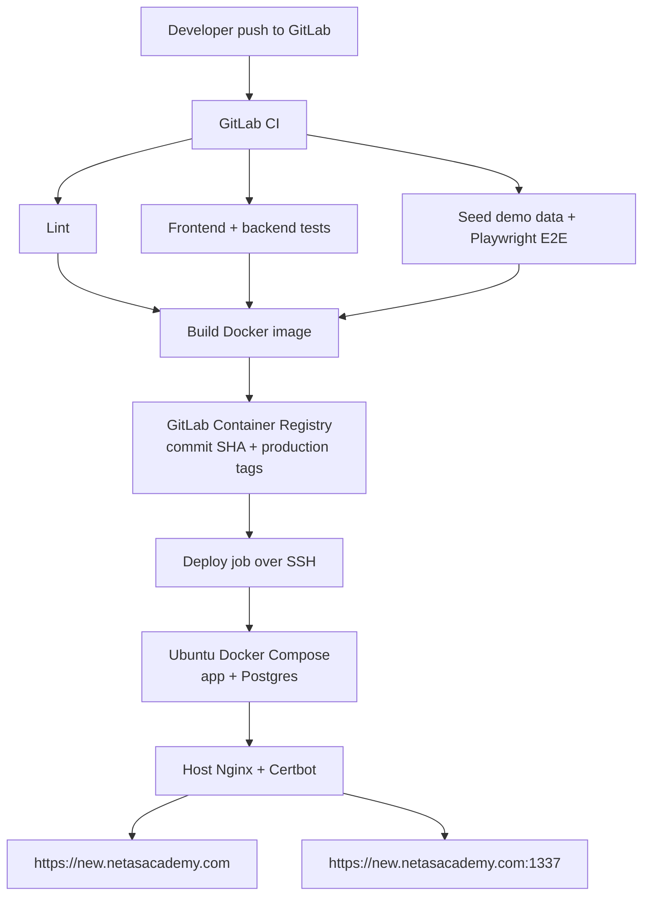
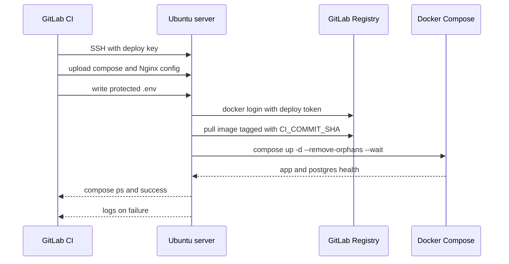

# feat: GitLab Ubuntu Production Deployment

## Summary

Move production delivery from GitHub Actions, GHCR, and EC2 to GitLab CI, GitLab Container Registry, and the custom Ubuntu host at `185.48.181.248`. The first migration keeps `new.netasacademy.com` and temporary public Strapi access on `https://new.netasacademy.com:1337`, while moving public proxying to host Nginx and running the app plus Postgres through Docker Compose.

---

## Problem Frame

The current production path is GitHub-specific: `.github/workflows/build-images.yml` publishes to GHCR and `.github/workflows/deploy-ec2.yml` performs an EC2 SSH deploy using `docker-compose.deploy.yml`, Dockerized Nginx, SQLite, and `new.netasacademy.com:1337`. The target path should keep the useful single-image app packaging and health-gated SSH deploy behavior, but make GitLab the build, registry, and deploy authority.

The target server is reachable as `root@185.48.181.248`, runs Ubuntu 24.04.4 LTS, has Docker 29.6.0, Docker Compose v5.1.4, and active host Nginx on port `80`. No app containers are running, Certbot is not installed, `ufw` is inactive, and the host has about 59 GB disk and 3.8 GiB RAM.

---

## Requirements

**GitLab ownership**

- R1. Production build and deploy must run from GitLab CI instead of GitHub Actions.
- R2. GitLab Container Registry must receive both `$CI_COMMIT_SHA` and `production` image tags.
- R3. The running production stack must expose the deployed commit through `GIT_COMMIT_SHA`.
- R4. The local checkout must be connected to the GitLab project through a GitLab remote before GitLab pipeline setup is considered complete.

**Quality gates**

- R5. GitLab CI must run the existing frontend lint gate before image publication or deploy.
- R6. GitLab CI must run frontend tests, backend tests, and the existing Playwright E2E suite on every `main` deploy path.
- R7. Any failed lint, test, E2E, image build, image push, or deploy health check must stop production deployment.

**Ubuntu runtime**

- R8. The production stack must run the combined app image and a separate Postgres container.
- R9. Production Strapi must use Postgres, not SQLite.
- R10. Postgres data must persist across image replacements, compose restarts, and host reboots.
- R11. The server must pull from GitLab Container Registry without GHCR credentials.
- R12. Production secrets must come from protected GitLab variables or server-local untracked environment files, never tracked files.

**Host Nginx and TLS**

- R13. Host Nginx must proxy `https://new.netasacademy.com` to the app frontend on local port `3000`.
- R14. Host Nginx must proxy `https://new.netasacademy.com:1337` to Strapi on local port `1337` for this compatibility phase.
- R15. Certbot must issue and renew certificates on the host.
- R16. Certificate renewal must reload host Nginx without restarting Docker services.

**Operations and recovery**

- R17. Deploy must run automatically from `main` after all gates pass.
- R18. Deploy must also be manually runnable from GitLab for reruns.
- R19. Deploy failure must print remote compose status and recent app/Postgres logs in GitLab job output.
- R20. Postgres backup and restore instructions must be re-established for the new production compose shape.

---

## Key Technical Decisions

- KTD1. **Use a dedicated Ubuntu production compose file:** Keep `docker-compose.yml` local-friendly and add `deploy/ubuntu/docker-compose.production.yml` for the server. This avoids turning local SQLite and Docker-Nginx defaults into production assumptions.
- KTD2. **Host Nginx owns ports `443` and `1337`:** The first migration keeps the public `:1337` contract, but Docker should bind app ports to `127.0.0.1` only. Host Nginx remains the public TLS and proxy boundary.
- KTD3. **Run Playwright on every `main` deploy path:** The user selected full E2E gating. The CI design should seed demo data before Playwright because the E2E suite depends on demo fixtures in `backend/scripts/seed-demo.js`.
- KTD4. **Use GitLab built-in registry variables for CI pushes and a deploy token for server pulls:** GitLab documents `CI_REGISTRY`, `CI_REGISTRY_USER`, and `CI_REGISTRY_PASSWORD` for CI registry login, while a deploy token with `read_registry` is the safer long-lived credential for the Ubuntu host.
- KTD5. **Keep B2 media and backup decisions explicit:** Existing B2 upload and Postgres backup code can be reused, but production launch should not silently fall back to local uploads unless that is chosen as a temporary launch risk.

---

## High-Level Technical Design

---

## Implementation Units

### U1. GitLab Project And Remote Setup

- **Goal:** Make GitLab the active delivery host for this repository while preserving the current GitHub remote until cutover is verified.
- **Requirements:** R1, R4
- **Dependencies:** None
- **Files:** No source files required unless documenting remote setup in `docs/deployment/gitlab-ubuntu-runbook.md`
- **Approach:** Use `glab` to verify the GitLab project or create/import it if missing, then add a `gitlab` remote locally. Keep `origin` unchanged during migration to avoid disrupting the current checkout.
- **Patterns to follow:** Current `glab auth status` shows authenticated GitLab API and SSH access as `arda-e`.
- **Test scenarios:** Test expectation: none -- this is repository hosting setup, verified through Git remote and GitLab project state rather than unit tests.
- **Verification:** The repository exists on GitLab, `git remote -v` includes a GitLab remote, and `glab repo view` resolves the selected project.

### U2. Ubuntu Production Compose

- **Goal:** Add a production compose file for the Ubuntu host with app, Postgres, persistent data, and optional backup sidecar.
- **Requirements:** R8, R9, R10, R11, R12, R20
- **Dependencies:** U1 for registry image naming
- **Files:** `deploy/ubuntu/docker-compose.production.yml`, `.env.example`, `docker-compose.yml`
- **Approach:** Create a production-only compose file that references `${APP_IMAGE}`, binds app ports to `127.0.0.1`, sets `DATABASE_CLIENT=postgres`, configures `DATABASE_URL` against the `postgres` service, and uses bind mounts or named volumes for Postgres persistence. Do not include a Dockerized Nginx service.
- **Patterns to follow:** `docker-compose.yml` already defines `postgres` and `postgres-backup`; `docker-compose.deploy.yml` already shows the production app env surface; `backend/config/database.ts` supports Postgres through environment configuration.
- **Test scenarios:**
  - Covers AE4. Given the production compose stack starts with `DATABASE_CLIENT=postgres`, when the app boots, then Strapi connects to Postgres and the app health check passes.
  - Given the app image changes, when compose recreates the app service, then the Postgres data directory or volume remains mounted and unchanged.
  - Given required secrets are absent, when compose config is evaluated, then it fails before starting production with placeholder secrets.
- **Verification:** `docker compose -f deploy/ubuntu/docker-compose.production.yml config` renders without unresolved production variables when supplied a deployment env file, and the service graph has no `nginx` service.

### U3. Host Nginx And Certbot Runtime

- **Goal:** Replace Docker-Nginx production proxying with host Nginx and Certbot while preserving the temporary public `:1337` Strapi URL.
- **Requirements:** R13, R14, R15, R16
- **Dependencies:** U2
- **Files:** `deploy/ubuntu/nginx/new.netasacademy.com.conf`, `docs/deployment/gitlab-ubuntu-runbook.md`, `docs/deployment/ec2-nginx-certbot.md`
- **Approach:** Add a host Nginx config with `80` HTTP redirect, `443` frontend proxy to `127.0.0.1:3000`, and `1337 ssl` Strapi proxy to `127.0.0.1:1337`. Install Certbot on the host and use a renewal deploy hook that runs `systemctl reload nginx`.
- **Patterns to follow:** `docker/nginx/conf.d/new.netasacademy.com.conf` contains the current proxy headers and timeout behavior to preserve conceptually.
- **Test scenarios:**
  - Covers AE5. Given certificates exist, when Nginx config is tested, then `https://new.netasacademy.com` proxies to the frontend and `https://new.netasacademy.com:1337/admin` proxies to Strapi.
  - Given Certbot renewal runs, when the deploy hook executes, then Nginx reloads without restarting Docker services.
  - Given the app containers are down, when a request reaches Nginx, then Nginx returns a proxy failure without exposing Docker ports publicly.
- **Verification:** Host `nginx -t` succeeds, Certbot dry-run renewal succeeds after DNS is correct, and public curl checks return expected HTTPS responses.

### U4. GitLab CI Quality Gates

- **Goal:** Add CI jobs that run lint, frontend tests, backend tests, and Playwright E2E before production image publication and deploy.
- **Requirements:** R5, R6, R7
- **Dependencies:** U1
- **Files:** `.gitlab-ci.yml`, `package.json`, `e2e/playwright.config.ts`, `backend/scripts/seed-demo.js`
- **Approach:** Use Node 22 jobs with npm caches scoped per package. Run frontend lint, frontend coverage tests, backend tests, and Playwright E2E. The E2E job should install Playwright browser dependencies and run the demo seed before tests so registration fixtures exist.
- **Patterns to follow:** Root `package.json` already exposes `npm run lint`; frontend tests use `npm run test:coverage --prefix frontend`; backend tests use `npm run test --prefix backend`; E2E uses `npm run test --prefix e2e`.
- **Test scenarios:**
  - Covers AE1. Given a frontend lint failure, when a `main` pipeline runs, then image build and deploy jobs do not run.
  - Given backend tests fail, when the pipeline runs, then image build and deploy jobs do not run.
  - Given Playwright E2E fails, when the pipeline runs, then image build and deploy jobs do not run.
  - Given all gates pass, when the pipeline reaches image build, then all quality jobs are complete and successful.
- **Verification:** A GitLab pipeline shows separate lint, test, E2E, build, and deploy stages with downstream jobs blocked on upstream failures.

### U5. GitLab Image Publish

- **Goal:** Build the existing production Docker image and publish it to GitLab Container Registry with immutable and stable tags.
- **Requirements:** R2, R3, R7, R11
- **Dependencies:** U4
- **Files:** `.gitlab-ci.yml`, `Dockerfile`
- **Approach:** Add a Docker build job that logs into `$CI_REGISTRY`, builds `Dockerfile`, pushes `$CI_REGISTRY_IMAGE:$CI_COMMIT_SHA`, and pushes `$CI_REGISTRY_IMAGE:production`. Preserve Node 22 from the existing Dockerfile.
- **Patterns to follow:** `.github/workflows/build-images.yml` currently builds the same Dockerfile and pushes both `latest` and commit SHA tags to GHCR.
- **Test scenarios:**
  - Covers AE2. Given a successful `main` pipeline, when image publish completes, then GitLab Container Registry contains a tag matching `$CI_COMMIT_SHA` and a `production` tag.
  - Given registry login fails, when the image job runs, then deploy does not run.
  - Given the Docker build fails, when the image job runs, then no production deploy starts.
- **Verification:** GitLab registry lists the commit SHA tag, and pipeline logs show successful login, build, and push.

### U6. GitLab SSH Deploy Job

- **Goal:** Deploy the commit-tagged image to the Ubuntu host with protected secrets, health waits, and failure logs.
- **Requirements:** R3, R7, R11, R12, R17, R18, R19
- **Dependencies:** U2, U3, U5
- **Files:** `.gitlab-ci.yml`, `deploy/ubuntu/docker-compose.production.yml`, `deploy/ubuntu/nginx/new.netasacademy.com.conf`, `docs/deployment/gitlab-ubuntu-runbook.md`
- **Approach:** Store the SSH private key, server target, app secrets, Postgres password, registry deploy token, SMTP secrets, and optional B2 secrets as protected GitLab variables. The deploy job writes a remote `.env`, logs into the GitLab registry with the deploy token, pulls `$CI_REGISTRY_IMAGE:$CI_COMMIT_SHA`, runs compose with `--wait`, and prints status. Add an automatic `main` deploy and a manual rerun job.
- **Patterns to follow:** `.github/workflows/deploy-ec2.yml` already contains the health-wait, remote `.env`, retry, and failure-log behavior to preserve in GitLab syntax.
- **Test scenarios:**
  - Covers AE3. Given valid registry credentials, when deploy runs, then the server pulls the GitLab image tag for the pipeline commit and waits for app health before succeeding.
  - Covers AE6. Given deploy fails, when the GitLab job exits, then job output includes `docker compose ps` and recent app/Postgres logs.
  - Given a required protected variable is missing, when deploy runs, then it fails before mutating the running stack.
  - Given a manual deploy is triggered for a known commit, when the job runs, then production returns to that commit-tagged image.
- **Verification:** A successful `main` pipeline deploys the expected commit SHA, and a forced failure produces enough remote logs in the job output for diagnosis.

### U7. Backup, Restore, And Media Launch Decision

- **Goal:** Preserve database recovery readiness and make the production media storage choice explicit.
- **Requirements:** R10, R12, R20
- **Dependencies:** U2, U6
- **Files:** `docs/deployment/gitlab-ubuntu-runbook.md`, `docker/postgres-backup/README.md`, `deploy/ubuntu/docker-compose.production.yml`, `.env.example`
- **Approach:** Reuse the existing Postgres backup sidecar for B2 if B2 is selected. Document a manual backup, restore to the production Postgres service, and verification query. Decide whether production media uses existing B2 upload provider variables or a temporary persistent local upload mount before launch.
- **Patterns to follow:** `docker/postgres-backup/backup.sh`, `docker/postgres-backup/config.sh`, and the README already define the B2 backup environment surface. `backend/src/config/env.schema.ts` and `backend/src/config/backend-config-manager.ts` define the B2 media provider surface.
- **Test scenarios:**
  - Given backup variables are present, when the backup sidecar runs manually, then it uploads a Postgres dump to the configured B2 bucket and prefix.
  - Given a dump exists, when restore is run against a fresh Postgres container, then expected Strapi tables and seeded records are present.
  - Given `UPLOAD_PROVIDER=aws-s3`, when required B2 media variables are missing, then backend config validation fails before launch.
- **Verification:** One backup artifact exists in the backup target, one restore test has been run, and the media storage decision is recorded in the runbook.

### U8. Retire GitHub Production Workflows

- **Goal:** Remove GitHub Actions and GHCR from the production delivery path after GitLab deployment is verified.
- **Requirements:** R1, R2, R11
- **Dependencies:** U6
- **Files:** `.github/workflows/build-images.yml`, `.github/workflows/deploy-ec2.yml`, `docker-compose.deploy.yml`, `docs/deployment/ec2-nginx-certbot.md`
- **Approach:** Delete or archive the GitHub production workflows only after a successful GitLab deploy and rollback/rerun path are confirmed. Keep local development Docker files intact.
- **Patterns to follow:** Keep scope literal; do not remove local compose, seed, or development scripts that are unrelated to production delivery.
- **Test scenarios:** Test expectation: none -- this is production path retirement after replacement verification.
- **Verification:** No production runbook or pipeline requires GitHub Actions, GHCR, EC2 secrets, or Dockerized production Nginx.

---

## GitLab Variables

The exact values should be protected and masked where GitLab allows masking.

| Variable | Purpose |
| --- | --- |
| `PRODUCTION_HOST` | `185.48.181.248` |
| `PRODUCTION_USER` | `root` for the first migration, optionally replaced by a deploy user later |
| `PRODUCTION_SSH_PRIVATE_KEY` | Private key used by GitLab deploy jobs |
| `PRODUCTION_APP_DIR` | Server deploy directory such as `/opt/netas_academy` |
| `REGISTRY_DEPLOY_USER` | GitLab deploy token username with `read_registry` |
| `REGISTRY_DEPLOY_PASSWORD` | GitLab deploy token secret with `read_registry` |
| `APP_KEYS` | Strapi app keys |
| `ADMIN_JWT_SECRET` | Strapi admin JWT secret |
| `API_TOKEN_SALT` | Strapi API token salt |
| `TRANSFER_TOKEN_SALT` | Strapi transfer token salt |
| `ENCRYPTION_KEY` | Strapi encryption key |
| `JWT_SECRET` | Strapi JWT secret |
| `POSTGRES_PASSWORD` | Production Postgres password |
| `EMAIL_SMTP_USER` | Brevo SMTP login |
| `EMAIL_SMTP_PASS` | Brevo SMTP key |
| `B2_*` | Optional media storage variables if B2 media is selected |
| `B2_BACKUP_*` | Optional Postgres backup variables if B2 backups are enabled |

---

## Scope Boundaries

- The first migration keeps `https://new.netasacademy.com:1337` instead of introducing a CMS subdomain.
- No live SQLite content migration is included.
- No preservation of current local uploads is included.
- No host-installed Postgres is included.
- No application feature work is included unless CI, runtime config, or health checks reveal a blocking deployment issue.

### Deferred to Follow-Up Work

- Move Strapi admin/API to a dedicated CMS subdomain and remove public `:1337`.
- Replace root SSH deploys with a limited deploy user after the first successful production launch.
- Add swap or tuned memory limits if production load shows memory pressure.
- Add container/image cleanup policy after deployment frequency is known.

---

## Risks & Dependencies

- **DNS and firewall:** Certbot and public checks require DNS for `new.netasacademy.com` to point at `185.48.181.248`, and inbound `80`, `443`, and `1337` must be reachable.
- **Root deploy user:** Root SSH is acceptable for initial setup but should be narrowed later.
- **E2E runtime cost:** Running Playwright on every `main` deploy increases pipeline time and may need CI cache tuning.
- **Media storage ambiguity:** Fresh launch avoids old upload migration, but new uploads still need a deliberate storage mode before real production use.
- **No swap on server:** The host has 3.8 GiB RAM and no swap. This is probably enough for the current app, but Docker build should happen in GitLab CI, not on the server.

---

## Acceptance Examples

- AE1. Given a frontend lint failure, when a commit is pushed to `main`, then GitLab CI fails before building or deploying the production image.
- AE2. Given a successful `main` pipeline, when the image is pushed, then GitLab Container Registry contains a tag for the commit SHA and the deploy records that SHA in production env.
- AE3. Given valid GitLab registry credentials on the Ubuntu server, when deploy runs, then the server pulls from GitLab Container Registry and waits for app health before success.
- AE4. Given the app image is replaced, when Docker Compose restarts the stack, then Postgres data remains available and Strapi connects to Postgres.
- AE5. Given Certbot renews a certificate, when the deploy hook runs, then host Nginx reloads and HTTPS service continues.
- AE6. Given deploy fails, when the operator opens the GitLab job, then the job output includes remote compose status and recent service logs.

---

## Operational Notes

- The existing dedicated workstation SSH key named `netas_academy_deploy` works for direct setup from this workstation. GitLab CI should receive a separate deploy private key as a protected variable, or this key can be promoted only if the user accepts that trade-off.
- The current server has Nginx active with only the default site enabled. Replacing the default site should be part of U3 after certificate planning is complete.
- `certbot` was not found in the server package check. U3 should install it before certificate issuance.
- Keep `docker-compose.deploy.yml` untouched until U6 succeeds; it remains a useful reference and rollback clue during migration.

---

## Sources & Research

- Origin requirements: `docs/brainstorms/2026-06-23-gitlab-ubuntu-deployment-migration-requirements.md`
- Current image publishing: `.github/workflows/build-images.yml`
- Current EC2 deploy behavior: `.github/workflows/deploy-ec2.yml`
- Current production compose: `docker-compose.deploy.yml`
- Local Postgres and backup services: `docker-compose.yml`
- Existing external Postgres overlay: `docker-compose.external-postgres.yml`
- Strapi database config: `backend/config/database.ts`
- Current Nginx proxy reference: `docker/nginx/conf.d/new.netasacademy.com.conf`
- Existing EC2 runbook: `docs/deployment/ec2-nginx-certbot.md`
- GitLab registry authentication docs: `https://docs.gitlab.com/user/packages/container_registry/authenticate_with_container_registry/`
- GitLab deploy token docs: `https://docs.gitlab.com/user/project/deploy_tokens/`
- GitLab protected variable docs: `https://docs.gitlab.com/ci/environments/deployment_safety/`
