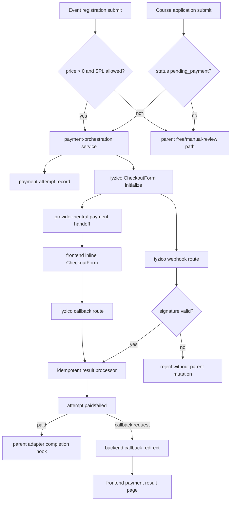
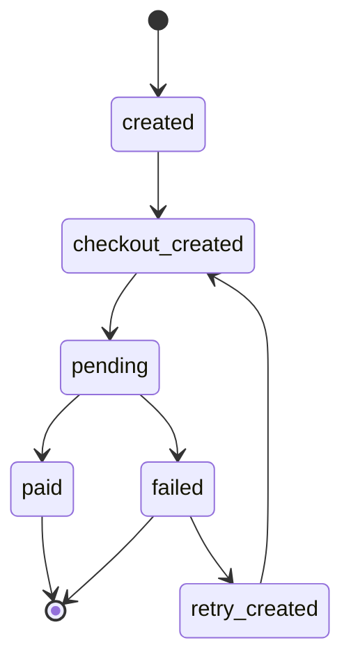

# feat: Shared payment orchestration for iyzico CheckoutForm

## Goal Capsule

| Field | Value |
|---|---|
| Objective | Add one shared backend payment orchestration seam that paid event registration and course application can both use to create iyzico CheckoutForm handoffs, track retry-safe attempts, and normalize payment results. |
| Authority | Product Contract in this file, then origin requirements in `docs/brainstorms/2026-06-11-paid-event-registration-iyzico-requirements.md`, then local specs in `docs/superpowers/specs/2026-04-21-payment-orchestration.md` and `docs/superpowers/specs/2026-04-21-course-application-workflow.md`. |
| Execution profile | Cross-stack feature work: backend schemas/services/controllers first, then parent adapters, then frontend CheckoutForm rendering and route proxies. |
| Stop conditions | Stop before implementation if the team changes provider, removes inline CheckoutForm from scope, or requires API-based card collection instead of CheckoutForm. |
| Product Contract preservation | Product Contract unchanged in behavior; the planning layer narrows implementation to the shared payment seam and parent adapter hooks, with PDF-template delivery left to the parent confirmation service boundary. |

---

## Product Contract

### Summary

Introduce one shared payment orchestration seam that both paid event registrations and course applications can call in this release. The seam owns payment eligibility handoff, checkout creation, and result normalization. iyzico CheckoutForm is the current inline presentation of that handoff for paid checkout, and the same contract is reused as course applications reach their payment step.

### Problem Frame

The repo already points in this direction, but the payment shape is split across related docs and code. `docs/superpowers/specs/2026-04-21-payment-orchestration.md` says payment choice must not live in frontend cache or local storage and that the frontend should receive a backend-created handoff. `docs/superpowers/specs/2026-04-21-course-application-workflow.md` already treats payment as a downstream branch of course application, and `backend/src/api/course-application/services/course-application.ts` persists `paymentStatus`, `paymentProvider`, and `paymentUrlSnapshot`. In parallel, `docs/brainstorms/2026-06-11-paid-event-registration-iyzico-requirements.md` requires inline iyzico payment, retry-safe attempts, and a separate payment record per attempt.

The product risk is divergence: one checkout shape for course applications, another for events, with provider-specific logic bleeding into parent flows. The shared architecture should keep event registration and course application as distinct parent flows while giving them one payment seam.

### Requirements

**Shared orchestration**

- R1. Payment orchestration must be a shared seam, not a feature-local one-off, so event registration and course application can both hand off to it.
- R2. The parent flow decides when payment is required; payment orchestration does not decide business eligibility by itself.
- R3. The backend owns provider selection, checkout handoff creation, and payment result normalization; the frontend only renders the handed-off checkout state.
- R8. The shared contract must be provider-neutral at the domain boundary so parent payment flows do not copy iyzico-specific logic into the domain model.
- R15. API-based iyzico payment is out of scope for this phase.

**Checkout behavior**

- R4. iyzico CheckoutForm is the only payment presentation in scope for the current release; starting payment must not require a full-page provider redirect.
- R5. The shared contract must preserve idempotency: creating a payment step must not create a second parent registration or application for the same submission.
- R6. A failed payment must leave the parent flow in a retryable state and allow a new payment attempt without duplicating the parent record.
- R7. Successful payment must resolve back into the parent flow's existing final state and trigger that flow's own confirmation actions.
- R11. Each checkout handoff must create a distinct payment attempt linked to the parent flow, with provider-neutral attempt identity, provider token/reference, amount, status, timestamps, and retry relationship.
- R12. If checkout handoff creation fails, the parent flow must remain retryable without duplicating the parent record, and the backend must return a normalized error state the frontend can render.
- R13. Webhook and result processing must be idempotent per payment attempt and provider event; parent completion and confirmation actions must run only once for a successful attempt.
- R16. Browser-facing iyzico callback completion must finalize the payment on the backend, then redirect the user to a frontend payment result page that displays the finalized state without deciding payment truth.

**Provider and security**

- R9. Integration must be sandbox-first, with separate live and sandbox credentials and base URLs.
- R10. Webhook acceptance must be signature-validated before the parent flow is marked paid or completed.
- R14. iyzico API keys and secrets must remain server-only, environment-scoped, never returned to the frontend, and excluded from application logs; frontend-visible checkout state must use only the backend-created handoff data.

### Scope Boundaries

- No refunds, chargebacks, partial captures, subscriptions, or recurring payments.
- No multi-provider selection UI or provider comparison in this phase.
- No API-based payment flow in this phase.
- No redesign of SPL, course admission, or event eligibility logic beyond its role as a gate into payment.
- Paid event registration and course application adapters are both in scope for this shared payment seam.
- No standalone customer payment portal.

### Deferred to Follow-Up Work

- Filling and emailing the Mesafeli Satış Sözleşmesi PDF remains a parent-flow confirmation action. This plan creates the payment-success trigger point and consent snapshot; it does not invent the missing PDF template or a PDF rendering stack.
- A full public course-application frontend is not added unless it already exists during implementation. The course adapter and API response contract are in scope; a new course application page is follow-up product/UI work.

### Context & Research

- `backend/src/api/event/content-types/event/schema.json` already has a decimal `price` field, so paid-event eligibility can be calculated by the event registration parent flow.
- `backend/src/api/registration/content-types/registration/schema.json` does not yet include `payment_pending` or `blocked`, while the paid-event origin requires both states.
- `backend/src/api/course-application/content-types/course-application/schema.json` already has `pending_payment`, `paymentStatus`, `paymentProvider`, and `paymentUrlSnapshot`.
- `backend/src/api/course-application/services/course-application.ts` currently resolves a local payment URL template; this should be replaced by the shared payment handoff for `pending_payment`.
- `frontend/src/components/event-registration-form.tsx` and `frontend/src/hooks/use-event-registration-form.ts` own the current event registration UX and can host the inline payment step after the backend returns `nextAction: "render_checkout"`.
- Official iyzico CheckoutForm docs describe an initialize step that returns a checkout token and `checkoutFormContent`, and a retrieve step that queries the result by token. The webhook docs describe signed webhook payloads that must be verified before trusting provider events.

---

## Planning Contract

### Assumptions

- Sandbox credentials and live credentials will be supplied through deployment environment variables before production release.
- The shared payment seam stores amount in minor units for exact comparisons, while Strapi display fields can remain decimal where they already exist.
- The frontend can render provider-supplied CheckoutForm markup only from the backend handoff response; arbitrary user-provided markup is never rendered.
- Course application keeps its existing `paymentUrlSnapshot` field for backward compatibility during the first pass, but new handoff data is stored on `payment-attempt`.

### Key Technical Decisions

- KTD1. Use append-only `payment-attempt` records as the shared ledger. Parent rows keep their business status, while attempts store provider-neutral identity, provider token/reference, amount, status, retry lineage, and provider-safe snapshots.
- KTD2. Link attempts to parents with a provider-neutral parent descriptor instead of Strapi polymorphic relations. Use `parentType`, `parentEntityId`, and `parentDocumentId` so the payment service can support `registration` and `course_application` without hard-coding Strapi relation shapes into the content type.
- KTD3. Keep parent adapters responsible for eligibility and completion. Event registration decides paid/free and SPL outcomes; course application decides `pending_payment`; payment orchestration creates handoffs and later calls adapter completion hooks.
- KTD4. Return one frontend handoff shape. Parent submit responses should expose `payment: { attemptReference, status, provider, presentation }`, where `presentation.kind` is currently `iyzico_checkout_form` and contains only backend-created frontend-safe values.
- KTD5. Treat provider callbacks and webhooks as two inputs to the same result processor. The callback can drive browser UX by retrieving the CheckoutForm result, but parent completion requires the same idempotent attempt-finalization path and webhook signature validation where the input is a webhook.
- KTD6. Store a separate provider-event ledger for idempotency. Each accepted iyzico webhook or callback result should create or find a `payment-provider-event` record keyed by provider plus event/token identity before mutating parent state.
- KTD7. Configuration is explicit and environment-scoped. The backend reads `IYZICO_ENVIRONMENT`, `IYZICO_API_KEY`, `IYZICO_SECRET_KEY`, `IYZICO_BASE_URL`, `IYZICO_CALLBACK_URL`, and webhook signature settings from server-only env vars; frontend env never includes provider secrets.
- KTD8. Use a backend-finalize, frontend-display callback UX. The iyzico callback endpoint owns token retrieval and parent mutation, then redirects to a localized frontend result page that renders success, failure, or retry guidance from backend-owned state.

### High-Level Technical Design

### System-Wide Impact

- Persistent data changes add two shared payment content types and new registration statuses. Existing demo data and tests must remain valid with the new enum values.
- Public unauthenticated routes expand to include payment callback/webhook endpoints. These routes must validate provider signatures or opaque attempt/token references before mutating state.
- Course application notifications currently include a `paymentUrl`; after this work they should describe a payment handoff or omit link-oriented copy when the payment is inline.
- The frontend registration page becomes multi-step for paid events while preserving the current free-event form behavior.

### Risks & Dependencies

- iyzico webhook signatures are security-sensitive; a false positive would let an attacker mark a parent flow paid. The plan requires focused signature tests and rejects unsigned/invalid webhooks before result retrieval or parent mutation.
- CheckoutForm markup rendering is inherently sensitive because it injects provider-supplied content. The UI must only render backend-provided provider content and must keep the container isolated from user-controlled fields.
- Parent completion actions can double-fire if callback and webhook arrive close together. The provider-event ledger and attempt status transition tests must prove exactly-once parent completion.
- The missing PDF template can block the origin's full post-payment staff email behavior. This plan avoids blocking the payment seam by exposing a parent completion hook and explicitly deferring the PDF generation stack.

### Sources & Research

- Local source: `backend/src/api/registration/services/registration.ts`, `backend/src/api/course-application/services/course-application.ts`, `backend/src/api/event/content-types/event/schema.json`, `backend/src/api/course-application/content-types/course-application/schema.json`, `frontend/src/components/event-registration-form.tsx`, `frontend/src/hooks/use-event-registration-form.ts`.
- Local tests: `backend/tests/api/registration/service.test.ts`, `backend/tests/api/registration/field-requirements.test.ts`, `backend/tests/api/course-application/service.test.ts`, `frontend/src/__tests__/event-registration-page-source.test.mjs`, `e2e/tests/event-registration.spec.ts`.
- External docs: [iyzico CheckoutForm](https://docs.iyzico.com/en/payment-methods/checkoutform), [iyzico CheckoutForm implementation](https://docs.iyzico.com/en/payment-methods/checkoutform/cf-implementation), [iyzico webhook](https://docs.iyzico.com/en/advanced/webhook), and [iyzico authentication](https://docs.iyzico.com/en/getting-started/preliminaries/authentication).

---

## Implementation Units

### U1. Add shared payment attempt and provider event models

- **Goal:** Create the persistent ledger that every payment handoff, retry, callback, and webhook result uses.
- **Requirements:** R1, R5, R6, R8, R11, R13, R14.
- **Dependencies:** None.
- **Files:** Create `backend/src/api/payment-attempt/content-types/payment-attempt/schema.json`, `backend/src/api/payment-attempt/controllers/payment-attempt.ts`, `backend/src/api/payment-attempt/routes/payment-attempt.ts`, `backend/src/api/payment-attempt/services/payment-attempt.ts`, `backend/src/api/payment-provider-event/content-types/payment-provider-event/schema.json`, `backend/src/api/payment-provider-event/controllers/payment-provider-event.ts`, `backend/src/api/payment-provider-event/routes/payment-provider-event.ts`, `backend/src/api/payment-provider-event/services/payment-provider-event.ts`; modify `backend/src/index.ts`; test in `backend/tests/api/payment-attempt/schema.test.ts`, `backend/tests/api/payment-provider-event/schema.test.ts`, and `backend/tests/api/payment-attempt/public-permissions.test.ts`.
- **Approach:** Define `payment-attempt` with `attemptReference` unique, `parentType`, `parentEntityId`, `parentDocumentId`, `provider`, `providerToken`, `providerConversationId`, `amountMinor`, `currency`, `status`, `retryOfAttemptReference`, `frontendPresentationSnapshot`, `providerSafeSnapshot`, `createdAt`, `completedAt`, and `failureReason`. Define `payment-provider-event` with provider, event identity, attempt reference, accepted/rejected status, signature metadata, and processed timestamp. Do not grant public read permissions to either content type.
- **Execution note:** Start with schema/public-permission tests so accidental public exposure is caught before service work.
- **Patterns to follow:** Strapi content type schemas under `backend/src/api/*/content-types/*/schema.json`; permission bootstrap in `backend/src/index.ts`; schema tests in `backend/tests/api/*/schema.test.ts`.
- **Test scenarios:**
  - Happy path: schema exposes required attempt fields, provider-neutral parent fields, and status enum values `created`, `checkout_created`, `pending`, `paid`, `failed`, `cancelled`.
  - Edge case: `retryOfAttemptReference` is optional for first attempts and allowed for retry attempts.
  - Error path: public bootstrap does not add `payment-attempt` or `payment-provider-event` read actions to `PUBLIC_READ_ACTIONS`.
  - Integration: model fields support both `registration` and `course_application` parent types without a Strapi relation migration to either parent.
- **Verification:** Backend schema tests prove fields and public permission boundaries; no generated/dependency directories are changed.

### U2. Add iyzico provider configuration, client, and signature utilities

- **Goal:** Encapsulate all iyzico-specific authentication, CheckoutForm initialization, result retrieval, and webhook signature validation behind server-only utilities.
- **Requirements:** R3, R4, R9, R10, R14, R15.
- **Dependencies:** U1.
- **Files:** Create `backend/src/services/payment-orchestration/iyzico/config.ts`, `backend/src/services/payment-orchestration/iyzico/client.ts`, `backend/src/services/payment-orchestration/iyzico/signature.ts`, `backend/src/services/payment-orchestration/types.ts`; modify `.env.example`; test in `backend/tests/services/payment-orchestration/iyzico-config.test.ts`, `backend/tests/services/payment-orchestration/iyzico-client.test.ts`, and `backend/tests/services/payment-orchestration/iyzico-signature.test.ts`.
- **Approach:** Build a small provider module that accepts a normalized checkout request and returns a frontend-safe CheckoutForm handoff. Keep API key and secret key inside backend code only. Normalize sandbox/live base URLs through env. Implement authorization/header generation using iyzico's documented authentication scheme and validate webhook signatures before a webhook can be accepted.
- **Execution note:** Implement config and signature tests before wiring routes; this is the highest security-risk unit.
- **Patterns to follow:** Existing server-only service modules under `backend/src/services/spl-check/*`; env-driven backend config tests in `backend/tests/unit/config/backend-config-manager.test.ts`; Strapi logging patterns that avoid secrets.
- **Test scenarios:**
  - Happy path: sandbox config returns the sandbox base URL and marks environment as sandbox when `IYZICO_ENVIRONMENT=sandbox`.
  - Happy path: live config uses live base URL only when explicitly configured for live.
  - Error path: missing API key, secret key, or callback URL yields a normalized configuration error without logging secret values.
  - Error path: invalid webhook signature returns a rejected verification result and does not expose the secret in logs/errors.
  - Integration: CheckoutForm initialize maps provider response token and checkout content into the provider-neutral handoff without returning API keys or raw secret-bearing headers.
- **Verification:** Focused provider tests pass and demonstrate sandbox-first defaults, no frontend secret exposure, and signature rejection behavior.

### U3. Implement the shared payment orchestration service and payment routes

- **Goal:** Provide one backend service that parent flows call to create handoffs, retry failed attempts, and process provider results.
- **Requirements:** R1, R2, R3, R5, R6, R8, R11, R12, R13.
- **Dependencies:** U1, U2.
- **Files:** Create `backend/src/services/payment-orchestration/service.ts`, `backend/src/services/payment-orchestration/parent-adapters.ts`, `backend/src/api/payment-orchestration/controllers/payment-orchestration.ts`, `backend/src/api/payment-orchestration/routes/custom-payment-orchestration.ts`; modify `backend/src/middlewares/rate-limiter.ts`; test in `backend/tests/services/payment-orchestration/service.test.ts`, `backend/tests/api/payment-orchestration/routes.test.ts`, and `backend/tests/api/payment-orchestration/controller.test.ts`.
- **Approach:** Expose service methods for `createCheckoutHandoff`, `retryCheckoutHandoff`, `handleCallbackResult`, and `handleWebhookEvent`. Inputs must include a parent descriptor, amount, currency, payer snapshot, success/failure callback metadata, and idempotency key from the parent flow. Persist the attempt before provider initialization; if provider initialization fails, leave the parent retryable and mark the attempt failed with a normalized failure reason.
- **Patterns to follow:** Course application service transaction/idempotency patterns in `backend/src/api/course-application/services/course-application.ts`; custom route patterns in `backend/src/api/registration/routes/custom-registration.ts`; rate limiter map in `backend/src/middlewares/rate-limiter.ts`.
- **Test scenarios:**
  - Happy path: creating a checkout handoff stores one `payment-attempt`, calls iyzico initialize once, stores provider token/content, and returns a provider-neutral payment object.
  - Edge case: retrying a failed attempt creates a new attempt with `retryOfAttemptReference` set and does not mutate the parent row before provider success.
  - Error path: provider initialize failure marks the attempt failed, returns a normalized `payment_unavailable` state, and leaves the parent in a retryable payment-pending state.
  - Error path: retry request for an already-paid attempt is rejected without creating a new attempt.
  - Integration: callback and webhook processing share the same attempt-finalization path so exactly-once completion is enforced by provider-event idempotency.
- **Verification:** Service/controller tests prove one shared contract can serve both parent types and that failed handoff creation is retryable without duplicate parents.

### U4. Adapt paid event registration to use the shared handoff

- **Goal:** Make event registration produce free, blocked, or paid checkout outcomes while preserving duplicate-registration idempotency.
- **Requirements:** R1, R2, R4, R5, R6, R7, R11, R12, R13.
- **Dependencies:** U1, U2, U3.
- **Files:** Modify `backend/src/api/registration/content-types/registration/schema.json`, `backend/src/api/registration/services/registration.ts`, `backend/src/api/registration/controllers/registration.ts`, `backend/src/api/event/content-types/event/schema.json` only if price precision needs schema clarification, `backend/src/services/internal-notifications/types.ts`, `backend/src/services/internal-notifications/templates.ts`; test in `backend/tests/api/registration/service.test.ts`, `backend/tests/api/registration/field-requirements.test.ts`, and `backend/tests/internal-notifications/templates.test.ts`.
- **Approach:** Add `payment_pending` and `blocked` registration statuses. Keep free events on the existing pending/confirmation path. For paid events with SPL clear/manual_review, create or return a single `payment_pending` registration and call payment orchestration for a CheckoutForm handoff. For SPL blocked, create a `blocked` registration and return the same generic success UX payload without user email. Do not let payment orchestration decide whether an event is paid.
- **Execution note:** Characterize current duplicate registration behavior before changing it; existing tests currently expect blocked SPL to reject, and those tests must be intentionally updated to the silent-block requirement.
- **Patterns to follow:** Current registration service transaction flow, SPL check usage, and notification envelope shape in `backend/src/api/registration/services/registration.ts`; origin acceptance examples AE1, AE3, and AE6 from `docs/brainstorms/2026-06-11-paid-event-registration-iyzico-requirements.md`.
- **Test scenarios:**
  - Covers AE1. Given SPL blocked for any event price, registration is stored as `blocked`, response is generic success, no user confirmation is sent, and internal notification includes blocked status.
  - Covers AE3. Given paid event price > 0 and SPL clear, submit returns `nextAction: "render_checkout"` with `payment.presentation.kind = "iyzico_checkout_form"` and does not redirect.
  - Covers AE6. Given an existing `payment_pending` registration for the same student/event, resubmission returns the existing parent and creates only a retry attempt when the prior attempt failed.
  - Edge case: absent or zero event price keeps the existing free-event response and does not create a payment attempt.
  - Error path: CheckoutForm initialization failure returns normalized payment error state while the registration remains `payment_pending`.
- **Verification:** Registration tests cover free, blocked, paid, duplicate, and provider-failure branches; internal notification tests cover blocked/payment-pending status copy.

### U5. Adapt course application to consume the shared handoff

- **Goal:** Replace local payment-link resolution in course application with the same shared payment handoff contract used by paid event registration.
- **Requirements:** R1, R2, R3, R5, R6, R7, R8, R11, R12.
- **Dependencies:** U1, U2, U3.
- **Files:** Modify `backend/src/api/course-application/services/course-application.ts`, `backend/src/api/course-application/controllers/course-application.ts`, `backend/src/api/course-application/content-types/course-application/schema.json` only if a compatibility field is needed, `backend/src/services/course-application/domain/course-application-status.ts`, `backend/src/services/internal-notifications/templates.ts`; test in `backend/tests/api/course-application/service.test.ts`, `backend/tests/api/course-application/routes.test.ts`, and `backend/tests/services/spl-check/types.test.ts`.
- **Approach:** Keep course application eligibility and SPL outcome mapping in the course application service. When the outcome is `pending_payment`, call shared payment orchestration and return `nextAction: "render_checkout"` or the existing action plus `payment` according to the normalized response contract. Keep `paymentUrlSnapshot` as a legacy nullable snapshot during transition, but prefer attempt-level handoff data for new CheckoutForm state.
- **Patterns to follow:** Existing course application `activeApplicationKey` idempotency, `pending_payment` status updates, and notification delivery in `backend/src/api/course-application/services/course-application.ts`.
- **Test scenarios:**
  - Happy path: SPL clear creates or updates application to `pending_payment`, creates a payment attempt, and returns a CheckoutForm payment handoff.
  - Edge case: duplicate active application remains rejected unless the existing application is the same retryable pending-payment parent selected by the implemented retry contract.
  - Error path: provider initialize failure keeps `paymentStatus: "pending"` or a normalized retryable failure status according to the final service contract, without creating a second course application.
  - Integration: `course_payment_pending` notification no longer depends on a legacy payment URL to represent inline payment.
- **Verification:** Course application tests prove local payment links are no longer the primary handoff and that payment failure does not duplicate applications.

### U6. Process iyzico callback and webhook results idempotently

- **Goal:** Mark attempts paid/failed, invoke parent completion hooks exactly once, and redirect browser callbacks to the frontend result page after backend finalization.
- **Requirements:** R7, R10, R13, R14, R16.
- **Dependencies:** U1, U2, U3, U4, U5.
- **Files:** Modify `backend/src/services/payment-orchestration/service.ts`, `backend/src/services/payment-orchestration/parent-adapters.ts`, `backend/src/api/payment-orchestration/controllers/payment-orchestration.ts`; modify parent services as needed for completion hooks in `backend/src/api/registration/services/registration.ts` and `backend/src/api/course-application/services/course-application.ts`; test in `backend/tests/services/payment-orchestration/result-processing.test.ts`, `backend/tests/api/payment-orchestration/webhook.test.ts`, `backend/tests/api/payment-orchestration/callback.test.ts`, `backend/tests/api/registration/service.test.ts`, and `backend/tests/api/course-application/service.test.ts`.
- **Approach:** Webhooks must verify signature first, then retrieve or normalize the provider result, then create/find a provider-event row, then transition the attempt. Successful first transition to paid invokes the parent adapter: registration becomes `confirmed`; course application becomes `completed` or the existing paid terminal state. Failed attempts remain retryable and leave parent status pending payment. The browser callback returns a redirect to the frontend result page after finalization instead of exposing JSON as the end-user landing experience.
- **Execution note:** Add tests that simulate callback-first, webhook-first, and duplicate-webhook ordering before finalizing the service.
- **Patterns to follow:** Existing registration confirmation email plugin boundary in `backend/src/plugins/iletisim-merkezi/server/services/confirmation-service.ts`; course application status domain helper in `backend/src/services/course-application/domain/course-application-status.ts`.
- **Test scenarios:**
  - Covers AE5. Given a `payment_pending` registration and valid iyzico success event, registration becomes `confirmed`, attempt becomes `paid`, and parent confirmation hook is called once.
  - Covers AE6. Given a failure result, attempt becomes `failed`, parent remains `payment_pending`, and retry creates a new attempt under the same parent.
  - Error path: invalid webhook signature returns an error response and leaves attempt and parent unchanged.
  - Edge case: duplicate success webhook for the same provider event is recorded as duplicate/no-op and does not send confirmation twice.
  - Integration: callback-first success followed by webhook success still has one paid attempt and one parent completion action.
  - Browser UX: callback-first success or failure redirects to the localized result page with an attempt reference and a normalized outcome hint.
- **Verification:** Result-processing tests prove signature gating, idempotency, parent completion semantics, and callback redirect behavior across both parent types.

### U7. Render the shared iyzico CheckoutForm handoff and payment result page

- **Goal:** Let paid event registration render the backend-created CheckoutForm inline, then give returning users a localized payment result page after backend callback finalization.
- **Requirements:** R3, R4, R6, R12, R14, R16.
- **Dependencies:** U3, U4, U6.
- **Files:** Modify `frontend/src/hooks/use-event-registration-form.ts`, `frontend/src/components/event-registration-form.tsx`, `frontend/src/messages/tr.json`, `frontend/src/messages/en.json`, `frontend/src/app/api/registrations/register/route.ts`; create `frontend/src/components/payments/iyzico-checkout-form.tsx`, `frontend/src/components/payments/payment-status-panel.tsx`, `frontend/src/app/[locale]/odeme-sonucu/page.tsx`, and `frontend/src/app/api/payments/[attemptReference]/retry/route.ts` if a retry proxy is used; test in `frontend/src/__tests__/event-registration-payment-source.test.mjs`, `frontend/src/__tests__/payment-result-page-source.test.mjs`, `frontend/src/__tests__/event-registration-page-source.test.mjs`, and `e2e/tests/event-registration-paid-payment.spec.ts`.
- **Approach:** Extend the registration hook state machine from single success/error to `form`, `payment`, `success`, and `error`. When the backend returns a payment handoff, render a payment section with consent controls and the provider CheckoutForm container. The component may use provider-supplied checkout content only from the backend response and should expose clear loading, failed, retry, and completed states. The payment result page is display-only: it reads backend-finalized state or a normalized callback outcome and shows Turkish-first success, failure, pending, or retry guidance.
- **Patterns to follow:** Existing event registration form styling/test IDs in `frontend/src/components/event-registration-form.tsx`; form persistence rules in `frontend/src/hooks/use-form-persistence.ts`; route proxy error logging in `frontend/src/app/api/registrations/register/route.ts`.
- **Test scenarios:**
  - Covers AE3. Paid registration response with `render_checkout` displays the inline payment step on the same route and does not set `window.location`.
  - Covers AE4. Mesafeli Satış consent unchecked disables the payment continue/submit affordance while optional consent checkboxes can change independently.
  - Error path: normalized `payment_unavailable` response shows a retryable error instead of generic registration failure.
  - Edge case: free registration response keeps the existing success message and clears persisted form state.
  - Integration: retry action calls the backend retry proxy with the attempt reference and replaces failed handoff content with the new attempt handoff.
  - Browser return: callback redirect lands on the result page and the page does not expose provider secrets or decide payment state locally.
- **Verification:** Frontend source tests and E2E cover same-page payment rendering, consent gating, callback result UX, retry UX, and free-event regression.

### U8. Update seed data, environment docs, and cross-stack verification gates

- **Goal:** Make the feature testable in sandbox/local environments and documented enough for safe deployment.
- **Requirements:** R9, R10, R14.
- **Dependencies:** U1, U2, U3, U4, U5, U6, U7.
- **Files:** Modify `backend/scripts/seed-demo.js`, `.env.example`, `README.md`, `docs/superpowers/specs/2026-04-21-payment-orchestration.md` only if the current spec needs a narrow contract update; test in `backend/tests/scripts/seed-demo-payment.test.js` if script coverage is added, plus existing build/lint gates.
- **Approach:** Seed at least one paid event with a future/open registration window and keep free events intact. Document sandbox/live env variables, callback/webhook URLs, and the rule that iyzico secrets are backend-only. Keep operational notes short and avoid production credentials in docs.
- **Patterns to follow:** Existing demo seed idempotency in `backend/scripts/seed-demo.js`; README env documentation style; root validation scripts in `package.json`.
- **Test scenarios:**
  - Happy path: demo seed creates or preserves one paid event with `price > 0`.
  - Error path: seed can rerun without duplicating paid demo rows.
  - Operational: `.env.example` includes sandbox-first iyzico placeholders without secrets.
  - Regression: existing free registration demo data remains available for current E2E coverage.
- **Verification:** Cross-stack gates in the Verification Contract pass, and docs describe the env surface without exposing secrets.

---

## Verification Contract

| Gate | Applies to | Done signal |
|---|---|---|
| `npm run test --prefix backend` | U1-U6, U8 | Backend unit/schema/service/controller tests pass for payment models, provider utilities, parent adapters, result processing, and callback redirect behavior. |
| `npm run lint` | U7 and cross-stack TypeScript changes | Frontend lint passes with no new warnings from payment components or route proxies. |
| `npm run build:backend` | U1-U6, U8 | Strapi builds with new content types, services, and routes. |
| `npm run build:frontend` | U7 | Next.js builds with the payment components, result page, and route proxies. |
| `npm run seed:demo` | U8 | Demo seed remains idempotent and includes a paid event for sandbox checkout testing. |
| `npm run build` | Full plan | Cross-stack production build passes after all units are integrated. |
| `npm run e2e` or focused `event-registration-paid-payment` run | U7 plus integrated backend | Paid event registration stays on the same page for checkout, returns to the result page after callback, handles retry, and preserves free-event behavior. |
| Manual sandbox callback/webhook check against running backend | U2, U3, U6 | A sandbox CheckoutForm attempt can be initialized, callback redirects to the result page after finalization, webhook payloads are accepted only with valid signature/token handling, and parent completion is idempotent. |

---

## Definition of Done

- Product behavior satisfies R1-R16 without introducing a second event-only or course-only payment implementation.
- `payment-attempt` and `payment-provider-event` store retry and provider-event history while parent rows keep business status.
- Event registration supports free, blocked, paid-pending, failed-retry, and paid-confirmed paths without duplicating registrations.
- Course application uses the shared handoff for `pending_payment` instead of the legacy local payment URL as the primary contract.
- iyzico secrets never appear in frontend env, response payloads, logs, test snapshots, or docs.
- Webhook/callback result processing is signature/token validated and idempotent before parent completion actions run.
- Frontend paid-event payment starts inline on the registration page and does not require full-page provider redirect to begin checkout.
- Browser callback completion redirects to a localized payment result page that displays backend-finalized success, failure, pending, or retry guidance.
- Existing free-event registration and current course-application non-payment branches still pass their regression tests.
- Abandoned exploratory code, temporary mocks, and debug logging are removed before final validation.
